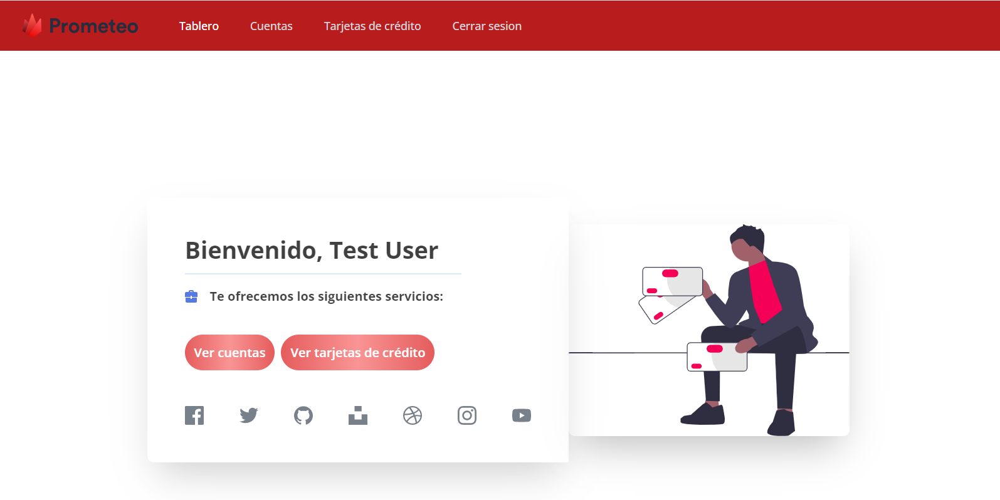

# Prometeo OB

Desarrollar una app web que permita iniciar sesión con la api de prometeo, donde el usuario pueda elegir su banco e ingresar sus credenciales, y luego muestre la información del mismo, obtenida también con prometeo.
Dado que la api requiere el uso de un API key que no debe ser expuesto al público, todas las llamadas a la api deberán hacerse desde el backend.

## Tecnologias


- **Django** es un marco web Python de alto nivel que fomenta un desarrollo rápido y un diseño limpio y pragmático. Creado por desarrolladores experimentados, se ocupa de gran parte de las molestias del desarrollo web, por lo que puede concentrarse en escribir su aplicación sin necesidad de reinventar la rueda. Es gratis y de código abierto.


- **React** es una biblioteca de JavaScript para construir interfaces de usuario

## Estructura del proyecto

```bash
prometeo_ob
|-- mkdocs
|-- cra-client
|-- server
```

| Nombre del directorio | Descripción                                      |
| --------------------- | ------------------------------------------------ |
| mkdocs                | Documentación del proyecto generada con `mkdocs` |
| cra-client            | Aplicacion creada utilizando React               |
| server                | Aplicacion creada utilizando Django              |

## Requerimientos

> **APLICACION `SERVER`**

- Python V3.9

- Django V3.2

> **APLICACION `CRA-CLIENT`**

- NodeJS V16.15.1

- NPM V8.11.0

## Instalación

> **APLICACION `SERVER`**

1. Posicionarse dentro del directorio `server` y luego ejecutar los comandos siguientes:

```bash
# Generar un entorno virtual


# Instalar las dependencias


# Posicionarse en src y ejecutar
$> python manage.py runserver 9099
```

> **APLICACION `CRA-CLIENT`**

1. Posicionarse dentro del directorio `cra-client` y luego ejecutar los comandos siguientes:

```bash
# Instalar las dependencias
$> npm install

# Iniciar la aplicacion
$> npm start
```

## Pantallas

> **APLICACION `SERVER`**

- **Documentacion del Api con Swagger**


> **APLICACION `CRA-CLIENT`**

- **Inicio de sesion**


- **Tablero**



- **Cuentas**


- **Tarjetas**


