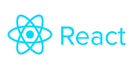

# Prometeo OB

Desarrollar una app web que permita iniciar sesión con la api de prometeo, donde el usuario pueda elegir su banco e ingresar sus credenciales, y luego muestre la información del mismo, obtenida también con prometeo.
Dado que la api requiere el uso de un API key que no debe ser expuesto al público, todas las llamadas a la api deberán hacerse desde el backend.

## Tecnologias


- **Django** es un marco web Python de alto nivel que fomenta un desarrollo rápido y un diseño limpio y pragmático. Creado por desarrolladores experimentados, se ocupa de gran parte de las molestias del desarrollo web, por lo que puede concentrarse en escribir su aplicación sin necesidad de reinventar la rueda. Es gratis y de código abierto.



- **React** es una biblioteca de JavaScript para construir interfaces de usuario

## Estructura del proyecto

```bash
prometeo_ob
|-- mkdocs
|-- cra-client
|-- server
```

| Nombre del directorio | Descripción                                            |
| --------------------- | ------------------------------------------------------ |
| mkdocs                | Documentación del proyecto generada con `mkdocs`       |
| cra-client            | Aplicacion creada utilizando React (Frontend)          |
| server                | Aplicacion creada utilizando Django (Backend API Rest) |

## Requerimientos

> **GENERAL**

- Git V2.37

> **APLICACIÓN `SERVER`**

- Python V3.9

- Django V3.2

> **APLICACIÓN `CRA-CLIENT`**

- NodeJS V16.15.1

- NPM V8.11.0

## Instalación

> **GENERAL**

1. Primero clonaremos el proyecto en cualquier directorio

```bash
$> git clone https://github.com/dsotoalexei/prometeo-ob.git && cd prometeo-ob
```

> **APLICACIÓN `SERVER`**

1. **Posicionarse dentro del directorio `server`**

```bash
$> cd server
```

2. **Copiar y renombrar el fichero `src/config/.env.template` por `src/config/.env`**

3. **Generar un entorno virtual**

```bash
$> python -m venv venv
```

4. **Activar entorno virtual**

```bash
## Window
$> .\venv\Scripts\activate

## Linux o Mac
$> source venv/bin/activate
```

5. **Instalar dependencias**

```bash
(venv) $> pip install -r requirements.txt
```

6. **Posicionar en el directorio `src`**

```bash
$> cd src
```

7. **Ejecutar el servidor**

```bash
$> python manage.py runserver 9099
```

8. **Abrir en un navegador la siguiente [URL](http://127.0.0.1:9099)**

```bash
http://127.0.0.1:9099
```

> **APLICACIÓN `CRA-CLIENT`**

1. **Posicionarse en el directorio `cra-client`**

```bash
$> cd cra-client 
```

2. **Copiar y renombrar el fichero `.env_local` a `.env`**

Contenido del fichero

```bash
REACT_APP_API_HOST=http://127.0.0.1:9099
```

3. **Instalar las dependencias**

```bash
# Instalar las dependencias
$> npm install
```

4. **Iniciar el cliente**

```bash
# Iniciar la aplicacion
$> npm start
```

5. **Abrir en un navegador la siguiente [URL](http://127.0.0.1:3000)**

```bash
http://127.0.0.1:3000
```

> **APLICACIÓN `CRA-CLIENT CON STORYBOOK`**

1. **Posicionarse en el directorio `cra-client`**

```bash
$> cd cra-client 
```

2. **Iniciar storybook**

```bash
# Iniciar la aplicacion
$> npm run storybook
```

3. **Abrir en un navegador la siguiente [URL](http://127.0.0.1:6006)**

```bash
http://127.0.0.1:6006
```

## Pantallas

> **APLICACIÓN `SERVER`**

- **Documentación del Api con Swagger**


> **APLICACIÓN `CRA-CLIENT`**

- **Inicio de sesión**


- **Tablero**

![]./mkdocs/docs/assets/images/cra-client/dashboard-page.png)

- **Cuentas**


- **Tarjetas**


> **APLICACIÓN `CRA-CLIENT CON STORYBOOK`**

- **Ejemplo de Account Card**


