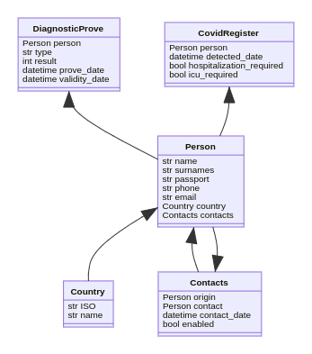

# Adicionar NPLUSONE

## Instalar dependencias

```zsh
$> poetry add -D nplusone
```

| Nombre   | Descripción                                           |
| -------- | ----------------------------------------------------- |
| nplusone | Detectando el problema de las consultas n+1 en Python |

> **NOTAS**
>
> `nplusone` soporta **Django >= 1.8**.

## Configurar NPLUSONE

Adicionar configuración en el fichero `src/server/settings/environments/development.py`

```
...
import logging

...

INSTALLED_APPS += (
    "nplusone.ext.django",
)

...
# nplusone
# https://github.com/jmcarp/nplusone

# Should be the first in line:
MIDDLEWARE = ("nplusone.ext.django.NPlusOneMiddleware",) + MIDDLEWARE  # noqa: WPS440

# Logging N+1 requests:
NPLUSONE_RAISE = True  # comment out if you want to allow N+1 requests
NPLUSONE_LOGGER = logging.getLogger("django")
NPLUSONE_LOG_LEVEL = logging.WARN
NPLUSONE_WHITELIST = [
    {'model': 'admin.*'},
]
```

## Qué es el problema del N+1

Se trata de un problema de optimización de consultas a una base de datos.

El problema de las `N + 1 queries`, el cual se produce al hacer consultas a datos que no están en la tabla principal a la que hacemos la consulta. En este artículo seguimos elevando el nivel de complejidad respecto a los anteriores.

#### Modelo de datos

Como hemos explicado anteriormente, en esta serie de posts utilizamos un modelo de datos que representa un diseño simple para el proyecto del pasaporte COVID, que diseñamos como referencia. El modelo de datos es el siguiente:



Para este artículo vamos a utilizar los modelos Person, Country y Contacts, que son los siguientes:

```python
class Country(models.Model):
   created_at = models.DateTimeField(verbose_name="Creation date", auto_now_add=True)
   updated_at = models.DateTimeField(verbose_name="Update date", auto_now_add=True)
   iso = models.CharField(max_length=3)
   name = models.CharField(max_length=100)

class Person(models.Model):
   created_at = models.DateTimeField(verbose_name="Creation date", auto_now_add=True)
   updated_at = models.DateTimeField(verbose_name="Update date", auto_now_add=True)
   name = models.CharField(max_length=100)
   surnames = models.CharField(max_length=150)
   passport = models.CharField(max_length=10, unique=True)
   phone = models.CharField(max_length=20)
   email = models.CharField(max_length=100, blank=True)
   country = models.ForeignKey(Country, on_delete=models.PROTECT)
   contacts = models.ManyToManyField("self", through="Contacts", blank=True)

class Contacts(models.Model):
   origin = models.ForeignKey(Person, verbose_name="main_person", on_delete=models.CASCADE)
   contact = models.ForeignKey(Person, verbose_name="contact_person", on_delete=models.CASCADE)
   enabled = models.BooleanField(default=True)
```

#### El problema

Tal como hemos indicado en la introducción, el problema que afrontaremos en este post es el problema de las `N + 1 queries`, el cual se produce al hacer consultas a datos que no están en la tabla principal a la que hacemos la consulta.

Este caso tiene dos vertientes, consultar datos de una tabla relacionada con una `Foreign Key` a la tabla original o una relación `M2M`. Si una vez hecha la consulta, recogemos valores de objetos relacionados podremos ver que Django realiza una consulta SQL nueva para cada uno de los objetos de nuestro queryset principal, dado que no habremos accedido a los datos previamente.

Esta situación es la que nos lleva a hacer N queries (1 por cada objeto de nuestro queryset), además de la consulta inicial que hayamos realizado. Podemos entender que las dimensiones del problema aumentarán a medida que el conjunto de datos de la consulta sea mayor y que se pueden provocar problemas de rendimiento o llegar a bloquear la base de datos. Hay que tener en cuenta que no solo se trata de la consulta en sí, sino también del tiempo necesario para abrir y cerrar la conexión con la base de datos.

#### Como solucionarlo

A nivel conceptual, está claro que la solución pasa por reducir el número de consultas SQL agrupando la información necesaria. En casos más complicados, habrá que buscar el equilibrio entre consultas SQL más complejas y el número de consultas.

Para reducir el número de consultas y agrupar la información, el ORM de Django nos proporciona dos métodos: `select_related` y `prefetch_related`.

El método [select_related](https://docs.djangoproject.com/en/4.0/ref/models/querysets/#select-related) se utiliza para seleccionar objetos relacionados mediante `Foreign Keys` con los objetos de la tabla principal consultada. De esta forma, aunque la query sea más compleja, al consultar los objetos relacionados no se realizarán consultas extra a la base de datos.

```python
# Query para recuperar listado de personas
persons = Person.objects.all()
for person in persons:
    # Query extra para consultar el nombre del país de cada persona
    print(person.country.name)


# Query para recuperar listado de personas que ya contiene la información del país
persons = Person.objects.select_related(“country”)
for person in persons:
    print(person.country.name)
```

El método [prefetch_related](https://docs.djangoproject.com/en/4.0/ref/models/querysets/#prefetch-related) se utiliza para seleccionar objetos relacionados mediante `M2M` con los objetos de la tabla principal consultada.

Este método tiene el mismo propósito que `select_related` pero con un enfoque diferente. Mientras que `select_related` hace un `JOIN` e incluye los campos en el `SELECT`, el `prefetch_related` hace una consulta separada y junta los datos en python, de forma que en vez de N + 1 queries, hace 2. Esta segunda query se ejecuta después de que se haya empezado a evaluar el Queryset y se haya ejecutado la query principal.

```python
# Query para recuperar listado de personas y mostrar sus contactos
persons = Person.objects.all()
for person in persons:
    # Query extra para consultar los contactos de cada persona
    for contact in person.contacts.all():
        print(contact.name)


# Query para recuperar listado de personas y query para recuperar los contactos
persons = Person.objects.all().prefetch_related("contacts")
for person in persons:
    for contact in person.contacts.all():
        print(contact.name)
```

Ambos métodos pueden combinarse con cualquier queryset, pudiendo utilizar los métodos que ya hemos visto anteriormente o los que veremos más adelante.

```python
# select_related
Person.objects.filter(name="Carlos").select_related(
    "country").values("name", "surnames", "country__name"
)

# prefetch_related
Person.objects.filter(name="Carlos").prefetch_related("contacts")
```

#### Traducción a SQL

Siguiendo en la línea de no perder de vista la traducción a SQL de las queries que preparamos con el ORM, vamos a exponer cómo afecta al SQL utilizar los métodos `select_related` y `prefetch_related`.

Tal como se ha anticipado anteriormente, al utilizar un `select_related` en nuestra consulta se crea un SQL más complejo utilizando un JOIN y añadiendo los campos de la tabla relacionada al inicio de la consulta. Como hemos comentado, también se pueden ajustar estos campos utilizando los métodos vistos en los posts previos.

```zsh
Person.objects.select_related("country")

SELECT person.id, person.created_at, person.updated_at, person.name, person.surnames, person.passport, person.phone, person.email, person.country, country.id, country.created_at, country.updated_at, country.iso, country.name FROM person INNER JOIN country ON (person.country_id = country.id)

Person.objects.select_related("country").values("name", "surnames", "country__name")

SELECT person.name, person.surnames, country.name FROM person INNER JOIN country ON (person.country_id = country.id)
```

En el caso del método `prefetch_related` ya hemos explicado que no cambia la consulta original, sino que en el momento de evaluar el Queryset se realiza una consulta extra para obtener los datos de las relaciones y se combinan en python.

Para hacer esta relación, la segunda consulta SQL se hace a la tabla de la relación filtrándose por los IDs del queryset original. En el ejemplo siguiente podemos ver como el filtro de la tabla de contactos se realiza a partir de los IDs de las personas de las que hacemos la consulta original.

```zsh
Person.objects.all().prefetch_related("contacts")

SELECT * from person;
SELECT * from contacts where contacts.origin_id IN ( list of Person IDs of the queryset)
```

#### Conclusión

Hemos visto cómo plantear la solución al problema de las “N + 1 queries”, que se produce al hacer consultas a datos en tablas relacionadas con la tabla principal. Este problema nos puede traer problemas de rendimiento debido al número de consultas a la base de datos.

Para evitar este problema podemos utilizar los métodos `select_related` y `prefetch_related` que ofrece el ORM de Django, aunque nunca hay que perder de vista el equilibrio entre el número de queries a la base de datos y la complejidad de las queries.

## Bibliografía

- [Documentación del paquete](https://github.com/jmcarp/nplusone)
- [Ejemplo de N+1](https://www.apsl.net/blog/resolucion-de-problemas-con-el-orm-de-django-iii-n-1-queries/)
