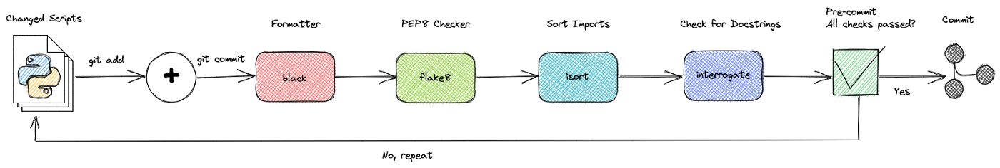
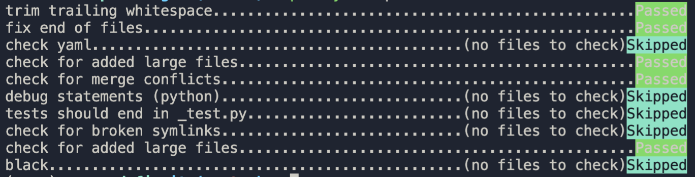

# Complementos para automatizar la revisión y el formateo de código en Python

## Requerimientos previos

- Instalar **Pyenv**
- Instalar **Poetry**

## Motivación

Al enviar su código de Python a Git, debe asegurarse de que su código:

- Se ve bien
- Es organizado
- Se ajusta a la guía de estilo PEP 8
- Incluye cadenas de documentación

Sin embargo, puede ser abrumador verificar todos estos criterios antes de enviar su código. ¿No sería bueno si pudiera verificar y formatear automáticamente su código cada vez que envíe un nuevo código como se muestra a continuación?

Ahí es cuando el compromiso previo (pre-commit) es útil.

## ¿Qué es la confirmación previa?

**[pre-commit](https://pre-commit.com/)** es un marco que le permite identificar problemas simples en su código antes de confirmarlo.

Puede agregar diferentes complementos a su canalización previa a la confirmación. Una vez que sus archivos estén confirmados, estos complementos los verificarán. A menos que pasen todas las comprobaciones, no se confirmará ningún código.



## Instalar pre-commit

Activar entorno virtual e instalar depenencias usando poetry

```zsh
# Activamos entorno virtual
$> source venv/bin/activate

# Desactivamos entorno virtual
$> deactivate

# Instalar pre-commit en los paquete para desarrollo (parámetro -D)
$> poetry add -D pre-commit

# Instalará el gancho (hook) en su repositorio git local
$> poetry run pre-commit install

# Ahora necesitas configurarlo. Esto le dará una configuración básica
$> poetry run pre-commit sample-config > .pre-commit-config.yaml

# Actualizar pre-commit y hooks
$> poetry run pre-commit autoupdate
```

Ahora vamos adicionar unos cambios el fichero `.pre-commit-config.yaml`

```yaml
# See https://pre-commit.com for more information
# See https://pre-commit.com/hooks.html for more hooks
# Apply to all files without commiting:
#   poetry run pre-commit run --all-files
# Update this file:
#   poetry run pre-commit autoupdate
repos:
- repo: https://github.com/pre-commit/pre-commit-hooks
  rev: v4.1.0
  hooks:
    - id: trailing-whitespace
    - id: check-ast
    - id: debug-statements
    - id: end-of-file-fixer
    - id: check-yaml
    - id: check-added-large-files
      args: ['--maxkb=2000']
    - id: check-merge-conflict
    - id: debug-statements
    - id: name-tests-test
    - id: check-symlinks
    - id: detect-aws-credentials
    - id: detect-private-key
    - id: check-toml
    - id: check-json
    - id: check-yaml
    - id: end-of-file-fixer
```

### Saltar verificación

Para evitar que la confirmación previa verifique una confirmación determinada, agrega `--no-verify` a git commit:

```zsh
$> git commit -m 'agregar ejemplos previos a la confirmación' --no-verify
```

Ahora agreguemos algunos complementos útiles a nuestra canalización previa a la confirmación.

## Instalar black

[Black](https://github.com/psf/black) es un formateador de código que debería ser obligatorio para todos los proyectos de Python. Hay complementos para muchos editores e IDE, por lo que debe instalarlo para que vuelva a formatear el código cada vez que guarde el archivo. Olvídese de pensar si necesita usar comillas simples o dobles, longitud de líneas, etc. Escriba el código de Python tan feo como pueda y Black se hará cargo.

```zsh
# Instalar pal
$> poetry add -D black
```

Adicionar configuración al fichero `.pre-commit-config.yaml`

```zsh
$> cat >> .pre-commit-config.yaml << EOF
- repo: https://github.com/psf/black
  rev: stable
  hooks:
    - id: black
      language_version: python3.9
EOF
```

> **NOTA**
>
> **`cat`**: Deriva su nombre de la palabra concatenar y te permite crear, fusionar o imprimir archivos en la pantalla de salida estándar o en otro archivo y mucho más.
>
> **`>>`**: agrega el archivo existente o crea un archivo si el archivo del nombre mencionado no está presente en el directorio.
>
> **`<<`** se conoce como estructura de documento aquí. Le hace saber al programa cuál será el texto final, y cada vez que se vea ese delimitador, el programa leerá todas las cosas que le ha dado al programa como entrada y realizará una tarea sobre él.
>
> **`<< EOF ... EOF`**: Pasar una cadena de varias líneas a un archivo.

Adicionar al fichero `pyproject.toml`

```toml
[tool.black]
line_length = 88
```

**Probemos:**

```zsh
# Usando pre-commit (se ejecuta en todos los archivos que aún está preparado (staged))
$> poetry run pre-commit run --all-files

# Usando black
$> poetry run black src
```

Si hay algún error, eso podría significar que Black tuvo que formatear algunos archivos. Ejecutar de nuevo y comprobar de nuevo. Debe terminar limpio.



## Instalar Flake 8

Ya contamos con Black para embellecer nuestro código. Eso no es suficiente para cumplir con PEP8. Entonces, para asegurarnos de que lo hagamos, usaremos flake8. Pero también instalaremos Bugbear, un complemento que contiene algunas advertencias útiles:

```zsh
# Instalar flake8
$> poetry add -D flake8 flake8-bugbear
```

Necesitamos agregar alguna configuración para omitir algunos archivos. Además, ignoraremos el límite PEP8 de longitud de las líneas y nos ceñiremos a la recomendación de Black de usar la advertencia B950 de Bugbear: se activará cuando haya demasiadas líneas de más de 80 caracteres.

```zsh
$> cat > .flake8 << EOF
[flake8]
max-line-length = 88
max-complexity = 10
select = C,E,F,W,B,B950
ignore = E203,E501,W503
import-order-style = google
show-source = true
enable-extensions = G
exclude =
    .tox,
    .git,
    __pycache__,
    *.egg-info,
    .nox,
    .pytest_cache,
    .mypy_cache,
    requirements,
    build,
    dist,
    **tests/fixtures/*,
    **migrations/*,
    venv,
    docs
EOF
```

Tenga en cuenta que también estamos ignorando muchos directorios que harían que flake8 tardara una eternidad en ejecutarse.
Una vez hecho esto, podemos ejecutarlo:

```zsh
$> cat >> .pre-commit-config.yaml << EOF
- repo: https://gitlab.com/pycqa/flake8
  rev: 3.9.2
  hooks:
    - id: flake8
EOF
```

**Probemos:**

```zsh
# Usando pre-commit (se ejecuta en todos los archivos que aún está preparado (staged))
$> poetry run pre-commit run --all-files

# Usando black
$> poetry run flake8 src
```

Script para permitir auto-fix: https://github.com/sciencefreak500/flake8_autofix

## Instalar [isort](https://pycqa.github.io/isort/index.html)

[isort](https://github.com/PyCQA/isort) es una biblioteca de Python que ordena automáticamente las bibliotecas importadas alfabéticamente y las separa en secciones y tipos.

```zsh
# Instalar isort
$> poetry add -D isort
```

Para agregar isort a la canalización previa a la confirmación

```zsh
$> cat >> .pre-commit-config.yaml << EOF
- repo: https://github.com/timothycrosley/isort
  rev: 5.10.1
  hooks:
   - id: isort
EOF
```

Adicinar al fichero `pyproject.toml`

```toml
[tool.isort]
multi_line_output = 3
line_length = 88
include_trailing_comma = true
profile = "black"
known_django = "django"
sections = "FUTURE,STDLIB,DJANGO,THIRDPARTY,FIRSTPARTY,LOCALFOLDER"
skip = [".tox", ".git", "__pycache__", "docs", "requirements", "build", "dist", "**tests/fixtures/*", "**migrations/*", "*.pyc", "*.egg-info", ".cache", ".eggs"]
```

**Probemos:**

```zsh
# Usando pre-commit (se ejecuta en todos los archivos que aún está preparado (staged))
$> poetry run pre-commit run --all-files

# Usando black
$> poetry run isort src/**/*.py
```

## Instalar [interrogate](https://waylonwalker.com/interrogate/)

[interrogar](https://interrogate.readthedocs.io/en/latest/index.html?highlight=pre-commit) verifica su base de código en busca de cadenas de documentación faltantes.

```zsh
# Instalar interrogate
$> poetry add -D interrogate
```

Para agregar **interrogate** a la canalización previa a la confirmación

```zsh
$> cat >> .pre-commit-config.yaml << EOF
- repo: https://github.com/econchick/interrogate
  rev: 1.5.0
  hooks:
   - id: interrogate
     args: [-c, 'pyproject.toml']
EOF
```

Adicionar al fichero `pyproject.toml`

```toml
[tool.interrogate]
ignore-init-method = true
ignore-init-module = true
ignore-magic = false
ignore-semiprivate = false
ignore-private = false
ignore-property-decorators = false
ignore-module = true
ignore-nested-functions = false
ignore-nested-classes = true
ignore-setters = false
fail-under = 80
exclude = ["setup.py", "docs", "build", "sphinx", "mkdocs"]
ignore-regex = ["^get$", "^mock_.*", ".*BaseClass.*"]
# possible values: 0 (minimal output), 1 (-v), 2 (-vv)
verbose = 2
quiet = false
whitelist-regex = []
color = true
omit-covered-files = false
generate-badge = "."
badge-format = "svg"
```

**Probemos:**

```zsh
# Usando pre-commit (se ejecuta en todos los archivos que aún está preparado (staged))
$> poetry run pre-commit run --all-files

# Usando interrogate
$> poetry run interrogate -c pyproject.toml
```

## Instalar [bandit](https://buildmedia.readthedocs.org/media/pdf/bandit/latest/bandit.pdf)

Bandit es una herramienta diseñada para encontrar problemas de seguridad comunes en el código de Python. Para hacer esto, Bandit procesa cada archivo, crea un AST a partir de él y ejecuta los complementos apropiados en los nodos AST. Una vez que Bandit ha terminado de escanear todos los archivos, genera un informe.

```zsh
# Instalar interrogate
$> poetry add -D bandit
```

Para agregar **bandit** a la canalización previa a la confirmación

```zsh
$> cat >> .pre-commit-config.yaml << EOF
- repo: https://github.com/PyCQA/bandit
  rev: '1.7.4'
  hooks:
    - id: bandit
      args: [-l, --recursive, -x, tests, -c, '.bandit.yaml']
      files: .py$
EOF
```

Adicionar al fichero `.bandit.yaml` en la raíz del proyecto: `touch .bandit.yaml`

```zsh
skips:
### https://github.com/codacy/codacy-bandit/tree/master/src/main/resources/docs/description
### B1xx - Misc tests
- B101  # [assert_used] - Ignore defensive `assert`s (especially useful for mypy) (Severity - Medium)
# - B102  # [exec_used] - The Python docs succinctly describe why the use of exec is risky. (Severity - High)
# - B103  # [set_bad_file_permissions] - Test looks for the use of chmod and will alert when it is used to set particularly permissive control flags. (Severity - High)
# - B104  # [hardcoded_bind_all_interfaces] - Test looks for a string pattern “0.0.0.0” that may indicate a hardcoded binding to all network interfaces. (Severity - Medium)
# - B105  # [hardcoded_password_string] - The use of hard-coded passwords increases the possibility of password guessing tremendously. (Severity - High)
# - B106  # [hardcoded_password_funcarg] - It checks that the assigned local variable does not look like a password. (Severity - High)
# - B107  # [hardcoded_password_default] - Test looks for all function definitions that specify a default string literal for some argument. (Severity - High)
# - B108  # [hardcoded_tmp_directory] -  Test looks for strings starting with (configurable) commonly used temporary paths (Severity - Medium)
### B109  # Test for a password based config option not marked secret - THIS PLUGIN HAS BEEN REMOVED.
# - B110  # [try_except_pass] - Errors in Python code bases are typically communicated using Exceptions. (Severity - Medium)
### B111  # Test for the use of rootwrap running as root - THIS PLUGIN HAS BEEN REMOVED.
# - B112  # [try_except_continue] - Test for a continue in the except block (Severity - Medium)
### B2xx - Application/framework misconfiguration
# - B201  # [flask_debug_true] - Test for use of flask app with debug set to true (Severity - Medium)
### B3xx - Blacklists (calls) - https://docs.openstack.org/bandit/1.4.0/blacklists/blacklist_calls.html#blacklist-various-python-calls-known-to-be-dangerous
# - B301  # [pickle] - Pickle library appears to be in use, possible security issue. (Severity - Medium)
# - B302  # [marshal] - Deserialization with the marshal module is possibly dangerous. (Severity - Medium)
# - B303  # [md5] - Use of insecure MD2, MD4, or MD5 hash function. (Severity - Medium)
### B304 - B305 Use of insecure cipher or cipher mode. Replace with a known secure cipher such as AES.
# - B304  # [ciphers] - (Severity - High)
# - B305  # [cipher_modes] - (Severity - Medium)
# - B306  # [mktemp_q] - Use of insecure and deprecated function (mktemp). (Severity - Medium)
# - B307  # [eval] - Use of possibly insecure function - consider using safer ast.literal_eval. (Severity - Medium)
# - B308  # [mark_safe] - Use of mark_safe() may expose cross-site scripting vulnerabilities and should be reviewed. (Severity - Medium)
# - B309  # [httpsconnection] - Use of HTTPSConnection does not provide security, see https://wiki.openstack.org/wiki/OSSN/OSSN-0033 (Severity - Medium)
# - B310  # [urllib_urlopen] - Audit url open for permitted schemes. Allowing use of ‘file:’’ or custom schemes is often unexpected. (Severity - Medium)
# - B311  # [random] - Standard pseudo-random generators are not suitable for security/cryptographic purposes. (Severity - Medium)
# - B312  # Telnet-related functions are being called. Telnet is considered insecure. Use SSH or some other encrypted protocol. (Severity - Medium)
### B313 - 320 Most of this is based off of Christian Heimes’ work on defusedxml: https://pypi.python.org/pypi/defusedxml/#defusedxml-sax
# - B313  # [xml_bad_cElementTree] - (Severity - Medium)
# - B314  # [xml_bad_ElementTree] - (Severity - Medium)
# - B315  # [xml_bad_expatreader] - (Severity - Medium)
# - B316  # [xml_bad_expatbuilder] - (Severity - Medium)
# - B317  # [xml_bad_sax] - (Severity - Medium)
# - B318  # [xml_bad_minidom] - (Severity - Medium)
# - B319  # [xml_bad_pulldom] - (Severity - Medium)
# - B320  # [xml_bad_etree] - (Severity - Medium)
# - B321  # [ftplib] - FTP-related functions are being called. FTP is considered insecure. Use SSH/SFTP/SCP or some other encrypted protocol. (Severity - High)
# - B322  # [input] - The input method in Python 2 will read from standard input, evaluate and run the resulting string as python source code. This is similar, though in many ways worse, then using eval. On Python 2, use raw_input instead, input is safe in Python 3. (Severity - High)
# - B323  # [unverified_context] - By default, Python will create a secure, verified ssl context for use in such classes as HTTPSConnection. However, it still allows using an insecure context via the _create_unverified_context that reverts to the previous behavior that does not validate certificates or perform hostname checks. (Severity - Medium)
# - B324  # [hashlib_new_insecure_functions] -
# - B325  # [tempnam] - Use of os.tempnam() and os.tmpnam() is vulnerable to symlink attacks. Consider using tmpfile() instead. (Severity - Medium)
### B4xx - Blacklists (imports) - https://docs.openstack.org/bandit/latest/blacklists/blacklist_imports.html
# - B401  # [import_telnetlib] - A telnet-related module is being imported. Telnet is considered insecure. Use SSH or some other encrypted protocol. (Severity - High)
# - B402  # [import_ftplib] - A FTP-related module is being imported. FTP is considered insecure. Use SSH/SFTP/SCP or some other encrypted protocol. (Severity - High)
# - B403  # [import_pickle] - Consider possible security implications associated with these modules. (Severity - Low)
- B404  # [import_subprocess] - Consider possible security implications associated with these modules. (Severity - Low)
# - B405  # [import_xml_etree] - Using various methods to parse untrusted XML data is known to be vulnerable to XML attacks. Replace vulnerable imports with the equivalent defusedxml package, or make sure defusedxml.defuse_stdlib() is called. (Severity - Low)
# - B406  # [import_xml_sax] - Using various methods to parse untrusted XML data is known to be vulnerable to XML attacks. Replace vulnerable imports with the equivalent defusedxml package, or make sure defusedxml.defuse_stdlib() is called. (Severity - Low)
# - B407  # [import_xml_expat] - Using various methods to parse untrusted XML data is known to be vulnerable to XML attacks. Replace vulnerable imports with the equivalent defusedxml package, or make sure defusedxml.defuse_stdlib() is called. (Severity - Low)
# - B408  # [import_xml_minidom] - Using various methods to parse untrusted XML data is known to be vulnerable to XML attacks. Replace vulnerable imports with the equivalent defusedxml package, or make sure defusedxml.defuse_stdlib() is called. (Severity - Low)
# - B409  # [import_xml_pulldom] - Using various methods to parse untrusted XML data is known to be vulnerable to XML attacks. Replace vulnerable imports with the equivalent defusedxml package, or make sure defusedxml.defuse_stdlib() is called. (Severity - Low)
# - B410  # [import_lxml] - Using various methods to parse untrusted XML data is known to be vulnerable to XML attacks. Replace vulnerable imports with the equivalent defusedxml package. (Severity - Low)
# - B411  # [import_xmlrpclib] - XMLRPC is particularly dangerous as it is also concerned with communicating data over a network. Use defused.xmlrpc.monkey_patch() function to monkey-patch xmlrpclib and mitigate remote XML attacks. (Severity - High)
# - B412  # [import_httpoxy] - httpoxy is a set of vulnerabilities that affect application code running in CGI, or CGI-like environments. The use of CGI for web applications should be avoided to prevent this class of attack. More details are available at https://httpoxy.org/. (Severity - High)
# - B413  # [import_pycrypto] - pycrypto library is known to have publicly disclosed buffer overflow vulnerability https://github.com/dlitz/pycrypto/issues/176. It is no longer actively maintained and has been deprecated in favor of pyca/cryptography library. (Severity - High)
### 5xx - Cryptography
# - B501  # [request_with_no_cert_validation] - Test for missing certificate validation (Severity - Medium)
# - B502  # [ssl_with_bad_version] - Test for SSL use with bad version used (Severity - Medium)
# - B503  # [ssl_with_bad_defaults] - Test for SSL use with bad defaults specified (Severity - Medium)
# - B504  # [ssl_with_no_version] - Test for SSL use with no version specified (Severity - Medium)
# - B505  # [weak_cryptographic_key] - Test for weak cryptographic key use (Severity - Medium)
# - B506  # [yaml_load] - Test for use of yaml load (Severity - Medium)
# - B507  # [ssh_no_host_key_verification] - Test for missing host key validation (Severity - Medium)
### 6xx - Injection
# - B601  # [paramiko_calls] - Test for shell injection within Paramiko (Severity - Medium)
# - B602  # [subprocess_popen_with_shell_equals_true] - Test for use of popen with shell equals true (Severity - Medium)
- B603  # [subprocess_without_shell_equals_true] - Ignore warnings about calling subprocess. Popen without shell=True (Severity - Medium)
# - B604  # [any_other_function_with_shell_equals_true] - Test for any function with shell equals true (Severity - Medium)
# - B605  # [start_process_with_a_shell] - Test for starting a process with a shell (Severity - Medium)
# - B606  # [start_process_with_no_shell] - Test for starting a process with no shell (Severity - Medium)
- B607  # [start_process_with_partial_path] - Ignore warnings about calling subprocess.Popen without a full path to executable (Severity - Medium)
# - B608  # [hardcoded_sql_expressions] - Test for SQL injection (Severity - High)
# - B609  # [linux_commands_wildcard_injection] - Test for use of wildcard injection (Severity - High)
# - B610  # [django_extra_used] - Potential SQL injection on extra function (Severity - High)
# - B611  # [django_rawsql_used] - Potential SQL injection on RawSQL function (Severity - High)
### B7xx - XSS
# - B701  # [jinja2_autoescape_false] - Test for not auto escaping in jinja2 (Severity - High)
# - B702  # [use_of_mako_templates] - Test for use of mako templates (Severity - High)
# - B703  # [django_mark_safe] - Potential XSS on mark_safe function (Severity - High)
```

**Probemos:**

```zsh
# Usando pre-commit (se ejecuta en todos los archivos que aún está preparado (staged))
$> poetry run pre-commit run --all-files

# Usando bandits
$> poetry run bandit -c .bandit.yaml
```

## Instalar [Pyupgrade](https://github.com/asottile/pyupgrade)

Una herramienta (y gancho de confirmación previa) para actualizar automáticamente la sintaxis para versiones más nuevas del lenguaje.

```zsh
# Instalar Pyupgrade
$> poetry add -D pyupgrade
```

Para agregar **pyupgrade** a la canalización previa a la confirmación

```zsh
$> cat >> .pre-commit-config.yaml << EOF
- repo: https://github.com/asottile/pyupgrade
  rev: 'v2.31.0'
  hooks:
    - id: pyupgrade
      args: [--py36-plus]
EOF
```

**Probemos:**

```zsh
# Usando pre-commit (se ejecuta en todos los archivos que aún está preparado (staged))
$> poetry run pre-commit run --all-files

# Usando bandits
$> poetry run pyupgrade
```

## Instalar [Safety](https://github.com/pyupio/safety-db)

Safety comprueba las dependencias de su proyecto en busca de vulnerabilidades de seguridad conocidas, utilizando una base de datos seleccionada de paquetes de Python inseguros.

```zsh
# Instalar Pyupgrade
$> poetry add -D safety
```

**Probemos:**

```zsh
# Generar requirements.txt desde poetry
$> poetry export -f requirements.txt --output requirements.txt

# Usando safety
$> poetry run safety check -r requirements.txt --cache
```

## Bibliografía

- [Información obtenida de towardsdatascience](https://towardsdatascience.com/4-pre-commit-plugins-to-automate-code-reviewing-and-formatting-in-python-c80c6d2e9f5)
- [Ejemplo de como utilizar isort](https://simpleisbetterthancomplex.com/packages/2016/10/08/isort.html)
- [Información pre-commit](https://docs.djangoproject.com/en/dev/internals/contributing/writing-code/coding-style/)
