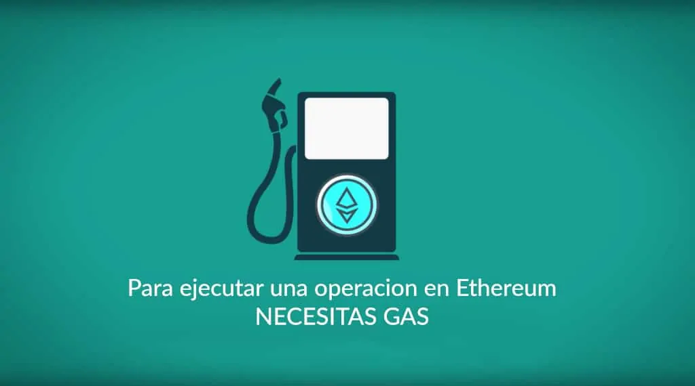
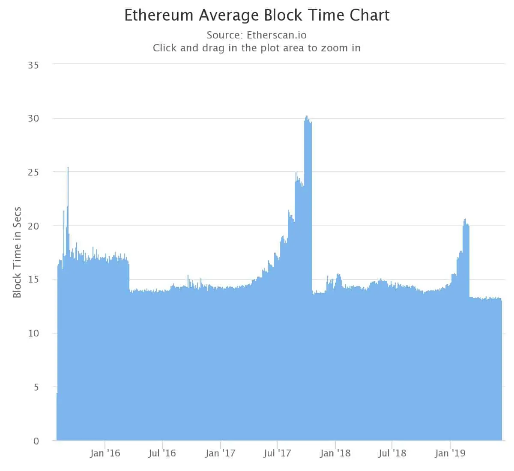
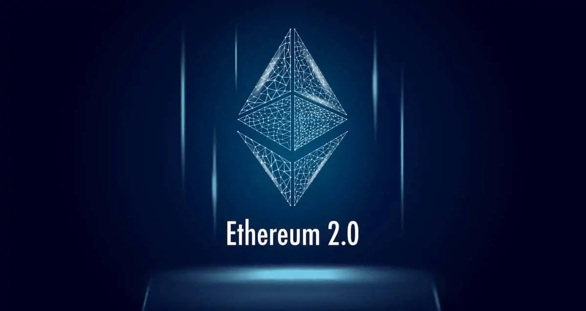
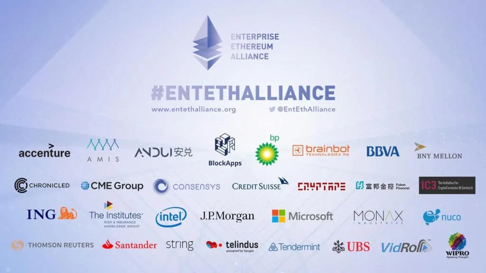

# ¿Qué es Ethereum (ETH)?

**Ethereum es una de las blockchain más importantes del mundo de las criptomonedas y la responsable de muchas de las revolucionarias tecnologías que buscan transformar el mundo tal como lo conocemos.**

## ¿Qué es Ethereum?

La criptomoneda Ethereum, es uno de los proyecto de criptomoneda más grande la industria de las criptomonedas. Ethereum en sí mismo es una plataforma digital que se basa en la tecnología [**blockchain**](https://academy.bit2me.com/que-es-cadena-de-bloques-blockchain/) o cadena de bloques. Su objetivo es convertirse en una blockchain capaz de ejecutar aplicaciones descentralizadas.

Para lograr esto, este proyecto cuenta con una blockchain y una criptomoneda con características únicas. Entre ellas la capacidad de usar y crear [**smart contract**](https://academy.bit2me.com/que-son-los-smart-contracts/) y nuevos [**tokens**](https://academy.bit2me.com/que-es-un-token/). Ambas son poderosas funcionalidades, que permiten que se erija como una de las blockchain más completas y poderosas del criptomundo.

La moneda de la red se denomina **Ether** (ETH), y al igual que [**Bitcoin**](https://academy.bit2me.com/bitcoin-el-origen-de-las-criptomonedas/) (BTC), el Ether se caracteriza por ser una criptomoneda que puede ser usada como método de pago entre pares. Otra de las semejanzas con Bitcoin y otras criptomonedas es que no está controlada por ningún gobierno u organismo regulador. Su desarrollo está marcado por la **Ethereum Foundation**, su Core Team y la comunidad que soporta y apoya. Otro punto importante, es que utiliza el protocolo de consenso [**Proof-of-Work (PoW)**](https://academy.bit2me.com/que-es-proof-of-work-pow/), usando el algoritmo Ethash. Aunque esto puede cambiar en el corto plazo con el lanzamiento de Ethereum 2.0 y el salto a ser una criptomoneda usando el protocolo [**Proof of Stake (PoS)**](https://academy.bit2me.com/que-es-proof-of-stake-pos/).

El desarrollo de esta blockchain comenzó gracias al trabajo de [**Vitalik Buterin**](https://academy.bit2me.com/quien-es-vitalik-buterin/) en el año 2013.

## Características técnicas de Ethereum

### Minería

Ethereum es un criptomoneda que funciona gracias al protocolo de consenso PoW usando el algoritmo **Ethash**. Este algoritmo está diseñado para ser altamente exigente y estar dirigido a la minería por GPU. Por esta razón, la minería fue en principio muy descentralizada y diversa.

Ethash utiliza la función hash Keccak, también conocida como SHA-3. De esta forma, el algoritmo busca utilizar elementos criptográficos altamente seguros. Al mismo tiempo, Ethash está pensado en tener un intensivo uso de memoria y de cache. Ambas características están dirigidas a ofrecer resistencia a la minería por [**ASIC**](https://academy.bit2me.com/que-son-mineros-asic/) y evitar la centralización de la misma.

### Emisión de criptomonedas

Esta criptomoneda de momento cuenta con una emisión anual limitada a 18 millones de Ethers por año. Es decir, cada año la actividad de minería puede generar 18 millones de nuevas monedas como máximo. Sin embargo, la emisión total es infinita. Para lograr la emisión, la red cuenta con un sistema de **[transacciones coinbase](https://academy.bit2me.com/que-es-coinbase-transaccion/)** bastante peculiar. En primer lugar, si un minero encuentra la solución de un bloque este recibe como recompensa 2 ETH. Pero si otro minero encuentra también una solución a ese bloque en ese momento, dicho minero también recibe una recompensa. De esta forma, se emiten las monedas en la blockchain de Ethereum.

La emisión inicial de Ether en la blockchain se relaciono con la preventa que se realizó para impulsar el proyecto. En ese entonces, un total de 60 millones de Ethers fueron creados. De estos, 12 millones fueron utilizados para crear un fondo de desarrollo, este es el comienzo de la conocida [**Fundación Ethereum**](https://ethereum.foundation/).

Sin embargo, Ethereum es una blockchain en constante evolución. Uno de los cambios importantes que se verán en Ethereum en los próximos años será el abandono de PoW para pasar a un sistema de minería PoS. Con este cambio, Ethereum pasará a crear criptomonedas para su blockchain de una forma completamente distinta a la actual, evitando usar mineros e incentivando una mayor participación económica en la blockchain.

### Gas, la base de todo

El [**Gas**](https://academy.bit2me.com/que-es-gas-en-ethereum/) es un concepto muy propio de la red Ethereum. Este es utilizado para medir el trabajo realizado dentro de la blockchain. Cada acción en la blockchain como una operación o un conjunto de operaciones tiene un costo específico que es dado en unidades Gas.

Entre las funciones del Gas dentro de la blockchain podemos mencionar:

1. **Asigna un coste a la ejecución de tareas.** El Gas es utilizado como una unidad para medir el costo de realizar una determinada acción dentro de la blockchain. Cada acción tiene un costo en Gas y un conjunto de acción realizadas suma el costo total de dicha operación. De esa forma, podemos ver al Gas como el precio a pagar por realizar acciones dentro de la blockchain.
2. **Ayuda a mejorar la seguridad del sistema.** Como cada acción tiene un precio, esto ayuda a evitar que la blockchain detenga su funcionamiento y merme su seguridad. Esto es posible gracias a que el Gas ayuda a proteger la red de ataques de spam. Para ello, el gas implica un gasto que evita que se puedan realizar [**ataques DDoS**](https://academy.bit2me.com/que-son-ataques-dos/) de forma sencilla en la red, ataques que pueden dejar sin servicio a millones de usuarios.
3. **Recompensa a los mineros.** Las acciones en la blockchain dependen de su ejecución en el hardware que está en manos de los mineros. Para pagar por este uso existe el Gas.

### Tamaño y tiempo de generación de bloques

Ethereum se caracteriza por calcular el tamaño de sus bloques de una forma un tanto particular. A diferencia de Bitcoin, donde su tamaño se limita a 1 MB, en Ethereum **su tamaño se limita a una cantidad específica de Gas.** Para ser más preciso, el límite de tamaño de los bloques de Ethereum es de 12.500.000 Gas (para Febrero de 2021). Esto significa que cada bloque puede contener un total de operaciones siempre y cuando no sobrepase el limite de Gas especificado.

Por lo general**, un bloque puede contener unas 500 operaciones de pago entre cuentas**, la más sencilla de las operaciones posibles. En el caso de un contrato inteligente, las operaciones de uno de ellos puede llegar fácilmente al limite de Gas de cada bloque.

**Otra diferencia con Bitcoin es el tiempo de generación de bloques.** En Bitcoin, cada bloque se genera cada 10 minutos, mientras que en Ethereum este valor es variable. En principio, cada bloque se generaba aproximadamente cada 16 segundos. Este valor llegó a aumentar hasta los 30 segundos en 2017, y en la actualidad se ubica en promedio en los 14 segundos. Esto significa que generalmente es más rápida en brindar confirmaciones que Bitcoin, lo que repercute positivamente en sus posibilidades como sistema de pago.

### Smart Contracts

Un [**smart contract**](https://academy.bit2me.com/que-son-los-smart-contracts/) o contrato inteligente es un programa informático que ejecuta determinadas acciones preestablecidas en su código bajo ciertas condiciones. Acciones que han sido revisadas y aceptadas por las distintas partes que han “firmado” dicho contrato. De esta manera, el smart contract hace valer sus condiciones programadas presentando una respuesta acorde a sus cláusulas de forma completamente autónoma.

La tecnología de los smart contract es una de las bases fundamentales de Ethereum y el funcionamiento de muchas de sus características. Una situación que se puede apreciar especialmente en los tokens y las DApps de esta blockchain.

### Ethereum Virtual Machine

La **[Ethereum Virtual Machine (EVM)](https://academy.bit2me.com/que-es-ethereum-virtual-machine-evm/)**, es un software cuyo objetivo es servir de **capa de abstracción** en la ejecución de código que está almacenado en la blockchain. Con esto, se busca prevenir que un programador malicioso de una DApp o smart contract pueda atentar contra la seguridad de los [**nodos**](https://academy.bit2me.com/que-es-un-nodo/) de la red y con la red mismo.

Para lograrlo esto, EVM realiza una completa abstracción del sistema manejando el acceso a los recursos de los computadores y limitando sus acciones en un ambiente controlado o máquina virtual. Pero adicional a esto, EVM también busca simplificar el desarrollo y actualización de aplicaciones y características disponibles para las [**DApps**](https://academy.bit2me.com/que-son-las-dapps/). Es decir, EVM fue creada tanto para proteger como para permitir ampliar las funciones de Ethereum de forma sencilla.

EVM permite el funcionamiento de smart contrats y DApps gracias al uso del lenguaje de programación [**Solidity**](https://solidity-es.readthedocs.io/es/latest/). Este lenguaje, permite programar toda la lógica detrás de las DApps y [smart contracts](https://academy.bit2me.com/que-son-los-smart-contracts/) a la vez que permite la ejecución descentralizada de su código utilizando la EVM.

## Ethereum 2.0, el esperado futuro prometido para Ethereum

Ethereum como la mayoría de las blockchain tiene un enorme problema: no puede escalar de forma correcta para atender a los millones de usuarios que tiene su red en este momento. Este problema de arquitectura de su red es algo que sus desarrolladores conocen y buscan desesperadamente solucionar, y dicha solución recibe el nombre de **Ethereum 2.0**.

Ethereum 2.0 es un proyecto que inicio su desarrollo en 2017 con la llegada de Ethereum Metropolis y sus dos actualizaciones Byzantium y Constantinople. En ese momento, comenzó la transformación de Ethereum para buscar dotarle de una mejor capacidad de escalar, disminuir los coste de comisión y controlar la minería de la criptomoneda que ya acusaba de problemas como “las Eras Glaciales”, esos peligrosos momentos en los que la minería de Ethereum sería tan compleja que sería imposible para la red llevarla a cabo.

Los primeros esfuerzos (en 2017) llevaron a los desarrolladores a jugar con opciones como [**Proof of Autorithy (PoA)**](https://academy.bit2me.com/que-es-proof-of-authority-poa/) y Proof of Stake (PoS) sobre el código de Ethereum. Allí nacieron proyectos como [**PoA Newtork**](https://www.poa.network/) y el [**PoC que dio origen a Casper**](https://blog.ethereum.org/2016/12/04/ethereum-research-update/), el protocolo que sería elegido para sustituir a **PoW en Ethereum**, y convertir a Ethereum en una red PoS.

Sin embargo, todo parece apuntar que los objetivos de los devs de Ethereum con Casper son, cuando menos, de una complejidad tan elevada que el lanzamiento de esta nueva actualización se ha retrasado en varias ocasiones, mientras la actual red sufre cada vez más de sus acuciantes limitaciones. De hecho, en 2019 PoA Network estaba en pleno funcionamiento y el tan prometido Ethereum 2.0, aún no salía. Esta situación fue aprovechada por la competencia, que ahora presenta soluciones más trabajadas y funcionales en la actualidad, como el caso de [**Polygon**](https://academy.bit2me.com/que-es-polygon-matic/), [**RSK**](https://academy.bit2me.com/que-es-rootstock-rsk/) y Binance Smart Chain.

### El inicio del cambio

Pero no todo es malo, en 2020 finalmente los devs de Ethereum dan el primer paso activando la Beacon Chain, el primer paso a Ethereum 2.0, activando de forma lateral esta red y creando la estructura básica para su funcionamiento. Sin embargo, el lanzamiento oficial de la Phase 1 de Ethereum 2.0 no tendrá lugar sino hasta el primer semestre de 2022 (según los últimos datos de los devs), cuando las funciones de la red se consideren estables. Entre esas funciones están:

1. Protocolo Casper probado junto a todo el sistema económico y de staking que brindará seguridad a la red. Esto llevará al abandono de PoW y la minería, para cambiarlo por PoS y sus sistema de apuestas en la red.
2. La llegada de las estructuras básicas de [**Sharding**](https://academy.bit2me.com/que-es-sharding/) a la red, para acelerar de forma significativa la capacidad de la red hasta las 1000 transacciones por segundo. Esta es la mejora más esperada de Ethereum 2.0, aunque llega un poco tarde considerando que ya hay redes con esa capacidad y más, funcionando en la actualidad (como [**FLOW**](https://academy.bit2me.com/que-es-flow/) o **Polygon**).
3. La construcción de las bases para la paralelización de la EVM, una capacidad que no estará lista sino hasta el lanzamiento de la Phase 2 de Ethereum 2.0, aún con fecha desconocida.
4. La unión de ETH1 y ETH2 en una misma blockchain, y no como dos redes separadas tal como pasa ahora.

En todo caso, tras seis años de desarrollo Ethereum 2.0, aún es el sueño esperado por muchos en la comunidad y aunque la tecnología que planea desplegar es inmensa, sus usuarios y comunidad deberán seguir esperando a que dicho sueño se haga realidad.

## Usos de Ethereum

Ethereum es una de las criptomonedas y blockchain con mayor variedad de usos que existen en la actualidad, entre ellos podemos destacar:

### Aceptar y recibir pagos de forma rápida y segura

Una de las grandes características desde su creación ha sido su capacidad de manejar pago de forma mucho más rápida que Bitcoin. Esto se debe al corto periodo de producción de bloques que oscila entre 10 y 30 segundos y la escalabilidad de la blockchain.

### Realización de ICO

Si bien la creación de tokens e [**ICOs**](https://academy.bit2me.com/ico-criptomonedas/) no fue iniciado por Ethereum, sino por las llamadas [**colored coins**](https://es.wikipedia.org/wiki/Moneda_coloreada), lo cierto es que este proyecto ofreció herramientas para facilitar este trabajo en sobremanera. Con la creación del [**token ERC-20,**](https://academy.bit2me.com/que-es-erc-20-token/) Ethereum pasó a convertirse en el **“Padre de las ICO”** y con razones para ello. Con la creación de [ERC-20](https://academy.bit2me.com/que-es-erc-20-token/), crear un token dejaba de ser una tarea altamente compleja.

En la actualidad basta con realizar un smart contract siguiendo el modelo del token ERC-20 y tenías el trabajo hecho. Esto dio un importante impulso a la blockchain y permitió la diversificación del mercado de las criptomonedas abriendo nuevas posibilidades.

De hecho, en la actualidad existen al menos 191.000 tokens ERC-20 creados, cada uno de ellos con características únicas ejecutándose sobre su blockchain.

### Smarts contracts y DApps

Los smart contracts y las [**DApps**](https://academy.bit2me.com/que-son-las-dapps/) son de los usos más grandes que tiene Ethereum. Las capacidades de estas dos herramientas son prácticamente infinitas. Desde la creación de smart contract para comprar-venta o negociación de bienes o servicios, su utilidad solo es limitada por la imaginación. Por otro lado, las DApps son toda una revolución. Estas son capaces de crear aplicaciones completamente descentralizadas, no censurables, seguras y económicamente autosustentables. También podemos mencionar las plataformas de [**oráculos**](https://academy.bit2me.com/que-es-oraculos-blockchain/) que son construidas sobre esta red, como el caso de [**Augur**](https://www.augur.net/).

## Empresas que usan Ethereum

Las capacidades de Ethereum para usar smart contracts, construir tokens de forma sencilla y desplegar DApps ha capturado la atención de muchas empresas a nivel mundial. Esto ha significado que el desarrollo de Ethereum ha tenido el apoyo directo o indirecto de un amplio grupo empresarial interesado en desarrollar su tecnología. Todo este conjunto de empresas han creado la llamada [**Ethereum Enterprise Alliance (EEA)**](https://entethalliance.org/) la cual cuenta con más de 100 miembros. Entre ellos destacan

- Accenture, una empresa dedicada servicios tecnológicos y consultoría.
- AMD, empresa líder en el desarrollo de chipset, CPU y tarjetas gráficas.
- BBVA, banco español con presencia a nivel mundial.
- Banco Santander, otro banco español con presencia a nivel mundial.
- BP Ventures, el brazo de inversión de la petrolera BP.
- Cisco, la empresa de redes más grande del mundo.
- Delloite, una de las empresas de servicios de auditoría, consultoría financiera y jurídica más grande del mundo.
- GoChain, una de las compañías más importantes en el desarrollo de DApps.
- Hyperledger, el mayor proyecto de desarrollo blockchain empresarial y open source del mundo.
- JP Morgan, una de las más grandes firmas financieras del mundo.
- Microsoft, la empresa de tecnología y desarrollo de software más grande del mundo y responsable del desarrollo de Windows.
- VMWare, la empresa más importante en el desarrollo de maquinas virtuales y soluciones de integración de entornos virtuales.

## Ventajas de Ethereum

1. Es una blockchain multipropósito gracias a su capacidad para integrar y utilizar smart contacts.
2. El uso y desarrollo de EVM confiere un alto nivel de seguridad para ejecutar smart contracts y DApps de forma completamente descentralizada y segura.
3. Cuenta con una rápida producción de bloques lo que le permite tener una velocidad de confirmación de transacciones mucho más rápida que Bitcoin y otras criptomonedas.
4. El desarrollo no es controlado por ninguna autoridad central, su Core de desarrollo es completamente descentralizado y las decisiones se toman en consenso. Además la comunidad tiene un alto impacto en las decisiones sobre el desarrollo de la blockchain.

## Enlaces de interés

**WEB OFICIAL**

[Ir a la web oficial](https://ethereum.org/)

**WHITE PAPER ETHEREUM**

[Ir al white paper](https://academy.bit2me.com/wp-content/uploads/2021/05/ETH-WHITEPAPER.pdf)

**TWITTER OFICIAL**

[Ir a la cuenta oficial de Twitter](https://twitter.com/ethereum)

**GITHUB OFICIAL**

[Ir al GitHub](https://github.com/ethereum)

**FACEBOOK OFICIAL**

[Ir al Facebook oficial](https://www.facebook.com/ethereumproject/)

**HILO DE REDDIT**

[Ir al hilo oficial de Reddit](https://www.reddit.com/r/ethereum/)

**HILO BITCOINTALK**

[Ir al hilo oficial en Bitcointalk](https://bitcointalk.org/index.php?topic=428589.0)

**BLOCK EXPLORER**

[Ir al explorador de bloques](https://etherscan.io/)

## ¿Qué es el Gas en Ethereum?

**Conoce lo que es el Gas, una unidad de medida utilizada para medir el trabajo realizado por Ethereum para realizar transacciones o cualquier interacción dentro de la red.**

Uno de los conceptos más importantes en el mundo de [**Ethereum**](https://academy.bit2me.com/que-es-ethereum-eth-criptomoneda/) es el **Gas**. Una palabra que seguramente muchos habrán visto en sus transacciones en Ethereum o la interacción de [**Smart Contracts**](https://academy.bit2me.com/que-son-los-smart-contracts/) y seguramente se han preguntado ¿Qué es el Gas? Pues bien, para responder rápidamente esa pregunta, desde Bit2Me Academy te lo podemos definir de la siguiente forma:

> **El Gas en Ethereum es una unidad de medida utilizada para medir el trabajo realizado por Ethereum para realizar transacciones o cualquier interacción dentro de la red.**

Sí, así de sencillo, es el concepto de Gas. Pero no te dejes engañar, este sencillo concepto esconde mucho más tras de sí, y es que el Gas es esencial para todo dentro de Ethereum, y su impacto en este ecosistema es inmenso.

Es por ello que teniendo en cuenta la importancia de este concepto, hemos creado una pequeña guía que te ayudará a entender todo lo que debes saber sobre el Gas y su papel dentro de la [**blockchain**](https://academy.bit2me.com/que-es-cadena-de-bloques-blockchain/) Ethereum.

### Una analogía para comprender qué es el Gas en Ethereum

Una forma sencilla ver que es el Gas en Ethereum sería la siguiente analogía:

Quieres viajar con tu familia de Madrid a Barcelona, el viaje lo harás en tu coche. En este punto, sabes de antemano que son 500 km de distancia y que tu coche gasta 1 litro de gasolina cada 10 km (para hacer simple el cálculo), así que necesitarás 50 litros de gasolina para llegar a destino. Además, también sabes que el litro de gasolina cuesta entre 1 € y 1,5 € dependiendo de la gasolinera donde te detengas a repostar.

Esto es lo mismo que pasa en Ethereum. Por un lado, cada tarea en Ethereum tiene un coste específico y no variable estipulado en Gas, lo que es equivalente al litro de gasolina que gasta tu auto por cada 10 Km. Por supuesto, las operaciones en Ethereum están formadas por distintas funciones más pequeñas, cada una de ellas con un valor de Gas (o consumo de gasolina) específico y su sumatoria es lo que nos dirá el valor final en Gas de dicha operación (el total de gasolina a gastar para hacer nuestro viaje). Así solo nos queda una cosa ¿Cuánto pagaremos por ese Gas para poder llevar a cabo la operación en Ethereum?

En nuestra analogía la gasolina varía entre 1 y 1,5 €, puedes escoger donde repostar y pagar lo menos posible para adquirir los 50 litros de gasolina que necesitas para tu viaje. Lo mismo pasa en Ethereum, el Gas tiene un precio en ether que es dado por la demanda y oferta de operaciones en Ethereum. Es decir, el precio del Gas en ether es variable, aunque en este caso tu puedes elegir el valor que vas a pagar por ese Gas, y si un minero está de acuerdo con ese valor, tomará tu transacción y la ejecutará.

Cómo puedes ver, el concepto de Gas es algo muy poderoso y útil dentro de Ethereum, y examinaremos más a fondo el porqué de esta grandiosa relación.

### **Gas, una forma única de medir el poder de cómputo en Ethereum**

Las blockchain o cadena de bloques que usan el protocolo de [**Prueba de Trabajo (Proof of Work – PoW)**](https://academy.bit2me.com/que-es-proof-of-work-pow/), funcionan todas bajo una misma premisa:

Para que puedas realizar una transacción que sea aceptada e incluida en la blockchain, se ha de pagar una comisión para que los mineros tomen tu transacción y la incluya en un bloque. Una vez allí, dicha transacción será validada por la red, y entonces, se ejecutarán las órdenes que están en la transacción, solo así podrás decir que ha sido aceptada y confirmada.

Una forma sencilla de ver PoW, pero es una idea correcta. Esto significa que para obtener acceso a una red blockchain siempre debemos pagar un pequeño precio. Generalmente este pago se realiza en unidades decimales de la moneda que funciona en la blockchain.

Este sería el caso de Bitcoin, donde las transacciones se pagan en [**satoshis**](https://academy.bit2me.com/que-es-un-satoshi/), la unidad decimal más pequeña de Bitcoin. El objetivo de esto ese sencillo y lo pasamos a resumir en la siguiente lista:

1. Asignar un costo a cualquier tarea que se ejecute en la red. Esto mantiene los incentivos de funcionamiento de la red, una tarea que depende de los mineros.
2. Mantiene la seguridad del sistema al evitar acceso a los recursos de forma indiscriminada. Debido a que todo tiene un costo, un hacker por ejemplo, no podría dedicarse a enviar spam o realizar un [**DDoS** ](https://academy.bit2me.com/que-son-ataques-dos/)sobre la red, porque este le resultaría excesivamente caro.

Si esto aplica para Bitcoin pregúntate ¿No aplicará lo mismo para Ethereum? La respuesta es sí, en Ethereum pasa lo mismo, solo que sus creadores han buscado un enfoque distinto a este problema. La decisión de crear este mecanismo llamado **“Gas”,** responde a que Ethereum es mucho más que una simple criptomoneda. De hecho, la red de Ethereum como un todo, funciona de forma análoga a un ordenador, un ordenador a la que se le conoce como la **“Ordenador Blockchain”**.

### ¿Por qué se creó el Gas?

Siguiendo con lo anterior, debes saber que en Ethereum cada transacción es un “pequeño programa”. Este programa le da instrucciones a la [**Ethereum Virtual Machine (EVM)**](https://academy.bit2me.com/que-es-ethereum-virtual-machine-evm/), para que luego esta máquina los interprete como una acción o serie de acciones a realizar. En este punto, Ethereum y su EVM son iguales en funcionamiento a Bitcoin y [**Bitcoin Script**](https://academy.bit2me.com/que-es-bitcoin-script/). Lo que realmente las diferencia es que Ethereum ofrece una flexibilidad mucho mayor a Bitcoin.

Sin embargo, **en Ethereum los desarrolladores decidieron asignar valores constantes a las diferentes operaciones que se pueden realizar en Ethereum.** De esta forma, cada tarea en Ethereum tiene un valor de Gas estipulado, que no cambia y no es alterado por la subida o bajada en el valor del ether, la moneda nativa de Ethereum.

El hecho de que ese valor del Gas sea constante responde a que, **si bien el precio del ether es volátil, el costo computacional de las operaciones siempre permanece constante**. Es por ello que, con la creación del Gas, los desarrolladores de Ethereum pueden diferenciar entonces entre lo que el coste computacional y el valor real de dichas operaciones en un momento dado. De hecho, este sistema ayuda a que Ethereum y su red se mantenga usable en todo momento, sin importar las subidas o bajas del ether.

Así por ejemplo, si un smart contract tiene una función para **“Consultar saldo de una dirección”**, esta acción en la red puede tener el valor de 1000 Gas, y siempre tendrá ese valor. Esto significa que para realizar dicha acción en Ethereum, se ha de pagar una pequeña comisión (en ether) correspondiente a la cantidad de Gas utilizado para poder realizar dicha acción en la blockchain.

Lo anterior genera tres cosas que son importantes y vitales dentro de Ethereum, y que explicamos a continuación:

1. **Unidad de Gas**. La Unidad de Gas es la cantidad de Gas que se puede atribuir a una instrucción en específico, pero no tiene ningún valor monetario.
2. **Precio de Gas**. El Precio de Gas por su parte es el pago de comisión que hacemos por cada Unidad de Gas. Es un precio que elegimos pagar por cada unidad y lo hacemos usando unidades decimales de Ether, los llamados Gwei. Esta comisión es la que te permite tener prioridad de atención. Si pagas más por cada Unidad de Gas que uses, más rápido los mineros tomarán tu transacción y la llevarán a un bloque.
3. **Limite de Gas**. Este es un valor que indica la cantidad máxima de Unidades de Gas que la red Ethereum puede manejar en un momento dado. Es su límite máximo, y es un punto que los mineros no pueden sobrepasar en ningún momento.

Como ves es bastante más complejo a lo que pasa en Bitcoin u otras criptomonedas derivadas, y la razón para esto es; que en Ethereum, la EVM está limitada a manejar una determinada cantidad de información. Así que para manejar ese límite de información, se ha creado esta medida de trabajo para controlar la cantidad de trabajo computacional que la red puede realizar al mismo tiempo.

### Curiosidades del Gas en Ethereum

#### ¿De cuánto es el límite de Gas?

El Límite de Gas (Gas Limit) depende de si nos referimos a una transacción, a una operación con [smart contracts](https://academy.bit2me.com/que-son-los-smart-contracts/) o un bloque. Así tenemos los siguientes límites:

1. **El Gas Limit de una transacción es de unas 21.000 unidades de Gas**. Esto significa que ninguna transacción sencilla dentro de Ethereum consumirá jamás más de esta cantidad de Gas.
2. **Por su parte, el Gas Limit de un smart contract es mucho mayor y es variable**. Esto se debe a que estos smart contracts pueden tener más o menos complejidad en sus interacciones y ello suma un mayor nivel de Gas. Normalmente este límite suele estar entre los 130 y 145 mil Unidades de Gas.
3. **Por último tenemos el Gas Limit de un bloque, el cual está establecido a no superar los 8 millones de Unidades de Gas.** Esto significa que los mineros pueden incluir tantas transacciones e interacciones con smart contracts como les sea posible, siempre y cuando no supere ese límite.

Este último límite es interesante porque permite hacer frente al **“halting problem”.** Este es un problema de computación que nos permite saber si un programa de computación se ejecutará en un bucle infinito con solo tener a la mano la entrada de datos y su programación. Esta situación plantearía un serio problema en la blockchain que podría llevar a una Denegación de Servicios (DoS). Sin embargo, debido a que Ethereum impone un Gas Limit por bloque, esto significa que ninguna operación en Ethereum por compleja que sea podrá exceder jamás dicho límite.

#### ¿Cómo cobran los mineros su trabajo?

Como ya hemos mencionado el Gas no tiene ningún valor económico, ni es un token dentro de Ethereum, es solo una unidad de medida. Se trata de una unidad importante para poder establecer el valor de la transacciones. Esto gracias a que cada Unidad de Gas tiene un precio en Gwei (decimales de Ether). Así que, por una transacción que consuma una determinada cantidad de Gas, debes pagar una determinada cantidad de ether para que pueda ser procesada.

Por ejemplo, si tenemos una operación “Pagar a María” con un coste de 12.000 Unidades de Gas, y el coste de la Unidad de Gas es de 20 Gwei, tenemos que:

> **Costo TX en Gwei = 12.000 \* 20 = 240.000 Gwei**
>
> **Cost TX en Ether = 240.000 Gwei \* 0.00000001 = 0.0024 Ether ~ 0,54 $ / 0,48 €**

Ahora ya sabes cómo se cobran las comisiones dentro de Ethereum. Como ves esto también tiene un impacto en la recompensa de bloque. En la actualidad, la recompensa de bloque de Ethereum es 2 Ether por bloque, el cual se mina cada 15 segundos de media.

Así que cada bloque generado tiene una recompensa fija de 2 Ether. Mientras que el resto de la recompensa viene dada por las comisiones cobradas por el minero siguiendo el ejemplo arriba mostrado. Por supuesto, el valor de gas de las transacciones se adapta a cada caso. Debido a ello, no es lo mismo una transacción sencilla (consume poco Gas), a un smart contract avanzado con varios acciones descritas (consumo mucho Gas).

De hecho, en estos últimos, el Gas y la cantidad que pueden usar está determinada por la complejidad de las instrucciones que pueden usar en la EVM.
## Bibliografía

- https://academy.bit2me.com/que-es-ethereum-eth-criptomoneda/
- https://academy.bit2me.com/que-es-gas-en-ethereum/
- https://www.xataka.com/criptomonedas/staking-gran-alternativa-futuro-a-mineria-criptodivisas-recuerda-mucho-a-viejas-cuentas-corrientes
