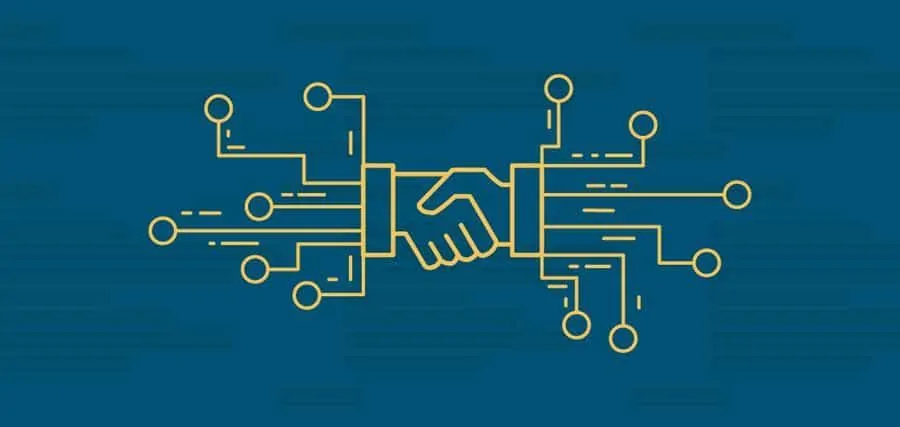
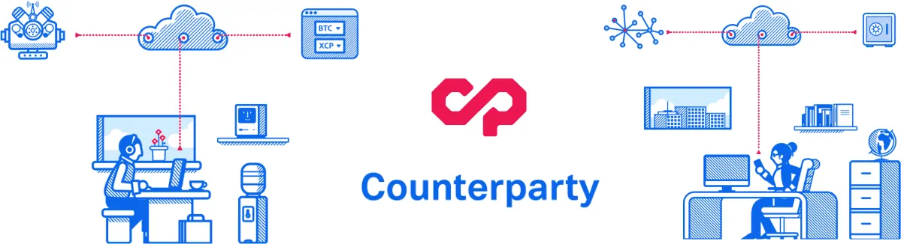
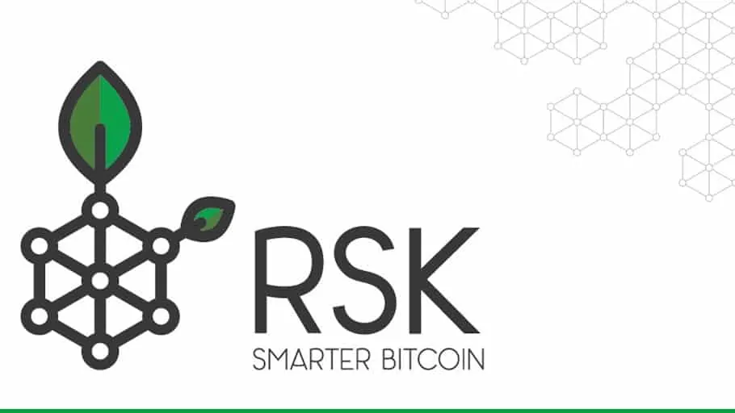
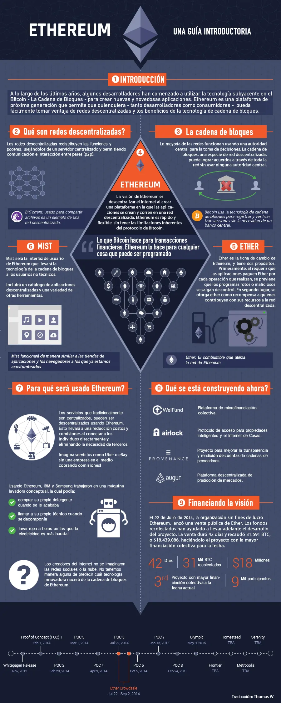

# Smart Contracts: ¿Qué son, cómo funcionan y qué aportan?

**Un smart contract es un tipo especial de instrucciones que es almacenada en la blockchain. Y que además tiene la capacidad de autoejecutar acciones de acuerdo a una serie de parámetros ya programados. Todo esto de forma inmutable, transparente y completamente segura.**

En estos últimos años, tras la creación de [**Bitcoin**](https://academy.bit2me.com/bitcoin-el-origen-de-las-criptomonedas/) y el lanzamiento de su primera versión en 2009, han sido muchos los proyectos interesantes que han ido apareciendo aportando nuevas ideas y soluciones descentralizadas a muchos de los procesos o aplicaciones centralizadas que todos usamos en la actualidad. En ese caso déjanos preguntarte: **¿te suenan los smart contracts?**

Pues bien, esta vez hablaremos en profundidad de estos mecanismos. Y es que los smart contracts **tienen como objetivo eliminar intermediarios para simplificar procesos y, con ello, ahorrar costes al consumidor.** La mayor parte de la información relacionada con los smart contracts tan solo está disponible en inglés. Es por ello que, desde Bit2Me y tras un primer capítulo en nuestra guía dedicado a hacer una introducción a los smart contracts, no queremos que te quedes con dudas, sin entender en totalidad el concepto de qué son los contratos inteligentes y cuál es su potencial.

Es por ello que hablaremos del origen de los smart contracts. Posteriormente analizaremos la situación actual y en tercer lugar presentaremos algunos de los proyectos alternativos a Bitcoin más importantes. Y finalmente describiremos cuál es el futuro de esta tecnología.

## ¿Qué es un smart contract?

Para entender un smart contract, primero hemos de recordar qué significa un contrato. **Un contrato no es más que un acuerdo entre dos o más partes, un entorno donde se define lo que se puede hacer, cómo se puede hacer, qué pasa si algo no se hace**. Es decir, unas reglas de juego que permiten a todas las partes que lo aceptan entender en qué va a consistir la interacción que van a realizar.

Hasta ahora los contratos han sido documentos verbales o caros documentos escritos. Estos documentos están sujetos a las leyes y jurisdicciones territoriales, y en ocasiones requieren de notarios. Es decir, más costes, tiempo y terceros que intervienen en el proceso. Debido a ello, no son accesibles para cualquier persona. Y esto no es lo peor: los contenidos de los contratos pueden estar sujetos a la interpretación. ¡Agárrate!

En cambio un contrato inteligente es capaz de ejecutarse y hacerse cumplir por sí mismo, de manera autónoma y automática, sin intermediarios ni mediadores. Evitan el lastre de la interpretación al no ser verbal o escrito en los lenguajes que hablamos. **Los smart contracts se tratan de “scripts” (códigos informáticos) escritos con lenguajes de programación. Esto quiere decir que los términos del contrato son puras sentencias y comandos en el código que lo forma.**

Por otro lado, un smart contract puede ser creado y llamado por personas físicas y/o jurídicas. Pero también por máquinas u otros programas que funcionan de manera autónoma. Un smart contract tiene validez sin depender de autoridades. Esto se debe a su naturaleza: **es un código visible por todos y que no se puede cambiar al existir sobre la tecnología blockchain**. Esto le confiere un carácter descentralizado, inmutable y transparente.

### Los smarts contracts y su enorme potencial

Con lo anterior, seguramente has podido ver el enorme potencial que encierran estos smarts contracts. Es importante destacar que, al estar distribuido por miles de ordenadores, se evita que una gran compañía los custodie, lo que elimina burocracia, censuras y los grandes costes / tiempos implícitos de este proceso que, dicho sea de paso, hasta ahora es el custodio.

Si juntamos los principios de un smart contract con la creatividad de muchos desarrolladores del planeta, el resultado son posibilidades jamás vistas, accesibles para todos y a costes que rozan la gratuidad. Ecosistemas sin figuras autoritarias que someten a su voluntad a sus integrantes. Hablamos de un mundo más justo.

Imagina un coche Tesla autoconducido, comprado en grupo, capaz de autogestionarse y alquilarse por sí solo. Todo ello sin una compañía tipo Uber detrás llevándose el 10 %. De esa podemos decir: b**ienvenido al mundo de los contratos inteligentes.**

## Los primeros contratos inteligentes

La primera vez que se tiene constancia de forma pública sobre los smart contracts es a través de [**Nick Szabo**](https://academy.bit2me.com/quien-es-nick-szabo/), jurista y criptógrafo Nick Szabo que **[mencionó públicamente](https://web.archive.org/web/20160417212209/https://szabo.best.vwh.net/smart_contracts_glossary.html)** el término en un documento en 1995. Dos años después, en 1997, desarrolló **[un documento mucho más detallado](https://ojphi.org/ojs/index.php/fm/article/view/548/469)** explicando los Smart Contracts.

Lamentablemente, pese a definir la teoría, era imposible hacerla realidad con la infraestructura tecnológica existente. Para que los contratos inteligentes se puedan ejecutar, es necesario que existan las transacciones programables y un sistema financiero que las reconozca, digitalmente nativo.

Precisamente, lo que Szabo definía como inexistente en 1995, en 2009 (casi 15 años después) se haría realidad con la aparición de Bitcoin y su tecnología, **[la cadena de bloques (\*blockchain\*)](https://academy.bit2me.com/que-es-cadena-de-bloques-blockchain/)**.

## Bitcoin y los smart contracts

Bitcoin tiene algunos *smart contracts* ya creados que se ejecutan por defecto y de manera transparente al usuario. Cuando hablamos de contratos de distribución, nos referimos a uno de los casos de uso de Bitcoin para formar acuerdos entre personas a través de la *blockchain*. Y es que Bitcoin, entre todas sus ventajas, permite añadir lógica al dinero, algo único de este tipo de dinero: es **dinero programable**. Esta lógica aplicada al dinero nos permite resolver problemas comunes que podemos encontrarnos en la actualidad, pero aumentando el nivel de confianza a lo largo de todo el proceso automatizado en el que se desarrolla la interacción.

### Algunos ejemplos de smarts contracts en Bitcoin

Ejemplificando, podrían desarrollarse nuevos productos o aplicaciones como por ejemplo:

- Mercados distribuidos que permitieran implementar contratos [**P2P**](https://academy.bit2me.com/que-es-una-red-p2p/) y *trading* en los mercados con Bitcoin postulándose como un competidor completo al sistema financiero actual.
- Propiedades como automóviles, teléfonos, casas o elementos no físicos controlados a través de la cadena de bloques conforman las nombradas ***[smart property](https://en.bitcoin.it/wiki/Smart_Property)\***. Mediante el uso de los contratos y con propiedades inteligentes se permite que el nivel de confianza sea muy superior reduciendo el fraude, los honorarios de mediación para terceras partes y permite que las operaciones se lleven a un nuevo nivel.
- Automatización de herencias estableciendo la asignación de los activos tras el fallecimiento. En cuanto llegase el fallecimiento, el contrato entraría en vigor y se ejecutaría repartiendo en este caso los fondos a la dirección establecida en el contrato.
- Seguros: partes de accidente, pagos de la compañía para reparaciones, reducción del fraude en accidentes…

Y es que los *smart contracts* se sirven de la tecnología de Bitcoin para existir, algo que le viene genial a Bitcoin, pues está haciendo que reciba mucha más atención trayendo cientos de miles de nuevos usuarios a su ecosistema. De hecho no es difícil encontrar afirmaciones del tipo: “Los *smart contracts* **[son la \*killer APP\* de Bitcoin”](https://www.fastcompany.com/3035723/smart-contracts-could-be-cryptocurrencys-killer-app)**.

Esta lógica que puede aplicarse a las transacciones Bitcoin se realiza a través del uso de **[todo un lenguaje](https://en.bitcoin.it/wiki/Script)** propio, permitiendo que sea la misma *blockchain* quien determine qué hacer basándose en las indicaciones programadas. Esto quiere decir que tenemos una transacción con unas instrucciones de forma distribuida e inmutable, dando una seguridad completa y sin interpretaciones.

## Un Smart Contract no es lo que piensas

Hoy en día todo está controlado por sistemas informáticos. Todo interactúa con ellos. En el desarrollo de aplicaciones es normal que los programadores creen una serie de “puertas” a su aplicación (llamadas APIs). Estas puertas permiten que otros programadores puedan entrar a tu aplicación para crear u obtener información. Casi todas las webs o programas tienen las suyas. Es decir, se define un protocolo, un contrato, una forma conocida en la que se llama a la aplicación con una estructura de datos. Es por medio de esta puerta por la que vamos a obtener una respuesta, pero con la estructura de datos predecible. En este caso, para que no falle la comunicación y, consigo, los programas.

Pero este contrato no está garantizado. El servidor de la aplicación está controlado por alguien que tiene la capacidad de hacer que mañana el programa funcione diferente. Está centralizado y puede mutar a la decisión de ese tercero. No es “smart”.

La gente necesita entornos predecibles, transparentes e incorruptibles. Los smart contracts son pedazos de códigos similares, es decir tienen formas de llamarlos y obtener unas respuestas, tienen un contrato, pero además son inmutables pues están distribuidos en miles de [**nodos**](https://academy.bit2me.com/que-es-un-nodo/) que no pueden alterar su contenido. De esa forma obtienes un programa que siempre va a actuar de la misma forma sin requerir de la buena voluntad de ese tercero. Algo que para casi cualquier caso de uso es necesario. Los Smart Contracts son programas en la nube que siempre actúan igual, y permiten almacenar información que no puede ser modificada a traición. **Son los programas más seguros jamás creados en la humanidad y solo fallan cuando están mal programados.**

## Los Smart Contracts mal programados

Los Smart Contracts son capaces de gestionar activos digitales, sujetos a un determinado valor económico, por lo que en realidad los Smart Contracts pueden gestionar dinero. Esto requiere que se haga especial énfasis en la correcta programación del mismo, pues el Smart Contract podría tener fallos de seguridad o fallos que generasen errores de ejecución o comportamientos inesperados.

Cuando ocurre esto el dinero puede perderse por completo. No ha ocurrido pocas veces y sin el *Know How* suficiente les seguirá ocurriendo a muchas iniciativas.

Lamentablemente esto ocurre con frecuencia, por lo que es realmente importante prestar especial atención en el desarrollo y testeo de estas piezas de software.

## ¿Cómo se realiza un contrato inteligente en Bitcoin?

Para que todo esto sea posible, tiene que haber un proceso completamente seguro que garantice que, al menos dos partes, puedan ejecutar el contrato sin necesidad de confiar el uno del otro, ni tan siquiera conocerse.

Los contratos utilizan el sistema descentralizado de Bitcoin para hacer cumplir acuerdos financieros sin dependencia de agentes externos, como sistemas judiciales, disminuyendo el riesgo de tratar con entidades desconocidas en transacciones financieras.

### Proceso de generación de un smart contract

Existen varios pasos para la creación de *smart contracts* seguros. Ejemplifiquemos con el caso de realizar depósitos seguros en cualquier página web que acepte bitcoins. ¿A nadie le gusta perder su dinero, verdad?

En conjunto, todas estas características no solo permiten construir nuevas e interesantes herramientas financieras sobre la cadena de bloques Bitcoin sino que, al estar cada contrato inteligente formado por personas o máquinas, las posibilidades de innovación para el ámbito del *Internet of Things, Insurtech, Logística, Administración* son tan amplias que es probable que empiecen a salir muy pronto las primeras *killer app* o aplicaciones revolucionarias de estos ámbitos.

> ### Pasos para la generación de un smart contract
>
> - El usuario y la página web se envían entre sí una clave pública recién generada.
> - Seguidamente el usuario crea la primera transacción sin transmitirla poniendo por ejemplo 5 BTC en un output que requiere tanto el usuario como el sitio web para firmarlo.
> - El usuario envía el hash de la primera transacción a la página web.
> - El portal crea una segunda transacción correspondiente al contrato. En esta segunda transacción se gasta la primera y se devuelve al usuario a través de la dirección que proporcionó en el primer paso. Pero como la primera transacción requería dos firmas (usuario y página web) esta operación todavía no estaría completa. Aquí es dónde toma importancia un nuevo parámetro: [**nLockTime.**](https://academy.bit2me.com/que-es-timelock/) Este se puede añadir en una transacción de bitcoin estableciendo una fecha futura de por ejemplo 6 meses. Antes de esta fecha, esos fondos no se podrían incorporar en ninguna transacción. El **[Sequence Number](https://bitcoin.org/en/en/glossary/sequence-number)** del input también se pone a 0.
> - Finalmente, la transacción sin firmar por completo se devolvería al usuario. Este comprobaría que todo está correcto y que las monedas volverían a su posesión. Eso sí, tras los 6 meses que se estipularon con nLockTime. Al tener el Sequence Number en 0, este contrato podría ser modificado en un futuro si ambas partes así lo creen conveniente. Pero claro… Si los administradores de la página web desaparecen, ¿cómo podría el usuario recuperar los fondos?
> - Hay que tener en cuenta que el script del input (instrucciones grabadas en cada transacción) todavía no ha finalizado. El espacio reservado para la firma del usuario todavía está formado por un conjunto de ceros después de que el portal creará la segunda transacción. Ahora tan solo faltaría la firma del usuario en dicho contrato.
> - A partir de aquí, tras los 6 meses que se delimitaron sí se transmitirían tanto la primera como la segunda transacción y los 5 BTC de la primera transacción, se devolverían al usuario en cuestión.

En conjunto, todas estas características no solo permiten construir nuevas e interesantes herramientas financieras sobre la cadena de bloques Bitcoin sino que, al estar cada contrato inteligente formado por personas o máquinas, las posibilidades de innovación para el ámbito del *Internet of Things, Insurtech, Logística, Administración* son tan amplias que es probable que empiecen a salir muy pronto las primeras *killer app* o aplicaciones revolucionarias de estos ámbitos.

## Situación actual de los *smart contracts* en Bitcoin

No olvidemos que cuando hablamos de Bitcoin estamos hablando de un ecosistema nuevo, dinámico y en proceso constante de crecimiento, pero también, como hemos indicado anteriormente, de *smart contracts*. Poco a poco van apareciendo nuevas implementaciones de los *smart contracts* en Bitcoin pero, actualmente, ya se aplica en algunas funcionalidades que probablemente te sonarán, como los **monederos multifirma,** en los que dos partes o más deben aprobar la realización de una transacción antes de que los fondos sean liberados.

Junto a las direcciones multifirma, los **dobles depósitos** son una de las funciones que facilitan el correcto funcionamiento de los contratos inteligentes de este tipo. Fue introducido por BitHalo y es innovador porque elimina la necesidad de un tercero que actúe como árbitro. Básicamente consiste en que las partes, digamos por ejemplo un comprador y un vendedor, realizan AMBOS una transacción de depósito ligado a un contrato inteligente. El programa del contrato tiene un tiempo determinado antes de que caduque. Si las personas involucradas en el acuerdo no lo resuelven en dicho periodo de tiempo, los fondos de los depósitos se quemarán, es decir, serán enviados a una dirección en la que nadie conoce la clave privada, lo que obliga a las partes a esforzarse al máximo en la búsqueda de soluciones.

Aunque Bitcoin dispone de un lenguaje de programación para añadir lógica, hay quienes opinan que a veces se queda corto. Este es el motivo por el que han ido creándose soluciones que llevan los *smart contracts* a nuevos horizontes, con lenguajes Turing completo, conozcamos algunas de estas nuevas opciones.

### ¿Qué es Counterparty?

**[Counterparty](https://counterparty.io/)** nace en 2014. Es una plataforma *open source* en la que se pueden desarrollar aplicaciones *peer-to-peer.* Inicialmente están orientadas al sector financiero, sobre la *blockchain* de Bitcoin: Actualmente el protocolo implementa y soporta la creación de activos, la emisión de bonos de esos activos, pago de dividendos, el comercio de activos usando un mercado descentralizado, las apuestas binarias, y los contratos-para-diferencia (CFD).  Su protocolo de código abierto, además de permitir crear y operar con activos digitales, también permite escribir contratos inteligentes, permitiendo transformar muchas de las acciones del mundo real en código que funcionan de forma automática sin necesidad de intermediarios y resistente a fallos.

En Counterparty también existe un *token* (o criptomoneda) llamado XCP. Este se utiliza para ofrecer algunas posibilidades que no son técnicamente posibles por el momento utilizando BTC (bitcoins).

Aunque el interés en *smart contracts* más potentes se viene anunciando desde el inicio del proyecto, es recientemente cuando **[se ha confirmado que finalmente se va a introducir dentro de Counterparty el EVM de Ethereum](https://www.ccn.com/counterparty-brings-ethereum-smart-contracts-to-the-bitcoin-blockchain/)**, el cual permitirá ejecutar contratos inteligentes idénticos a los de Ethereum pero sobre la red de Bitcoin, permitiendo una diversidad de aplicaciones enorme como [**Organizaciones Autónomas Descentralizadas (DAOs)**](https://academy.bit2me.com/que-es-una-dao/),  sistemas de identidad, sistemas de votación basados en consenso, entre otras. A fecha de esté capítulo de la Guía Bitcoin, el [**Ethereum Virtual Machine (EVM)**](https://academy.bit2me.com/que-es-ethereum-virtual-machine-evm/) está operativo solo en la red de pruebas de Counterparty. ¿Cómo es posible que hayan podido reaprovechar el EVM de software libre? Counterparty utiliza el mismo lenguaje de programación de contratos inteligentes, llamado [**Solidity**](https://academy.bit2me.com/que-es-solidity-smart-contracts-ethereum/).

Según comenta Trevor Altpeter, director de la Counterparty Foundation, EVM ahora será capaz de hacer todo lo que hace Ethereum, solo que en la *blockchain* de Bitcoin.

Para poder ejecutar los contratos se utiliza la moneda de Counterparty, el XCP.

### ¿Qué es RootStock?

[**RootStock (RSK)**](https://academy.bit2me.com/que-es-rootstock-rsk/), conocido como el Ethereum de Bitcoin,  es otra de las plataformas intentando llevar *smart contracts* turing completo a Bitcoin para aprovechar así el efecto red y la seguridad de Bitcoin sin necesidad de crear algo de cero (**[se ha publicado que la plataforma también va a ser compatible con Ethereum](https://www.reddit.com/r/ethereum/comments/3n5nu8/rootstock_seems_to_be_ethereum_pegged_to_bitcoin/)**). Se trata de una plataforma *open source* para la creación contratos inteligentes que recompensará a los mineros que participen activamente. Su objetivo principal es el de añadir valor y funcionalidad al ecosistema Bitcoin activando *smart contracts* seguros en la red, añadiendo opciones para pagos instantáneos y una mayor escalabilidad. Para ello, RootStock, se sirve de **[cadenas laterales (sidechain)](https://academy.bit2me.com/que-es-cadena-lateral-sidechain/)**, conectadas a la cadena de Bitcoin, y su token (Roots), el cual servirá solo para ser intercambiado por bitcoins.

Pese a ser relativamente nuevo, Rootstock ya ha conseguido 1 millón de dólares en su última ronda de financiación por parte del Digital Currency Group (DGC).

El propio Nick Szabo ha dicho en su twitter: “lo mejor de Bitcoin (moneda y liquidez del sistema) + lo mejor de Ethereum (ecosistema de programación de contratos inteligentes)”

## Plataformas innovando con los *smart contracts*

No todos los proyectos giran únicamente en torno a la red Bitcoin y son ya varias las alternativas. Destacan inicialmente Ethereum y, durante el 2016, Lisk. Entremos un poco en detalle para describir cada una de ellas.

#### *Smart contracts* en Ethereum

Ethereum, que es uno de los proyectos más famosos en el sector de los *smart contracts.* Es una plataforma de computación distribuida basada en una *blockchain* pública como Bitcoin y que además permite ejecutar contratos inteligentes P2P (entre los nodos, sin servidores centrales) en una máquina virtual descentralizada llamada [**Ethereum Virtual Machine (EVM).**](https://academy.bit2me.com/que-es-ethereum-virtual-machine-evm/)

Se basa en toda la teoría de Bitcoin en cuanto a estar distribuido, tener su propia criptomoneda, mineros e incluso su propio *blockchain* entre otras cosas pero, a diferencia de Bitcoin, Etherum ha creado un intérprete de lenguaje de programación  mucho más extenso (**[Turing completo](https://es.wikipedia.org/wiki/Turing_completo)**), permitiendo añadir lógica mucho más compleja dentro del *blockchain*. Es decir, se podría asemejar a un ordenador distribuido, el cual utiliza su criptomoneda (el ether) como la “gasolina” que necesitan el contrato para que los mineros puedan ejecutarlo. Es decir, ahora con Ethereum los contratos son programas con muchas más funcionalidades y posibilidades. Aunque para ello, y esto es algo que mucha gente les critica, han tenido que crear toda una nueva red de cero, renunciando a la red de Bitcoin (la más potente del mundo).

Puedes consultar, estudiar o copiar una extensa lista de aplicaciones descentralizadas desarrolladas sobre Ethereum en [**State of Dapps**](https://www.stateofthedapps.com/). [**¿Quieres aprender más sobre Ethereum?**](https://academy.bit2me.com/que-es-ethereum-eth-criptomoneda/) A continuación te dejamos una infografía en español que podría ser de tu interés.

### Smart contracts en Lisk

[**Lisk**](https://lisk.io/) es una plataforma para crear y ejecutar *smart contracts* de forma descentralizada fue lanzada en 2016 presentándose como una de las mejores opciones para desarrollar contratos inteligentes seguros y rápidos gracias a la utilización de Javascript (el lenguaje de programación más usado) como el lenguaje para la creación de los *smart contracts*, convirtiéndose así en una alternativa a Ethereum en la que el lenguaje de programación utilizado es **[Solidity](https://solidity.readthedocs.io/en/latest/introduction-to-smart-contracts.html).**

Tras una exitosa pre venta de la moneda que necesitará el contrato para funcionar (el **[LSK](https://github.com/LiskHQ)**), en la que se recaudaron más de 14,000 bitcoins, Lisk todavía se encuentra en una fase muy inicial pero ya dispone de varios conceptos de DAPP en los que se está trabajando como el ‘proof of existance’ o una red social para artistas llamada **[Discovr](https://www.youtube.com/watch?v=Djcaoba1MLg)**.

## Los oráculos

No podemos olvidar los [**oráculos**](https://academy.bit2me.com/que-es-oraculos-blockchain/). Una de las características más importantes para que un *smart contract* pueda interactuar con el mundo real, son los llamados **oráculos (\*oracles\* en inglés)**. Los oráculos son instrumentos que permiten actualizar estados internos de un *smart contract* a través de información del exterior (generalmente obtenida a través de APIs), por ejemplo obtener la cotización de una acción o divisa o si un paquete ha sido enviado por la empresa de transportes.

Para explicarlo mejor imaginemos un contrato inteligente sobre una apuesta de fútbol, Madrid – Barça, el contrato usaría como oráculo una fuente oficial, por ejemplo la web de la Liga de fútbol española. En función del resultado libera los fondos al ganador. ¿Quien necesita una casa de apuestas que se queda con un porcentaje de tu dinero? Esto mismo vendría a ser una casa de apuestas sin comisiones, segura y sin intermediarios (descentralizada).

Los oráculos también funcionan de forma autónoma. No obstante, hay que tener presente que la fuente que usa el oráculo se trata de una tercera parte en la que hay que confiar, y que podría corromperse por su dueño, crackearse, o simplemente podría fallar su servidor, algo que tiene implicaciones negativas: estamos CENTRALIZANDO la confianza, algo contrario a la filosofía *blockchain*. Por suerte, ya existen proyectos que están desarrollando soluciones para este problema **[Orisi](https://orisi.org/)** y **[Oraclize](https://www.oraclize.it/)**. En esencia combinan el resultado de todos los proveedores de información que se le indique y es este quien determina su decisión en función de lo que la mayoría le diga. Es decir, descentraliza la obtención del resultado, algo genial.

## Un mundo dominado por Smart Contracts

¿Te imaginas que, en unas décadas, los políticos de la época estén 4 años preparando el smart contract donde definirán cómo se repartirá el dinero y las acciones que tendrán?

De esa forma, la sociedad solo debería votar (mediante la tecnología blockchain también, claro) el smart contract que quiere usar durante ese nuevo periodo.

Esto garantizaría que lo votado se ejecutará, teniendo una transparencia total y seguimiento de los gastos. Algo necesario urgentemente, dado los tiempos que corren…

Puede que así sean las elecciones dentro de no mucho tiempo.

## **Esto es solo el principio**

Y hasta aquí llega, de momento, nuestro recorrido por esta apasionante rama de la tecnología *blockchain*. Como has visto, algunas plataformas compiten por soluciones similares en un entorno de creatividad constante pero todos con el mismo objetivo: eliminar puntos de fricción del sistema tradicional para ahorrar tiempo y dinero a la gente. A apenas unos pocos años de los primeros pasos de Bitcoin, solo unos pocos se tomarán la molestia de leer este texto (siéntete afortunado), menos aún serán los que profundizarán sobre ello y muy muy pocos los que decidirán dar un paso al frente y pasar a la acción. Está todo por hacer, hay muchos problemas, muchas cosas que funcionan mal ¿no es una oportunidad única de hacer algo?

A poco que uno se ponga a imaginar puede vislumbrar un mañana sin grandes multinacionales monopolizando sectores, sino códigos transparentes que viven infinitamente en una cadena de bloques y son capaces de orquestar la provisión de todo tipo de servicios sin coste (o un coste ridículo comparado al actual). Vamos hacia un mundo global, pero distribuido, sin intermediarios ni grandes empresas organizando todo a su antojo en la sombra. Un mundo global con servicios globales, donde los *smart contracts* tienen todas las papeletas de ser la semilla de un cambio sin precedentes: se calculan más de 25 billones de dispositivos conectados a Internet en 2017, todos ellos susceptibles de ejecutar *smart contracts* entre ellos a diario.

En esto y mucho más se traducen los *smart contracts*, ahora solo falta crear interfaces sencillas que hagan uso de este potencial en casos concretos. ¿Estás listo para ello?

## Bibliografía

- https://academy.bit2me.com/que-son-los-smart-contracts/
