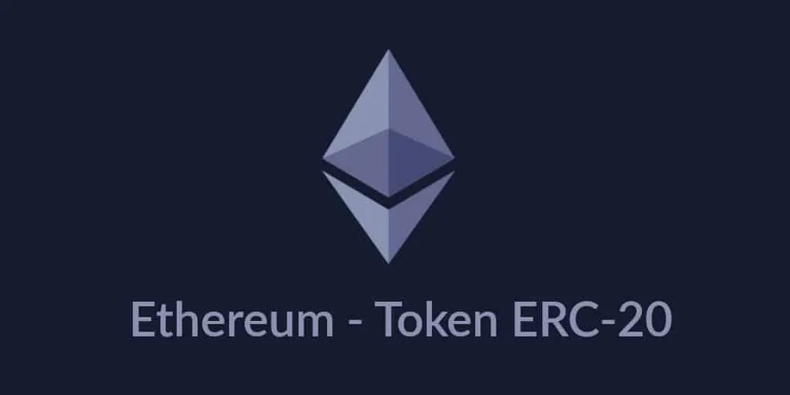

# ¿Qué es un token ERC-20?

**Un token ERC-20, no es más que un smart contract que cuenta con una estructura de datos ya preestablecida. Esta estructura está pensada en facilitar la implementación de diversas funcionalidades sobre la blockchain de Ethereum, facilitando el trabajo de creación a los desarrolladores.**

La blockchain de [**Ethereum**](https://academy.bit2me.com/que-es-ethereum-eth-criptomoneda/), a diferencia de **Bitcoin,** ha sido creada para ser todo un ecosistema integrado. Por ello, sus desarrolladores crearon nuevos mecanismos para facilitar ciertas tareas. Un ejemplo de esto, era mejorar la capacidad de crear nuevas monedas “sobre” una blockchain existente. Algo posible con el Bitcoin y que observamos en las llamadas [**colored coins**](https://academy.bit2me.com/que-es-una-colored-coin/). Para lograr esto, **los desarrolladores de Ethereum crearon los tokens ERC-20**.

Su creación fue propuesta por [**Fabian Vogelsteller**](https://academy.bit2me.com/quien-es-fabian-vogelsteller/) y [**Vitalik Buterin**](https://academy.bit2me.com/quien-es-vitalik-buterin/), y aprobada el 19 de noviembre de 2015. La misma forma parte de los **EIP** de **Ethereum,** bajo la designación [**EIP-20**](https://github.com/ethereum/EIPs/blob/master/EIPS/eip-20.md) **(EIP** son las siglas en inglés de **Propuesta de Mejora de Ethereum**).

Las siglas **ERC** significan **Ethereum Requests for Comments** o **Solicitud de Comentarios para Ethereum,** mientras el número 20 proviene del EIP donde se describe. ERC-20 describe un estándar sobre las funciones y eventos que un [**smart** **contract**](https://academy.bit2me.com/que-son-los-smart-contracts/) **de** **Ethereum** puede implementar.

En la actualidad, los tokens ERC-20 son uno de los tokens más ampliamente utilizados en el mundo cripto. La cantidad de tokens ERC-20 creados es enorme, puedes comprobar en **[Etherscan](https://etherscan.io/tokens)** cuantos existen en la actualidad.

## ¿Cómo funcionan los tokens ERC-20?

**Los tokens ERC-20, son en principio contratos inteligentes que se ejecutan en la** [**blockchain**](https://academy.bit2me.com/que-es-blockchain-cadena-de-bloques) **de Ethereum.** Funcionan dentro de un marco programático establecido por el equipo de Ethereum. Este marco es lo suficientemente amplio como para permitir distintos usos sin que ello interrumpa el funcionamiento de la blockchain de Ethereum. Por ejemplo, son capaces de llevar una sub-contabilidad paralela al libro principal de Ethereum, teniendo su propia unidad de cuenta. Todo ello, sin que se mezclen los saldos de Ether de las direcciones. Pero garantizando la transparencia, trazabilidad y seguridad que brinda la red de Ethereum.

**Es precisamente, esta enorme flexibilidad la que ha llevado a los tokens ERC-20 a ser un estándar.** **La utilidad principal de estos tokens, es estandarizar la interfaz de creación y  emisión de nuevos tokens en la red.** Esto lo logra, haciendo cumplir ciertas reglas y parámetros para su aceptación. Por ejemplo, para alterar o mover un token ERC-20, debes tener Ether. Esta situación sostiene tanto la parte económica como utilitaria del token.

**El objetivo y la necesidad de los tokens ERC-20, es diseñar un estándar, para crear interoperabilidad y compatibilidad entre tokens y fomentar mejoras en el ecosistema de Ethereum.** Esto gracias a que los token ERC-20 facilitan enormemente el trabajo de crear nuevos tokens. Ya que la infraestructura estaba pensada para ello. Además estuvo acompañado de herramientas con ese propósito como el lenguaje de programación **Solidity,** o la maquina virtual **[EVM](https://academy.bit2me.com/que-es-ethereum-virtual-machine-evm/).**

## ¿Por qué se crearon los tokens ERC-20?

La **motivación** **principal** de los desarrolladores al crear algo tan amplio, era principalmente **crear** **un** **sistema** **de** **capacidad** **múltiple**. Todo ello bajo una interfaz estándar **reutilizable** por otras aplicaciones: desde monederos hasta intercambios descentralizados. Todo ello bajo un [**API**](https://www.ticbeat.com/tecnologias/que-es-una-api-para-que-sirve/) que le garantiza los desarrolladores las siguientes ventajas:

1. **Uniformidad** **en la programación**. La API es estándar y estable lo que facilita la tarea de programar usando la misma. Esto facilita la tarea creativa de los programadores a la hora de crear nuevo software basado en las capacidades de Ethereum.
2. **Reduce la complejidad de la programación.** Dado que la API es sencilla, usarla reduce la complejidad del software creado para usarla. Esto se traduce en una mejor lectura, seguridad y auditabilidad del código escrito.
3. **Soporte para múltiples lenguajes de programación y mejoras en la portabilidad.** Dado que la API de los tokens es libre, es posible programar en ella es distintos lenguajes de programación. Ello facilita enormemente la capacidad de crear software específico. Algunos de los lenguajes soportados para esta tarea son Solidity, JavaScript, C, C++, Python, Java y Go.
4. **Menor complejidad en la comprensión de cada tipo tokens implementado.** Esto gracias a que todos estarán basados en los mismos principios de funcionalidad.
5. **Mayor seguridad**, en especial gracias a funciones como [**token allowance.**](https://academy.bit2me.com/que-es-token-allowance/)
6. **Menor riesgo de romper contratos, al no tener impedimentos, ni incompatibilidades.** Esto gracias a que la API es estable, los cambios introducidos en ellas mejoran la misma, pero nunca romperán la compatibilidad.

## Características principales de los tokens ERC-20

Como ya hemos mencionado, los tokens ERC-20 se caracterizan principalmente por su amplias capacidades de adaptación. Pero para lograr esto, un token ERC-20 usa una cierta estructura básica que permite aprovechar todo su potencial. En ese sentido, estas características son:

1. **Tienen un nombre o identificador y un símbolo asociado.** Por medio de estos dos valores, es posible identificar y diferenciar los tokens unos de otros dentro la blockchain de Ethereum.
2. **Es capaz de manejar los aspectos económicos básicos de su emisión.** Datos como el sistema de precisión decimal y la emisión total, son parte fundamental del token en su estructura de datos.
3. **Maneja una interfaz para controlar y revisar los balances de las direcciones de sus dueños.** Por este medio, el token es capaz de informar el balance total de fondos contenidos en una dirección específica.
4. **Puede manejar el sistema de transferencias de forma nativa.** Esto gracias a que el token tiene funciones para manejar transferencias de fondos.
5. **Adicionalmente el token es capaz de manejar autónomamente retiros parciales de fondos desde una dirección.** Por ejemplo, si a Juan se le da permiso de retirar 1000 ETH de la cuenta de María, Juan puede retirar 250 ETH en un primer retiro. En subsecuentes retiros, Juan puede terminar de retirar el resto de los fondos, pero solo podrá llegar hasta los 1000 ETH. Una característica que recibe el nombre de **“Aprobado”** y depende de otra llamada **“Provisión”.**

## Bibliografía

- https://academy.bit2me.com/que-es-erc-20-token/
