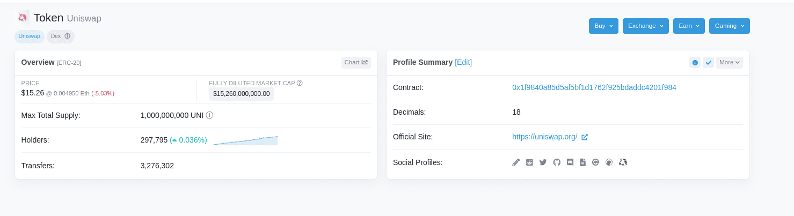
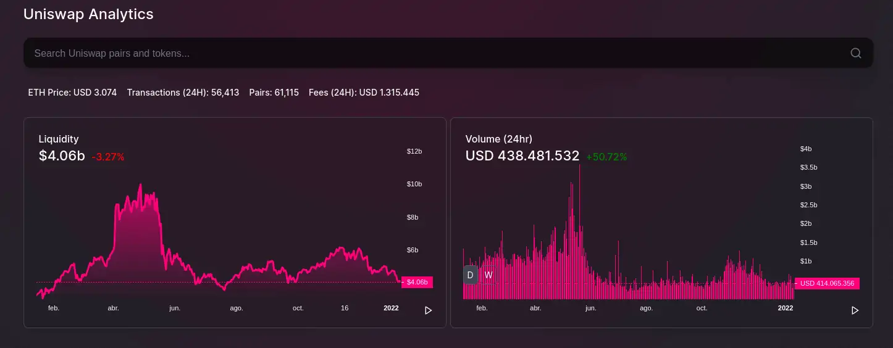
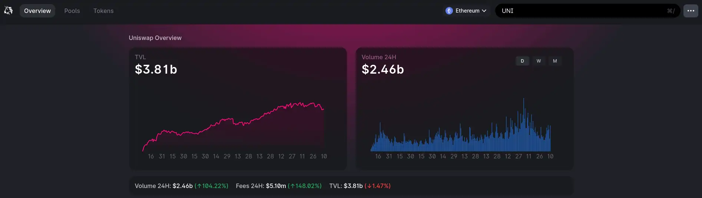

# ¿Qué es un LP Token?

**Los LP Token o tokens de liquidez, son tokens especiales creados por las plataformas DEX con el fin de recompensar a los usuarios que inyectan liquidez a sus pools con el fin de hacer posible su funcionamiento, y que se han convertido en tokens de gran utilidad en los mercados.**

Un token LP o token de proveedor de liquidez (Liquidity Pool Token o LP Token), es un tipo de token emitido por las plataformas de [**intercambio descentralizadas (DEX)**](https://academy.bit2me.com/exchange-descentralizado-dex/). El concepto es el siguiente: los proveedores de liquidez utilizan sus tokens para inyectar liquidez a los distintos pools del DEX y, en consecuencia, estos reciben una recompensa acorde a la inyección de liquidez aportada a dicho pool mediante el LP token como forma de pago.

Este es un modelo ampliamente utilizado por DEX como [**Uniswap**](https://academy.bit2me.com/que-es-uniswap/), [**SushiSwap**](https://academy.bit2me.com/que-es-sushiswap/), **PancakeSwap**, [**Compound**](https://academy.bit2me.com/que-es-compound-comp/) y, en general, por la mayoría de DEX que usan el modelo de **AMM o Creadores de Mercados Automatizados.**

## ¿Cómo funcionan los LP Token?

Ahora bien, ¿Qué características técnicas podemos encontrar en los mismos? Pues esto varía de acuerdo al proyecto que implementa el LP Token como tal. Para entender un poco mejor esto, veamos el LP token UNI de la plataforma Uniswap. El token UNI es en realidad un utility token del tipo [**ERC-20**](https://academy.bit2me.com/que-es-erc-20-token/) que funciona sobre la blockchain de Ethereum y cuyo smart contract podemos encontrar en esta dirección.

Una vista rápida a la imagen superior nos revela algunas características y datos importantes sobre el token UNI, entre las que destacan:

1. Emisión total de mil millones de tokens.
2. Es un token del tipo [ERC-20](https://academy.bit2me.com/que-es-erc-20-token/) de Ethereum.
3. \+ 297 mil hodlers on-chain.
4. \+ 3 millones de transferencias on-chain desde su lanzamiento.
5. Dirección de contrato 0x1f9840a85d5af5bf1d1762f925bdaddc4201f984, verificable en la blockchain de Ethereum.
6. Precisión de hasta 18 decimales.
7. Valor actual del token y su capitalización diluida de mercado.

Toda esta información nos deja claro que UNI es un token fungible (como lo define el estándar ERC-20), transferible y de libre uso dentro de la red Ethereum. Además, nos informa que su emisión es limitada y por tanto el valor del token en relación al tiempo y utilidad de la plataforma se puede ir apreciando, una apreciación en la que influye otro factor importante: el uso de la plataforma y la liquidez total aportada dentro de los pools del DEX.

Es en este punto donde entra en juego una fórmula que ayuda a determinar el valor de un LP Token, a saber:

> ***Valor LP Token = Valor total del fondo de liquidez / Oferta circulante de LP Tokens***

Para entender esta fórmula, sigamos con el ejemplo del token UNI. Sabemos que Uniswap tiene un TVL de 7,87 mil millones de dólares. Este total está dividido en la liquidez bloqueado en su V2:

Y la liquidez bloqueada en su V3:

Sí además conocemos que el token UNI posee una circulación actual de 627.286.736,56 UNI, entonces con esos dos datos podremos aplicar la fórmula y conocer el valor de su LP Token:

> ***Valor UNI = 7,87 mil millones de dólares / 627.286.736,56***
>
> ***Valor UNI = 12,84 $***

En este punto seguro te preguntarás:

- ¿Por qué el valor arrojado por la fórmula es inferior al que observamos en CoinMarketCap o Etherescan?

Porque el resultado de la fórmula corresponde al valor otorgado por el token mediante los datos ofrecidos únicamente por Uniswap. Es decir, no tiene en cuenta otros mercados y exchanges donde el token tiene presencia (como Bit2Me donde puedes comprar-vender el token UNI), de allí la diferencia de precio, entre lo que vemos en esos marcadores y lo que nos arroja nuestro anterior ejemplo. Es decir, sí tomamos la liquidez UNI en esos otros espacios y los sumamos, terminaremos obteniendo el valor final real del token con un mínimo error.

## Cada LP Token es único

Ahora bien, este ejemplo con el token UNI te ha dejado claro cómo funciona el mismo y cómo podemos calcular su valor de mercado, pero ¿Qué pasa con el resto de LP Tokens?

Las reglas son las mismas y serían:

1. **Cada LP Token funciona bajo una blockchain y un estándar único**. Por ejemplo, UNI y Sushi funcionan sobre [**Ethereum**](https://academy.bit2me.com/que-es-ethereum-eth-criptomoneda/) y usan el estándar [**ERC-20**](https://academy.bit2me.com/que-es-erc-20-token/), pero CAKE (el LP Token de PancakeSwap) funciona sobre BSC y es del tipo BEP-20. Esto significa que cada token funciona en su red y no pueden intercambiarse de forma directa.
2. **El valor de los LP Token depende del valor total de las plataformas donde se comercia** (sean DEX o CEX) y ese valor se divide entre el total de tokens en circulación.
3. **Sí se produce una quema de tokens LP por algún motivo, esto afectará de forma positiva el valor del token** (lo hará más escaso y por tanto, más valioso).

Ahora bien, también se debe tener en cuenta un aspecto muy importante y es que cada plataforma DEX tiene sus propias reglas de emisión, las cuales afectan en mayor o menor medida el valor del token. Por ejemplo, plataformas de emisión directa como Uniswap buscan que el valor de UNI aumente con mayor adopción y atraiga la inversión. Mientras que, plataformas como [**Terra**](https://academy.bit2me.com/que-es-terra-luna/) esperan que sus tokens aumenten de valor siguiendo modelos algorítmicos que ajusten la emisión y el valor del token según sus necesidades.

Esto significa que para sacar el máximo provecho de un LP Token debes conocer la estructura y funcionamiento del proyecto que lo ha emitido. Sí conoces esto, podrás saber cómo puede aumentar el valor del token y hasta qué punto puede llegar el mismo.

Este caso, se aplica por ejemplo al [**Bit2Me Token (B2M)**](https://academy.bit2me.com/que-es-bit2me-token-b2m/), cuya emisión es directa y es utilizado como un LP Token para quienes participan en su sistema de [**staking**](https://academy.bit2me.com/que-es-staking/) Bit2Me Earn. Así, a medida que el TVL de [**Bit2Me Earn**](https://bit2me.com/es/suite/earn) aumenta, el valor del B2M se irá consolidando, a la vez que recibes recompensas por tu participación.

## Recepción de recompensas

Ahora bien, el principal objetivo de los LP tokens es ofrecer recompensas a los proveedores de liquidez y, en este punto, cada plataforma tiene un método para ello. El sistema más usual es la repartición equitativa de recompensas entre los participantes del pool, lo que es posible porque de las comisiones cobradas por el DEX, un porcentaje se destina a ello. Las recompensas serán mayores o menores dependiendo del porcentaje asignado para tal fin.

Así, por ejemplo, un proveedor de liquidez en Bit2Me Earn puede recibir un APY de 25% si utiliza el token B2M para recibir dicha recompensa. Esto significa que por cada 1.000 € en el pool, el proveedor recibirá 250 € al año por su participación, y dicha recompensa se le asignará en tokens B2M. Un punto a tener en cuenta es que a medida que tu participación se diluye en el pool (porque se apunten más personas en la participación y por tanto la recompensa se divide entre más individuos), el APY final disminuye.

¿Qué significa todo esto? Que, si entraste en el pool en Enero 2022 con un APY de 30% y en diciembre el APY es de 20%, al final la cantidad de tokens recibidas habrá disminuido ligeramente, lo que generalmente compensa con la consolidación y revalorización del token. Podrías pensar que es injusto, pero la realidad es que el sistema está pensado para evitar que la emisión del token se dispare descontroladamente y termine por minar su valor final.

En pocas palabras, es una estrategia de equilibrio de los [**tokenomics**](https://academy.bit2me.com/que-es-tokenomics-economia-tokens/) dentro del ecosistema. Este esquema se repite en la mayoría de protocolos, por lo que es normal encontrar pools nuevas con APY explosivos, que finalmente terminan cayendo rápidamente debido a este sistema de funcionamiento.

## Conclusiones

Los LP tokens pueden resultar muy útiles para la adopción de nuevos productos, especialmente aquellos relacionados con el mundo [DeFi](https://academy.bit2me.com/que-es-defi-o-finanzas-descentralizadas/). Sin embargo, dada la utilidad y enormes posibilidades del mismo, los LP Tokens están siendo utilizados en plataformas tan diversas como los juegos blockchain o los [**metaversos**](https://academy.bit2me.com/que-es-el-metaverso/), todo ello con una clara finalidad: atraer personas a dichos espacios y aumentar su adopción.

En todo caso, el éxito del LP Token dependerá del producto que se presente, su utilidad y el interés que logre despertar en la comunidad. Sí un LP Token alcanza todo esto, entonces es probable que nos encontremos ante un éxito seguro.

## Bibliografía

- https://academy.bit2me.com/que-es-un-lp-token/
