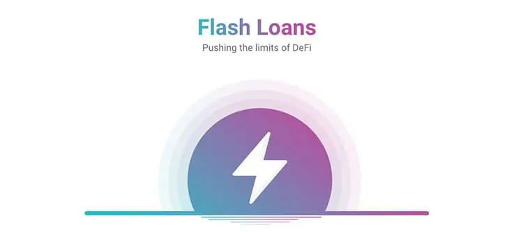
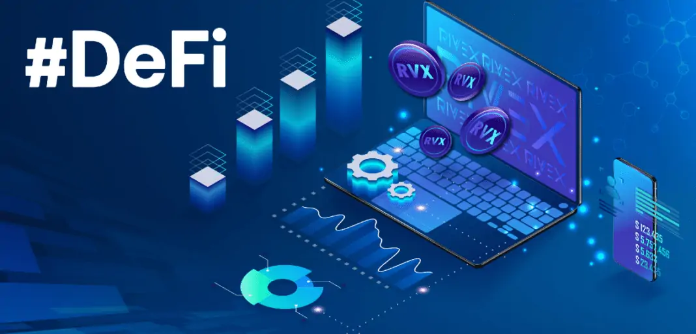

# ¿Qué es un Flash Loan?

**Conoce que son los Flash Loans o Préstamos Flash, una potente utilidad de los protocolos [DeFi](https://academy.bit2me.com/que-es-defi-o-finanzas-descentralizadas/) que te permite operar con préstamos sin garantía para así apalancar tus posiciones para arbitraje, trading y otras operaciones financieras dentro del enorme ecosistema DeFi.**

La llegada de los protocolos DeFi o de finanzas descentralizadas ha permitido una enorme flexibilización en el acceso a crédito por parte de las personas que participan en el mundo cripto.

Una prueba de esa flexibilización la podemos ver en los flash loans o préstamos (ultra)rápidos. Gracias a ello, los usuarios de DeFi pueden acceder a préstamos de criptomonedas de forma muy rápida y sin necesidad de aportar garantías para ello. Sí, has leído bien, un préstamo cripto sin garantías, y todo ello gracias a su forma de funcionamiento.

## ¿Qué es un Flash Loan?

Un flash loan o préstamo flash no es más que un préstamo programado sobre un [**protocolo DeFi**](https://academy.bit2me.com/que-es-defi-o-finanzas-descentralizadas/), capaz de ofrecer una provisión de fondos a los usuarios sin que estos necesiten aportar una garantía (ni en criptomonedas, ni de ningún tipo) por los fondos que le son prestados. El protocolo DeFi brinda acceso al usuario de unos fondos para que éste pueda utilizarlos y devolverlos al protocolo en una misma operación, incluyendo las comisiones correspondientes.

En blockchain esto es posible, porque existe la posibilidad de programar una transacción para que tome los fondos prestados, los movilice por distintos [**smart contracts**](https://academy.bit2me.com/que-son-los-smart-contracts/) de otros protocolos, se realicen las operaciones de intercambio pertinentes y, al final de esa misma transacción, el dinero del préstamo y sus comisiones sean reintegradas al protocolo inicial mientras el usuario se retira con sus ganancias.

Lo importante a destacar, es que todo se realiza en una única operación, de forma instantánea, y toda ella queda registrada en un mismo bloque de la blockchain donde se registre.
Esta idea surgió gracias al proyecto [**AAVE**](https://academy.bit2me.com/que-es-aave/), quienes diseñaron esta función con el fin de permitirles a sus usuarios acceder a la liquidez del protocolo para realizar operaciones rápidas. De esta manera, se incentiva el uso de estas operaciones rápidas, que les permitían básicamente dos cosas:

1. Mantener la liquidez en su protocolo para las operaciones regulares de su protocolo (préstamos e intercambios).
2. Permitir un nuevo modelo de préstamos rápidos, que no afecta la liquidez real de su protocolo DeFi.

## ¿Cómo funciona un Flash Loan?

Ahora bien, **¿Cómo es posible que AAVE alcance ambos puntos con los flash loans?** Pues bien, el primer caso es fácil de entender.

Piensa que cada vez que un proveedor de liquidez ingresa tokens al protocolo de AAVE, ese pool donde participa aumenta su liquidez (por ejemplo, agregar ETH/USDT a AAVE). Cuando el LP realiza esa operación, rápidamente podemos ver una transacción que agrega ambos tokens al pool de AAVE destinado para ese par de tokens. Esos tokens están ahora en el poder del smart contract de AAVE y el pool los gestiona de forma autónoma. Así, se cumple el primer punto, y eso es algo que tenemos claro.

Sin embargo, para el segundo punto, los desarrolladores aplican una pequeña trampa. En blockchain, existe un punto especial durante todo ese proceso de creación y confirmación de la transacción que se realiza, hablamos del tiempo de confirmación dentro de la red. En ese momento, la transacción se encuentra en un estado “inconsistente” en la que la operación aparece realizada (ha sido creada y se ha emitido a la red) y, al mismo tiempo, no está confirmada (no se ha producido el consenso acerca de sí la transacción es correcta o no y, por lo tanto, no se ha incluido aún en ningún bloque). Es decir, los nodos de la red ven la transacción, incluso pueden reportar el saldo en cuenta dentro de los monederos de origen y destino, aunque no exista confirmación.

Esto último no es raro, si has realizado alguna vez una operación con BTC seguramente te habrán hecho alguna transacción y verás el saldo reflejado en tu monedero, pero algunos monederos no te dejan disponer de ese dinero hasta que no sea confirmado por la red. Es un dinero que “está” y, al mismo tiempo, “no está”, sólo debes esperar a que se confirme, y este evento se presenta en todas las redes blockchain. Es precisamente este estado donde comienza la “trampa” que hace posible la ejecución de los flash loans.

### Ejecución del Flash Loan

Durante un flash loan, el protocolo DeFi que hace el préstamos permite “salir” el dinero a manos del prestatario, quien usará estos fondos para una serie de operaciones con la que busca obtener algún beneficio.

Generalmente, el prestatario utiliza ese dinero para realizar intercambios en otros protocolos que al final le permitirán obtener los beneficios deseados, recuperar el dinero del préstamo y pagar las comisiones necesarias para todo el conjunto de operaciones realizadas. Todo ello en una sola transacción, aprovechándose de ese pequeño tiempo que brinda el tiempo de confirmación y el estado “**inconsistente**” en el que los protocolos intervinientes “**ven el dinero fluir**” a sus respectivos pools. Al final, cuando la transacción es incluida en un bloque y comienza su cómputo, entonces toda la programación de la transacción es leída y ejecutada, con lo que pasa lo siguiente:

1. **Se crea el flash loan y el prestatario tiene los tokens**, los cuales provienen de los pools del protocolo.
2. **Se ejecutan las operaciones intermedias solicitadas por el prestatario**, se pagan comisiones, se recupera el dinero del préstamo y las ganancias obtenidas.
3. **Finalmente se reintegra el préstamo y se pagan comisiones**, mientras el usuario retira a su dirección personal las ganancias.

De esta manera, el flash loan logra su cometido: prestarte un dinero que jamás llega a estar bajo tu absoluto control, pero que sirve para que otros protocolos avalen tus operaciones porque, en lo que a blockchain se refiere, dispones de los fondos y la transacción lo demuestra. La idea de los flash loans se parece mucho a los avales crediticios de las finanzas tradicionales, ya que realmente el dinero no está en tus manos sino en las de un tercero (el protocolo DeFi).

Sin embargo, pese a la enorme utilidad que ofrece esta herramienta, los protocolos DeFi se enfrentan a un enorme problema: los Flash Loan Attack, un ataque por el cual un actor malicioso es capaz de manipular el préstamo otorgado para quedarse con una enorme cantidad de dinero.

## ¿Cómo funciona un Flash Loan Attack?

Ahora bien, los protocolos DeFi no son infalibles, ya que en todo esto intervienen complejos smarts contracts que pueden contener fallos. Si bien la tecnología blockchain es muy segura, los fallos no son una excepción ya que, en definitiva, son piezas de software y como tal tienen imperfecciones que pueden ser más o menos evidentes. Este punto es el que aprovechan los atacantes para realizar un Flash Loan Attack sobre estos protocolos.

Generalmente, los Flash Loan Attacks son utilizados para explotar vulnerabilidades detectadas en los protocolos con el fin de aprovechar el capital del préstamo, con el fin de sustraer grandes cantidades de dinero del protocolo atacado.

Por ejemplo, un atacante puede ir AAVE solicitar un flash loan y usarlo para atacar un protocolo como, por ejemplo, Balancer. Esto es posible, porque nuestro atacante ha detectado una vulnerabilidad en el sistema que calcula las recompensas de los pools de Balancer y, con ese conocimiento, el hacker puede utilizar esa debilidad para obtener cuantiosas ganancias. Así, el hacker pide el flash loan, realiza las operaciones para explotar el fallo en Balancer, reintegra el pago a AAVE y se retira con las ganancias que sustrajo subrepticiamente de Balancer. ¿Resultado? Nuestro hacker toma sus ganancias, AAVE recupera su dinero y comisiones, pero [**Balancer**](https://academy.bit2me.com/que-es-balancer/) y sus LPs sufren un duro golpe en su tesorería.

Ahora bien, los Flash Loans Attacks pueden presentar varios vectores de ataque, ya que estos dependen de la programación del protocolo atacado. Esto es algo que requiere enormes conocimientos técnicos por parte del atacante, no sólo conocimientos de programación de [smart contracts](https://academy.bit2me.com/que-son-los-smart-contracts/), sino también conocimientos de la plataforma blockchain en la que se ejecutan esos smart contracts. Debido a ello, los Flash Loans Attacks son bastante complejos de realizar, pero lo mismo ocurre para evitarlos, por lo que los desarrolladores se encuentran en un continuo trabajo de auditoría y mejora de los contratos para evitar estos problemas.

## Grandes Flash Loans Attacks conocidos

Algunos de los mayores ataques conocidos son los siguientes:

1. **Poly Network**, el ataque se llevó a cabo en agosto de 2021 y el atacante logró sustraer la cantidad de 611 millones de dólares del pool. El vector utilizado fue un flash loan attack que aprovechaba un fallo en el proxy cross-chain de Ethereum-BSC-Polygon y por el cual se logró sustraer la cantidad mencionada.
2. **Cream Finance,** octubre de 2021, un atacante realizó un flash loan attack para aprovechar una vulnerabilidad en una función que controlaba el sistema de precios de los tokens asignado al subsistema de flash loan de la plataforma. ¿Resultado? La pérdida de 140 millones de dólares.
3. **PancakeBunny**: en mayo de 2021 se explotó un fallo en los cálculos del precio del token BUNNY y como resultado el atacante logró hacerse de 45 millones de dólares.
4. **Alpha Finance:** el ataque se llevó a cabo en febrero de 2021. Para ello, el atacante solicitó un flash loan en AAVE y con conocimiento de una vulnerabilidad en el sistema de redondeo de los pools y un pools en desarrollo (sUSD), utilizó ambos fallos para manipular los precios dentro Alpha Finance y hacerse con 37,5 millones de dólares.

En todo caso, estos son sólo algunos de los ataques más grandes y conocidos. En el mundo DeFi existen muchos y un espacio recomendable para mantenerte al tanto de ellos es [**Rekt**](https://rekt.news/es/). Recuerda siempre que DeFi es un mundo de oportunidades, pero existen riesgos, ten presente los mismos, aprende y planifica tus estrategias para protegerte de los mismos.

## Bibliografía

- https://academy.bit2me.com/que-es-un-flash-loan/
