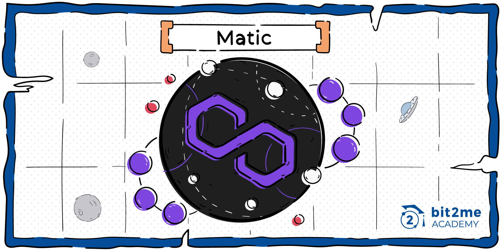
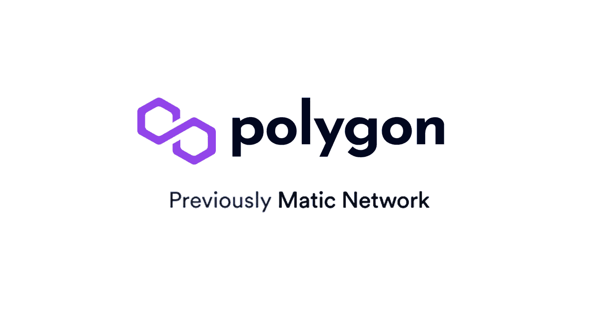
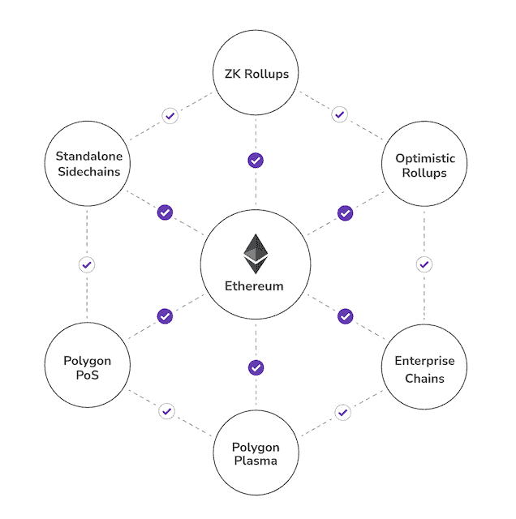

# ¿Qué es Polygon (MATIC)?

**Polygon (MATIC) es un proyecto de escalabilidad que permite que aplicaciones descentralizadas puedan ejecutarse en una red con menores comisiones, mayor velocidad e interoperabilidad con la red Ethereum.**

El proyecto Matic (y símbolo MATIC), ahora conocido como Polygon (pero manteniendo el símbolo MATIC), es un proyecto centrado en ofrecer soluciones de escalabilidad a proyectos [**blockchain**](https://academy.bit2me.com/que-es-cadena-de-bloques-blockchain/) que hacen vida en la red [**Ethereum (ETH)**](https://academy.bit2me.com/que-es-ethereum-eth-criptomoneda/). Recordemos que, Ethereum no lo ha tenido fácil desde el año 2017 cuando se hicieron claramente patentes sus problemas de escalabilidad al tener que afrontar un uso masivo de su red durante el boom de las [**ICO**](https://academy.bit2me.com/ico-criptomonedas/).

Pero no solo eso, desde finales de 2019 hasta nuestros días, Ethereum ha estado casi siempre al límite de sus capacidades. Una situación que ha sido impulsada por la gran adopción de plataformas como [**Decentraland**](https://academy.bit2me.com/que-es-decentraland-mana/), CryptoKitties (en el apartado [**NFT**](https://academy.bit2me.com/que-es-token-nft/)) y del boom de las [**DeFi**](https://academy.bit2me.com/que-es-defi-o-finanzas-descentralizadas/), donde plataformas como [**Uniswap**](https://academy.bit2me.com/que-es-uniswap/), [**Compound**](https://academy.bit2me.com/que-es-compound-comp/), [**Balancer**](https://academy.bit2me.com/que-es-balancer/), [**Curve**](https://academy.bit2me.com/que-es-curve-crv/) y [**AAVE**](https://academy.bit2me.com/que-es-aave/) han significado un enorme peso transaccional sobre la red Ethereum.

Dicho de otra forma, Ethereum está muy sobrecargado en la actualidad y, por eso, proyectos como Polygon (MATIC) abren una puerta para crear una solución a este problema sin abandonar este ecosistema. ¿Quieres saber de qué se trata? Entonces continúa leyendo con nosotros este interesante artículo sobre Polygon.

## Los inicios de Polygon (MATIC)

La historia de Polygon (MATIC) comienza en el año 2018, cuando Jaynti Kanani, Sandeep Nailwal y Anurag Arjun decidieron que era hora de hacer frente a los problemas de escalabilidad y usabilidad dentro de la red Ethereum. En su momento, la idea giraba en torno a crear una red de segunda capa (sidechain) que sirviera para manejar la gran carga transacciones de la red Ethereum.

En su primera presentación, Matic (que era el nombre del proyecto en ese entonces) buscaba lograr todo esto uniendo el poder Plasma y una estructura de nodos que tendrían el control de una sidechain [**Proof of Stake (PoS)**](https://academy.bit2me.com/que-es-proof-of-stake-pos/) para Matic. De esta forma, todo el funcionamiento de las [**DApps**](https://academy.bit2me.com/que-son-las-dapps/) portadas a Matic, estaría sobre la sidechain, y sus efectos sobre la red Ethereum serían trasladados en bloques por medio de Plasma. Esto permitiría que Matic ofreciera un gran número de transacciones que directamente permitiría dejar atrás los problemas de escalabilidad de Ethereum.

Sin embargo, hacer realidad todo esto requería de un gran trabajo y una fuerte inversión de recursos. Es por ello que el 26 de abril de 2019, Matic ofreció una ronda de inversión semilla en la que se vendieron 209 millones de tokens MATIC por un valor de 161 mil dólares. Junto a esta ronda semilla, y el mismo día, se ofreció también una ronda para early adopters y una IEO. En la ronda de inversión early adopters, se puso en venta un total de 171 millones de tokens MATIC por un valor de 444.600 $. Mientras que la [**IEO**](https://academy.bit2me.com/que-es-una-ieo/), puso en venta un total de 1.900.000.000 de tokens MATIC y se captó un monto superior a los 4 millones de dólares.

Los esfuerzos de desarrollo en este punto se duplicaron y para mayo de 2019, se comenzó a realizar la auditoría del [**smart contract**](https://academy.bit2me.com/smart-contracts-principiantes/) de Matic por parte de la empresa [**Nomic Labs**](https://medium.com/nomic-labs-blog/matic-network-security-audit-report-c3b2e9d5dcc4). Esta auditoría de Nomic, se sumaba a una anterior realizada por Quanstamp, la cual fue dirigida a revisar el [smart contracts](https://academy.bit2me.com/que-son-los-smart-contracts/) de Plasma, que fue realizado el mes de marzo de 2019. Como resultado del proceso de auditoría y la financiación inicial al proyecto, el proyecto Matic pudo finalmente salir a la luz el 19 de mayo de 2020, fecha en la cual la red Matic lanzó su primer bloque dentro de su sidechain.

Sin embargo, más tarde en febrero de 2021, Matic decidió cambiar su nombre y convertirse en Polygon, manteniendo el nombre de su token y mostrando al público una nueva hoja de ruta para adaptarse a nuevas tecnologías como los rollups y Validium, que mejorarían la experiencia de su red y la de sus usuarios.

## ¿Cómo funciona Polygon Network?

Como ya comentamos, Polygon funciona en base a crear una red de nodos descentralizados que sirven para crear una sidechain que es conectada a la red Ethereum (o a la red que se desee). Esta sidechain funciona en primer lugar usando el protocolo de consenso de Proof of Stake (PoS) y permite una alta velocidad de procesamiento dentro de Polygon. En segundo lugar, Polygon también hace uso de Plasma, una tecnología equivalente a [**Lightning Network (LN)**](https://academy.bit2me.com/lightning-network/) que es compatible con Ethereum.

La idea de usar PoS y Plasma va de la mano con crear puentes de comunicación bidireccionales con Ethereum, que permita que las DApps de Polygon y Ethereum puedan comunicarse sin problemas. De esta manera, un usuario de Ethereum puede enviar valor a una DApps en Polygon, o viceversa, sin tener que preocuparse por incompatibilidades entre ambas redes. Lo mejor de todo, es que el funcionamiento de Polygon permite realizar este tipo de acciones con cualquier otro tipo de redes blockchain, siempre y cuando se cree la estructura de conexión entre la sidechain de Polygon y la blockchain objetivo.

Sin embargo, esto genera un problema: la sidechain de Polygon puede crecer de forma exponencial y descontrolada si es conectada a varias redes de esta manera. Para evitar este problema, Polygon ha implementado un sistema de puntos de control on-chain sobre su red. El sistema de puntos de control permite que un nodo dentro de la red solo tenga que almacenar una determinada cantidad de bloques, siendo que los anteriores a este punto ya se encuentran almacenados en sus respectivas mainchain. Con esto, Polygon busca resolver dos problemas:

1. El aumento descontrolado en las necesidades de almacenamiento de la red.
2. El costo de implementar un nodo, lo cual alejaría a las personas de instalar uno, y lo que llevaría a una mayor centralización en la red.

Sin duda una solución eficiente y segura para mantener el funcionamiento de la red en todo momento.

### Proof of Stake, la clave de la velocidad de Polygon

Proof of Stake (PoS) es el protocolo de consenso elegido para la red Polygon, y no es de extrañar, ya que este protocolo permite una alta velocidad de generación de bloques y por tanto, una mayor velocidad en la confirmación de transacciones. Estos dos puntos son fundamentales para Polygon porque la idea es ofrecer una solución de escalabilidad que atienda a millones de personas en todo el mundo sin mayores problemas.

Dicho esto, los nodos de Polygon funcionan gracias al [Staking](https://academy.bit2me.com/que-es-staking/) de tokens MATIC, los cuales son usados para elegir los validadores y generadores de bloques dentro de la red. Sin embargo, el proceso de generación de bloque tiene un punto especial de funcionamiento. Este punto es, que cada bloque generado dentro de Polygon, genera un [**árbol Merkle**](https://academy.bit2me.com/que-es-un-arbol-merkle/) que asocia de forma única e inequívoca a todas las transacciones dentro de ese bloque de la red Polygon. Dicho árbol Merkle, es el único dato que se envía como información a la red Ethereum usando Plasma, y sería la prueba fundamental de que la acción realizada en la red Polygon ha sido registrada de forma correcta y es inalterable.

Esta solución por supuesto también tiene un punto a favor: la transmisión de datos a la red Ethereum tiene un costo ínfimo, en comparación con los costos de transacción on-chain sobre Ethereum. En comparación, una transacción de Ethereum puede costar en promedio unos 15 $, mientras que en Matic la transacción tiene un costo promedio de 0,001 $.

En la siguiente imagen, puedes ver claramente cada uno de los aspectos que hemos mencionado. Podrás ver cómo los productores de bloques de la red Polygon/Matic generan los bloques, dichos bloques están relacionados con un árbol Merkle, y de ellos parte la creación de los puntos de control que luego son enviados a la cadena principal de Ethereum. Todo este proceso está pensado para mantener la seguridad de la red y contar no solo con la seguridad de Polygon/Matic, sino también con el enorme poder computacional y de seguridad de la red Ethereum para respaldar el funcionamiento de este sistema.

### Polygon SDK

Ahora bien, Polygon ha evolucionado mucho desde su lanzamiento inicial, y parte de esa evolución se debe a Polygon SDK. Este componente está pensado para que se puedan crear múltiples tipos de aplicaciones y desplegarlas en la red Polygon. Así, Polygon SDK permite a los desarrolladores implementar cadenas compatibles con Ethereum,. Lo que lo convierte en una red con un sistema de múltiples cadenas que pueden interoperar entre ellas

Entre los tipos de cadenas que se pueden crear podemos mencionar:

1. Redes sidechain conectadas por PoS y Plasma a Ethereum.
2. Sidechains standalone.
3. Cadenas laterales con uso de ZK Rollups, una solución pensada en ofrecer la máxima privacidad posible sin renunciar a la velocidad.
4. Sidechains con uso de Optimistic Rollups.
5. Cadenas cerradas y centradas en instituciones o empresas.
6. Sidechains interoperables.

Todo esto sin renunciar a:

1. Compatibilidad con la mainchain de Ethereum.
2. Una gran escalabilidad y velocidad de procesamiento.
3. Seguridad.
4. Gobernanza on-chain u off-chain según se requiera.
5. Interoperabilidad.
6. Facilidad de desarrollo.
7. Modularidad, permitiendo añadir funciones a cada sidechain de forma sencilla.

De esta manera, Polygon SDK permite transformar a Ethereum en un sistema multicadena, similar a la estructura blockchain. Este sistema es similar a otros como Polkadot, Avalanche o Cosmos, pero de una forma mucho más integrada.

## Principales características de Polygon

Las principales características de la Polygon son:

1. Uso de un potente algoritmo de consenso Proof of Stake para la sidechain. Adicional, el uso de smart contracts Plasma, para unir la red sidechain con la mainnet de Ethereum.
2. Una infraestructura que permite que las DApps en Polygon puedan interactuar de forma bidireccional con la red Ethereum.
3. Un completo kit de desarrollo pensado en mejorar la experiencia de desarrollo y de usuario para las DApss creadas con Polygon.
4. Su red es pública, sin permisos y es capaz de soportar múltiples protocolos de consensos y otras redes blockchain además de Ethereum.
5. Ofrece un sustancial aumento en la escalabilidad de la red, con un límite teórico de al menos 200 mil transacciones por segundos.
6. Ofrece un menor coste por transacción.
7. Permite la interoperabilidad entre las sidechains desplegadas en Polygon.

## Token MATIC, el epicentro económico de Polygon

El token MATIC, es el token nativo de la red Polygon. En primer lugar, este token tiene como finalidad fungir de token de utilidad para el funcionamiento de la red Proof of Stake de Polygon. No solo eso, el token también puede usarse para movilizar valor entre los usuarios y DApps dentro de la red Polygon. Dicho esto, la utilidad del token MATIC es múltiple, y se ajusta a las distintas realidades dentro de la red Polygon.

El inicio del token MATIC comienza con una IEO que se realizó en la plataforma Binance Launchpad el 24 de abril de 2019. Sin embargo, esta no fue una venta típica, ya que, en lugar de ser una venta directa, se realizó de una forma indirecta usando un sistema de boletos, tal cual fuera una lotería. La idea detrás de este sistema era evitar la común situación en la que una persona con mucho dinero podía comprar muchos tokens. E incluso, hacerse pasar por otras personas, para acumular más tokens a su favor.

Así que, en lugar de vender directamente los tokens, se crearon 16.666 boletos que se debían comprar y dichos boletos daban al usuario ganador la capacidad de reclamar sus recompensas en tokens MATIC al final de la jornada. Pese al llamativo del sistema, la venta fue un éxito ya que se lograron captar más de 4 millones de dólares

## Casos de uso de Polygon

Polygon Network tiene amplias posibilidades y casos de uso en su haber. La idea de permitir que las DApps puedan escalar de forma real. Y, contando en todo momento con el poder computacional de Ethereum y manteniendo la compatibilidad con esta red. Esto ciertamente anima a muchos desarrolladores a tomar en cuenta el planteamiento de este proyecto.

Por ejemplo, gracias a Polygon es posible conectar de forma muy económica sistemas de pagos, DEX, AMM y demás aplicaciones [DeFi](https://academy.bit2me.com/que-es-defi-o-finanzas-descentralizadas/) que hacen vida dentro de Ethereum. De hecho, proyectos como AAVE, Curve, QuickSwap, 1inch, SushiSwap, SportX, Beefy Finance, Pooltogether, bZx, Augur, Ocean Protocol, Clover Finance, y decenas más usan ya el poder de Polygon Network para su funcionamiento.

Es decir, a sistemas de pagos, atomics swaps, DEX, AMM, Liquidity pools, yield farming y flash Loans, que confían en la capacidad de Polygon para llevar a cabo sus operaciones con la mayor velocidad y el menor costo posible. Una muestra clara de que Polygon es lo que promete, una red rápida, segura y económica para potenciar tus DApps al siguiente nivel.

## Enlaces de interés

**WEB OFICIAL**

[Ir a la web oficial](https://polygon.technology/)

**WHITE PAPER**

[Ir al white paper](https://academy.bit2me.com/wp-content/uploads/2021/07/polygon-whitepaper-en.pdf)

**TWITTER OFICIAL**

[Ir a la cuenta oficial de Twitter](https://twitter.com/0xPolygon)

**GITHUB OFICIAL**

[Ir al GitHub](https://github.com/maticnetwork/)

**DISCORD OFICIAL**

[Ir al Discord oficial](https://discord.gg/polygon)

**HILO DE REDDIT**

[Ir al hilo oficial de Reddit](https://www.reddit.com/r/0xPolygon/)

**CANAL DE YOUTUBE**

[Ir al canal de YouTube](https://youtube.com/PolygonTV)

**BLOCK EXPLORER**

[Ir al explorador de bloques](https://polygonscan.com/)

## Bibliografía

- https://academy.bit2me.com/que-es-polygon-matic/
