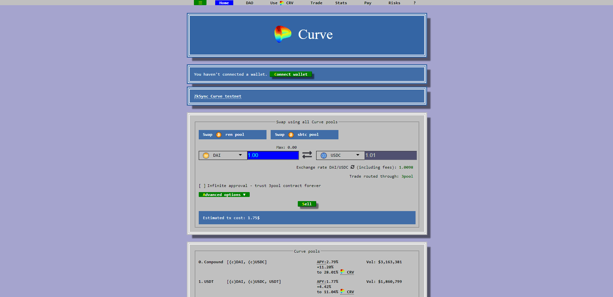
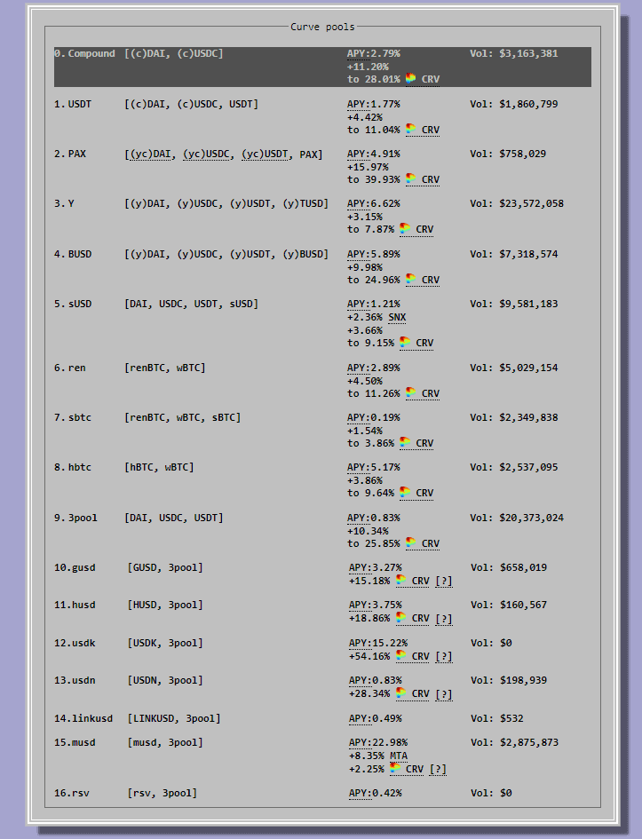

# ¿Qué es Curve (CRV)?

**Curve (CRV) es un exchange descentralizado (DEX) y un pool de liquidez que permite tradear con stablecoins o monedas estables de forma rápida y sencilla.**

El boom de las [**DeFi o Finanzas Descentralizadas**](https://academy.bit2me.com/que-es-defi-o-finanzas-descentralizadas/) ha visto nacer a muchas plataformas que ofrecen nuevas y novedosas herramientas, y una de esas plataformas es Curve Finance.

Pero ¿Qué ofrece realmente Curve Finance que lo hace tan llamativo para los usuarios de [DeFi](https://academy.bit2me.com/que-es-defi-o-finanzas-descentralizadas/)? Pues bien, estas y otras preguntas las responderemos a continuación en este artículo dedicado a desentrañar una de las plataformas con mayor crecimiento en el ecosistema DeFi.

## Curve Finance (CRV), el DEX de las stablecoins

Curve Finance (CRV) o Curve, es un [**exchange descentralizado (o DEX)**](https://academy.bit2me.com/exchange-descentralizado-dex/) dedicado a ofrecer intercambios de [**monedas estables o stablecoins**](https://academy.bit2me.com/que-es-stablecoin/). En pocas palabras, realiza operaciones como las que [**Uniswap**](https://academy.bit2me.com/que-es-uniswap/) realiza, solo que Curve se enfoca en activos con paridad 1 a 1 con divisas nacionales. Esta característica ha convertido a Curve en un favorito de los traders y proveedores de liquidez de stablecoins que buscan un slippage mínimo para minimizar las pérdidas. Recordemos que; **el slippage hace referencia a la diferencia entre el precio esperado de una operación y el precio al que se ejecuta la operación,** y es una fuente recurrente de perdidas en determinados intercambios.

Y no solo eso, Curve ofrece una interfaz sencilla y algunos de los [**smart contracts o contratos inteligentes**](https://academy.bit2me.com/que-son-los-smart-contracts/) más seguros del todo ecosistema DeFi. Esto junto a un amplio soporte de stablecoins entre las que podemos encontrar **[DAI](https://academy.bit2me.com/que-es-dai/), USDC, [USDT](https://academy.bit2me.com/que-es-usdt-theter-criptomoneda/), TUSD, BUSD, PAX y sUSD**, así como pares **[BTC](https://academy.bit2me.com/que-es-bitcoin-btc-criptomoneda/) ([RenBTC](https://academy.bit2me.com/que-es-renbtc/), [WBTC](https://academy.bit2me.com/que-es-wrapped-bitcoin-wbtc/), sBTC y HBTC)**, permitiendo operar con todos ellos de forma rápida, en un proceso sin custodia y de forma descentralizada.

Todas estas características han convertido a Curve en una de las plataformas DeFi más usadas en la actualidad, sobre todo por su capacidad de ofrecer excelentes cotizaciones de intercambio para las stablecoins y por permitir la conexión de varias plataformas DeFi haciendo uso de las pools de Curve.

## Origen de Curve Finance (CRV)

Curve Finance es un proyecto relativamente reciente en el mundo DeFi, de hecho, su [**whitepaper**](https://academy.bit2me.com/que-es-un-whitepaper/) fue presentado el [**10 de noviembre de 2019**](https://www.curve.fi/stableswap-paper.pdf), de la mano de Michael Egorov.

La plataforma, que en un principio recibía el nombre StableSwap, estaba pensada en proporcionar servicios DeFi para stablecoins dentro de un creador de mercado autónomo (del inglés Autonomous Money Market – AMM) que tendría como principal característica un deslizamiento de precios mínimo, así como una “cuenta de ahorros fiduciaria” eficiente para proveedores de liquidez, todo ello manejado por [smart contracts](https://academy.bit2me.com/que-son-los-smart-contracts/) dentro de [**Ethereum**](https://academy.bit2me.com/que-es-ethereum-eth-criptomoneda/).

Lo que llevó a Egorov a crear este sistema fue ofrecer un medio de intercambio que sirviera de puente entre stablecoins centralizadas (como USDT) y descentralizadas (como DAI), para hacer que el intercambio entre ellas mantuviera un dinamismo que ayudará a crecer el mercado.

Esto hacía frente a situaciones como las que se presentaron cuando [**MakerDAO**](https://academy.bit2me.com/que-es-makerdao/) redujo su tarifa de estabilidad al 5,5%, haciendo que muchos usuarios de [**Compound**](https://academy.bit2me.com/que-es-compound-comp/) (que tenía la tasa de interés del 11% en ese momento) se quedarán allí porque tomaron el préstamo en DAI, y la conversión entre DAI y USDC es una tarea costosa, lo que lleva al estancamiento de los mercados.

## ¿Cómo funciona Curve?

El funcionamiento de Curve puede entenderse simplemente como un intercambio o exchange descentralizado. Pero detrás de ese exchange se esconden algunos conceptos como los pools de liquidez, los cuales son los que permiten tener la liquidez necesaria para sus intercambios de stablecoins.

### Curve Pools, los espacios de liquidez del protocolo

En este punto, las pools de liquidez de CRV se parecen mucho a las pools de [**Uniswap**](https://academy.bit2me.com/que-es-uniswap/). De hecho, Curve es conocido como el **“Uniswap de las stablecoins”** debido a ello.

Ahora bien, recordemos que un pool de liquidez es, simplemente, un espacio controlado por un smart contract donde se amasan grandes cantidades de un activo que son inyectados (o invertidos) por los proveedores de liquidez (LP).

Estos usuarios inyectan esta liquidez con el fin de obtener ganancias provenientes de los préstamos o intercambios que se realizarán usando estos activos. Así, cada prestamos o intercambio realizado lleva un pequeño fee o intereses, que sumados en total termina por alimentar las ganancias de los proveedores de liquidez. Pues bien, este es el concepto que Curve sigue con sus pools, solo que estas en lugar de tener activos altamente volátiles, prefiere a las stablecoins.

Así, los proveedores de liquidez pueden inyectar su DAI o USDT a las Curve Pools, que luego este protocolo usará para ofrecer intercambios con un ligero fee que al final alimentará las ganancias de los proveedores de liquidez. El hecho de usar stablecoins, hace que incluso cada decimal cuente y, al final, la ganancia obtenida sea importante en relación al tiempo que se bloquee un determinado capital dentro de la pool.

Por supuesto, el ratio de intercambio dentro de estas pools es manejado de forma autónoma por smart contracts. Así, por ejemplo, si una pool ofrece intercambios DAI/USDT y existe en ella paridad entre sus tokens (hay 1000 DAI y 1000 USDT), el ratio del intercambio será de 1:1. Sin embargo, si ese ratio cambia por ejemplo 800 DAI y 1200 USDT, el ratio del intercambio iría subiendo para el DAI y bajando para el USDC, todo con la finalidad de que el pool vuelva a equilibrarse y siempre cuente con liquidez para sus operaciones.

El caso anterior es el mismo principio que sigue Uniswap, y es lo que permite que este sistema sea catalogado como un AMM. Ahora bien, como hemos comentado, las ganancias que obtienen los LP provienen de las tarifas que se cobran en cada operación. De hecho, mientras más uso tenga las pools y mayor dinamismo haya en los pools y mercados, mayores serán las ganancias que obtengan los LP.

Pero, además de esto, Curve se integra también con otras plataformas, proporcionando otro medio de intercambio secundario con el fin de obtener mayores ganancias. Esta es la razón por la que podemos ver pools de liquidez en proyectos como Yearn Finance, Uniswap o [**Compound**](https://academy.bit2me.com/que-es-compound-comp/), cada uno de ellos pensados en sacar provecho de la liquidez contenida en Curve, usando dichos activos en otros protocolos.

En definitiva, Curve y sus pools están pensadas no solo para hacer de intercambio, sino también para proveer liquidez a otros protocolos.

### El token CRV

El token CRV, es un token [ERC-20](https://academy.bit2me.com/que-es-erc-20-token/) de gobernanza diseñado para incentivar a los proveedores de liquidez en la plataforma, así como lograr que la mayor cantidad posible de usuarios se involucren en la gobernanza del protocolo.

Actualmente CRV tiene tres usos principales: votación, [staking](https://academy.bit2me.com/que-es-staking/) e impulso.

Esas tres cosas requieren que se vote dentro de la DAO de Curve, cosa para la cual debe si un usuario desea votar deberá bloquear sus tokens CRV y adquirir tokens veCRV.

veCRV significa CRV con voto en custodia, es simplemente tokens CRV bloqueados por un período de tiempo, cuanto más tiempo bloquee sus tokens CRV, más veCRV recibirá.

Este es un mecanismo de reciente creación, de hecho, fue presentado el 13 de agosto de 2020.

Entre los detalles del token podemos mencionar:

1. 1. Tiene una oferta total de 3,03 billones de tokens que se distribuirán de la siguiente forma:
      1. 62% a proveedores de liquidez comunitarios
      2. 30% a accionistas (equipo e inversores) con 2-4 años de consolidación
      3. 3% a empleados con 2 años de consolidación
      4. 5% a la reserva comunitaria
   2. El suministro inicial de alrededor de 1.300 millones (~ 43%) se distribuye como tal:
      1. 5% a proveedores de liquidez anteriores a CRV con derecho a 1 año
      2. 30% a accionistas (equipo e inversores) con 2-4 años de consolidación
      3. 3% a empleados con 2 años de consolidación
      4. 5% a la reserva comunitaria
   3. El suministro circulante será 0 en el lanzamiento y la tasa de liberación inicial será de alrededor de 2 millones de CRV por día.

Como todo token ERC-20, este puede ser almacenado en cualquier monedero que sea capaz de ofrecer soporte para este estándar, de forma que puedes almacenarlo de forma segura en todo momento.

## Pros y Contras de Curve

### Pros

Una de las principales bondades de Curve es que su mecanismo de intercambio de monedas es extremadamente sencillo. Su smart contract dista de ser muy complejo y esto tiene como principal ventaja que su mantenimiento y mejora de seguridad es muy alta. De hecho, cuenta con un equipo de investigación de problemas de seguridad muy activo.

Otro punto positivo es que suele ofrecer intercambios por comisiones bastante más bajas que otras plataformas. Por ejemplo, durante la última subida del precio de gas de Ethereum, una transacción en Curve podría promediar los 33 $, mientras que en Uniswap podía llegar a estar entre los 55 y 80 $.

Por otro lado, negociar tokens en Curve tiene un riesgo bastante bajo. Las operaciones consisten en una sola transacción con una superficie mínima de ataque. Adicionalmente, los riesgos de pérdidas impermanentes son raros de ver dentro de Curve, todo gracias a que este protocolo hace uso de stablecoins.

### Contras

Pese a esto, uno de los contras de Curve es su integración con otras plataformas con la intención de maximizar sus ganancias. La integración, por ejemplo, con Compound pone en riesgo los activos que Curve dispone dentro de esa plataforma. De esa manera, un fallo dentro de [**Compound**](https://academy.bit2me.com/que-es-compound-comp/) afectaría de forma negativa a Curve y sus proveedores de liquidez. Si bien esta solución de integración resuelve el problema de las bajas ganancias, genera otro que puede ser peor.

Por otro lado, la alta dependencia a mercados altamente dinámicos y explosivos hace que la plataforma tenga una alta fluctuación en sus rendimientos. Los pools de alto rendimiento atraen liquidez con el tiempo y, a menudo, se convierten en grupos de bajo o medio rendimiento con el tiempo.

## Enlaces de interés

**WEB OFICIAL**

[Ir a la web oficial](https://www.curve.fi/)

**TWITTER OFICIAL**

[Ir a la cuenta oficial de Twitter](https://twitter.com/CurveFinance)

**GITHUB OFICIAL**

[Ir al GitHub](https://github.com/curvefi)

**DISCORD OFICIAL**

[Ir al Discord Oficial](https://discord.gg/9uEHakc)

**TELEGRAM OFICIAL**

[Ir al Telegram oficial](https://t.me/curvefi)

**GUIAS DE CURVE**

[Ir a las guías oficial de Curve](https://guides.curve.fi/)

## Bibliografía

- https://academy.bit2me.com/que-es-curve-crv/
