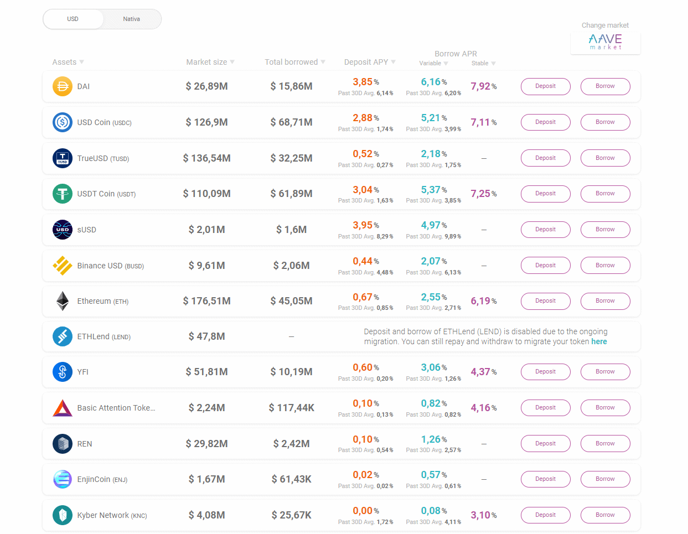

# ¿Qué es AAVE?

**AAVE, o anteriormente ETHLend, es un conocido proyecto de finanzas descentralizadas o [DeFi](https://academy.bit2me.com/que-es-defi-o-finanzas-descentralizadas/) que está centrado en la realización de prestamos con criptomonedas, usando una sencilla interfaz y bajo un esquema que revoluciono este sector.**

Uno de los proyectos [**DeFi o de Finanzas Descentralizadas**](https://academy.bit2me.com/que-es-defi-o-finanzas-descentralizadas/) más antiguos es AAVE, anteriormente conocida como ETHLend. Esta es una plataforma que en un principio se dedicaba a ofrecer préstamos descentralizados con garantías en [**criptomonedas**](https://academy.bit2me.com/que-es-una-criptomoneda/). Pero a lo largo de su existencia, AAVE se ha visto sometida a las mismas fuerzas evolutivas del mundo crypto. Un hecho, que le ha llevado a convertirse en mucho más que una simple plataforma de préstamos crypto.

Ahora AAVE es una completa plataforma DeFi con múltiples herramientas, las cuales conocerás a continuación.

## AAVE (ETHLend), los inicios del DeFi sobre Ethereum

ETHLend era el nombre con el que, en 2017, inició el proyecto AAVE. De hecho, su lanzamiento responde a un exitoso [**ICO (Oferta Inicial de Monedas)**](https://academy.bit2me.com/ico-criptomonedas/) que les permitió recaudar 17 millones de dólares. Con esta financiación, el proyecto logró sacar adelante su plataforma y para finales de 2017, se lanzó el token LEND, el corazón de la plataforma.

La idea del proyecto era sencilla: **crear un mercado descentralizado de préstamos**. Por un lado estaban los que deseaban pedir préstamos, y por otro los que prestaban criptomonedas a cambio de un interés. En AAVE los que piden préstamos han de poner un colateral de garantía, para evitar los impagos. Un mecanismo bastante flexible que llamó la atención de muchos usuarios.

Además, la plataforma ofrecía préstamos con diferentes tipos de colaterales. Toda esta flexibilidad hizo de ETHLend una plataforma muy utilizada en el criptomundo, especialmente por traders que buscaban préstamos que sirvieran para apalancar sus posiciones y obtener mejores ganancias.

En septiembre de 2018, los desarrolladores de ETHLend decidieron transformar la plataforma ofreciendo nuevos servicios y con ello cambiaron su nombre a AAVE. Además, AAVE transformó su sistema de préstamos a uno basados en mercados de liquidez, donde los precios se calculan en función de la disponibilidad de activos en dicho mercado.

En palabras sencillas, los precios dentro de AAVE son definidos de forma algorítmica tomando en cuenta la demanda y oferta de los activos. Una idea muy parecida por ejemplo a la que podemos ver en [**Uniswap**](https://academy.bit2me.com/que-es-uniswap/) o [**Curve**](https://academy.bit2me.com/que-es-curve-crv/), con el que compartiría la misma categoría de **mercados automatizados de dinero (Automated Market Money o AMM).**

### Objetivos de AAVE

El objetivo de AAVE es el de crear un mercado de préstamos algorítmicos donde los usuarios puedan hacer dos cosas:

1. **Invertir dinero en pools para crear liquidez**. Esto les permitirá ofrecer préstamos a otros usuarios, y obtener ganancias en forma de intereses por su papel de proveedores de liquidez.
2. **Crear una plataforma capaz de ofrecer préstamos con diversos colaterales, opciones de colateralización y políticas de funcionamiento.** Esto con el fin de ajustarse a las necesidades de sus usuarios y distintos mercados.

El funcionamiento de estas dos opciones es sencillo. En primer lugar, si deseas ser un proveedor de liquidez, todo lo que debes hacer es invertir tu dinero en las pools dentro de AAVE. De esta manera, con cada nuevo préstamo realizado por la plataforma obtendrás una pequeña ganancia que se traducirá al final en la ganancia total de tu inversión.

Por otro lado, si eres un usuario que desea un préstamo, todo lo que debes hacer es interactuar con dicha plataforma. En este punto, AAVE pedirá una garantía a cambio de ofrecerte el préstamo en cuestión. Básicamente empeñas tus criptoactivos a cambio del préstamo, una vez que devuelvas el préstamo, la plataforma te reintegra la totalidad de los criptoactivos empeñados.

Estas son las funcionalidades básicas de AAVE, y en todo momento tienen un claro objetivo: **ofrecer una plataforma de préstamos segura y descentralizada.**

## Mecanismos de funcionamiento de AAVE

Ahora bien, ¿Cómo logra AAVE todo esto? ¿Cuál es el mecanismo que permite que toda su plataforma funcione y se mantenga? Para ver esto de una forma sencilla imaginemos el siguiente ejemplo:

> Daniel desea obtener un préstamo que le permita hacer una pequeña inversión. Lógicamente espera una buena ganancia de esa inversión. Sin embargo, Daniel no tiene en su poder el dinero suficiente para la inversión que desea hacer, pero si tiene entre sus posesiones una casa, así que usará el mismo como garantía hipotecaria para pedir un préstamo al banco.
>
> El banco en este punto realiza una valoración de la casa, y acuerda un valor con Daniel. Tras ello el banco le entrega a Daniel un préstamo bajo unas determinadas condiciones de pago e intereses. De esa forma, Daniel obtiene su dinero, hace la inversión, y al cabo de X meses deberá haber pagado su préstamo y los intereses, pero además habrá obtenido las ganancias de la inversión.

Este tipo de ejemplo es bastante sencillo de ver, ya que estamos acostumbrados a la figura de la hipoteca. En el caso que nos atañe, AAVE hace precisamente lo mismo, te pide como usuario una garantía en forma de criptomonedas por la cual te ofrece dinero (otras criptomonedas) en forma de préstamo. Dicho préstamo está bajo unas condiciones muy claras, donde deberás pagar el mismo en un determinado espacio de tiempo y con unos intereses claros. Así, al devolver el préstamo, la plataforma obtiene sus ganancias y tú puedes recuperar tus criptomonedas sin mayor problema.

Las ventajas de esto son muchas pero de momento destacaremos dos:

1. En todo el proceso no han habido intermediarios centralizados en forma de corporación opaca, solo interactúas con unos [**smart contracts**](https://academy.bit2me.com/que-son-los-smart-contracts/) transparentes e inmutables.
2. En ningún momento vendiste y compraste criptomonedas, simplemente empeñaste, por lo que la tributación de ello es muy diferente y ventajosa frente a una compra / venta.

Por ello, AAVE es mucho mejor que un banco y las posibilidades que te ofrece son mucho mayores que las de cualquier institución financiera tradicional puede ofrecerte. Sin embargo, este sencillo ejemplo solo muestra de forma superficial lo que AAVE hace, ya que detrás se esconde mucho más. ¡Conozcamos más!

### Pools de liquidez, aglutinando activos para realizar préstamos

AAVE es capaz de ofrecer préstamos a quienes lo requieran gracias a las pools de liquidez. Las pools de liquidez son una agrupación de criptomonedas que son introducidas al protocolo. Son creados por los usuarios que desean poner ahí sus criptomonedas y, a cambio, reciben el nombre de proveedores de liquidez o LP.

El objetivo de quienes juegan el papel de proveedores de liquidez en estos pools de AAVE es obtener beneficios, a través de los intereses que se generen cada vez que sus criptomonedas son prestadas.

Este mecanismo sirve de incentivo para que más y más personas deseen inyectar liquidez, y con ello ofrecer mayores préstamos y obtener mayores ganancias.

Estas pools en AAVE actualmente representan a varias criptomonedas. De hecho, el protocolo soporta pools de criptomonedas como **[DAI](https://academy.bit2me.com/que-es-dai/), USDC, TrueUSD, [USDT](https://academy.bit2me.com/que-es-usdt-theter-criptomoneda/), sUSD, BUSD, [Ethereum](https://academy.bit2me.com/que-es-ethereum-eth-criptomoneda/), YFI, BAT, EnjinCoin, KNC, LINK, Mana, [MKR](https://academy.bit2me.com/que-es-makerdao/), REP, [ZRX](https://academy.bit2me.com/que-es-token-0x-zrx/), [wBTC](https://academy.bit2me.com/que-es-wrapped-bitcoin-wbtc/), SNX y el el token nativo de AAVE, LEND.**

En definitiva, un total de 19 tokens distintos soportados que al momento de escribir este artículo suman un total de 1,8 billones de dólares en valor bloqueado. Es decir, las distintas pools de AAVE en la actualidad cuentan con una liquidez de 1,8 billones de dólares.

Esto nos da una idea clara del nivel de relevancia económica que tiene AAVE dentro del ecosistema DeFi actual. Y también nos dice una cosa: son muchos usuarios que han mostrado gran interés por el modelo de funcionamiento de AAVE.

Las pools, por supuesto, no solo sirven para amasar dinero, sino también para ofrecer ganancias. Las pools ofrecen a quienes inyectan liquidez un porcentaje de ganancia anual que va desde 4,45 % (para DAI) hasta el 0.02 % (para ZRX). Aunque estos valores también son ajustados de acuerdo al nivel de oferta y demanda dentro de ese pool y el total de liquidez disponible dentro del mismo. Todo ello es manejado por [smart contracts](https://academy.bit2me.com/que-son-los-smart-contracts/) que vigilan de forma constante estos parámetros.

### Tasas de interés variables y estables

Otro de los puntos más llamativos de AAVE es su capacidad de ofrecer tipos de intereses ajustados a las necesidades. AAVE ofrece a sus usuarios dos opciones de tipo de interés (estables o variables) y se puede elegir libremente entre ellas. De esta manera, el usuario puede en todo momento elegir el mejor interés para su préstamos, buscando la mejor posición posible.

Gracias a esta función, AAVE se ha diferenciado de otras plataformas del sector y se ha permitido también tener un gran crecimiento en este año 2020.

### Sistema de seguridad para los préstamos

AAVE siendo un protocolo de préstamos que usa garantía criptomonedas, también tiene una serie de salvaguardas para evitar que la volatilidad de los mercados rompa con la dinámica positiva del sistema. La mayoría de estas salvaguardas recaen en en **Safety Module (SM)** o Módulo de Seguridad de AAVE. Básicamente, es un sistema que se encarga de vigilar el buen funcionamiento de AAVE y todos los subsistemas unidos al protocolo (como el caso de los oráculos).

El sistema está formado por las siguientes áreas:

1. **Módulo de [staking](https://academy.bit2me.com/que-es-staking/)**: el cual se encarga de proteger la liquidez del protocolo en medio de una caída de los mercados de criptomonedas.
2. **Módulo de subasta**: el cual se activa en medio de un mercado en déficit para reconvertir los tokens bloqueados y mantener al mínimo las pérdidas.
3. **Un Módulo Backstop**: el cual contiene el ETH y las monedas estables depositadas previamente que tienen una posición de prioridad en la subasta en el caso de que ocurra un evento de déficit.
4. **Reserva del ecosistema**: con el cual se pueden cubrir pérdidas dentro del protocolo.
5. **Oráculos**: provistos por Chainlink y respaldados por AAVE, los cuales están pensados para tener información de primera mano sobre las acciones del mercado y de allí se tomarán las decisiones siguientes dentro de AAVE.

Gracias a este esquema de funcionamiento, AAVE garantiza que en medio de arremetidas bajistas en el precio de los tokens de sus pools, los proveedores de liquidez siempre puedan mantener una posición positiva con respecto a sus tokens invertidos.

### Uniswap, dentro de AAVE

AAVE cuenta con sus propios pools de liquidez para ofrecer préstamos a sus usuarios, pero además de esto también ofrece una posibilidad más: **usar los pools dentro de Uniswap.** El objetivo de este puente con Uniswap es traer estos activos de liquidez de Uniswap al espacio de préstamos como garantía para AAVE.

De esta manera, AAVE es capaz de presentar nuevos pares de préstamos, aumentar su nivel de liquidez y permitir que los usuarios de ambas plataformas puedan interactuar.

### Gobernanza del protocolo

AAVE también cuenta con un modelo de gobernanza que busca llevar al protocolo a un nuevo nivel de desarrollo. El sistema de gobernanza que plantean sus desarrolladores está apoyado sobre lo que ellos llaman AAVENOMICS.

La AAVENOMICS es toda una política económica que sostendrá AAVE en su totalidad. La idea principal es transformar su actual token LEND al nuevo token AAVE. Esta conversión se dará en una proporción de 100 LEND por 1 AAVE, y su objetivo es reducir la circulación de tokens LEND actual, y revalorizar al token AAVE.

De esta forma, cada tenedor de tokens AAVE tendrá potencial no solo de votar dentro de la plataforma, sino que tendrá un token de alto valor que tendrá su punto de origen en la producción de incentivos a los usuarios que hacen vida dentro del protocolo. En total, 16 millones de tokens AAVE existirán, de los 13 millones se repartirán entre los usuarios y 3 millones quedarán bloqueados en la reserva.

Junto a esto, AAVE busca que su nuevo token incremente la participación de los usuarios en la gobernanza, y al mismo tiempo le sirva de estabilizador macro en todo su sistema económico al ser una herramienta de staking y trading dentro de otros protocolos, como [**Balancer**](https://academy.bit2me.com/que-es-balancer/).

La visión de este modelo de gobernanza es completamente innovadora, sin embargo, de momento aún no existe un paper explícito sobre el funcionamiento completo de este sistema. Se espera que para el año 2021 este sistema comience a implementarse con el proceso de migración del token LEND al token AAVE.

## Flash loans, la función estrella de AAVE

Todo lo anterior deja claro que AAVE es un protocolo muy completo pensado en presentar las mejores herramientas para préstamos posibles. Sin embargo, hay una función estrella dentro de AAVE que lo ha catapultado en el ecosistema DeFi: los flash loans o préstamos flash.

Pero **¿Qué son los flash loans?** Pues bien, un flash loan o préstamos flash no es más que un préstamo sin garantía, en el cual puedes pedir prestado un activo, siempre que el monto prestado (y una tarifa) se devuelva antes del final de la transacción.

Esto es algo totalmente nuevo en el mundo financiero tradicional, pero también en el mundo blockchain, y es posible gracias al funcionamiento de los smart contracts y la forma en como la EVM de Ethereum funciona.

Básicamente lo que sucede es que se programa un préstamo, en el cual solicitamos una determinada cantidad de tokens de algún activo soportado por la plataforma. A cambio, realizaremos el pago de ese préstamo dentro de la misma operación realizada por el smart contract que estamos programando. En pocas palabras, durante la ejecución del smart contract que hacemos, pedimos el préstamo y lo pagamos, teniendo como tiempo intermedio todo el proceso de ejecución de ese smart contract.

En este punto (durante la ejecución del smart contract) es donde podemos programar transacciones extra dentro o fuera de AAVE manejando el monto prestado. Lo importante, es que al finalizar la ejecución del smart contract, se debe tener reintegrado el dinero prestado junto a los intereses.

Esta no es una herramienta de uso común para los usuarios de AAVE. El smart contract para un flash loans debe construirse desde 0 y atender a los requisitos pedidos por AAVE para su aceptación. En caso contrario, no se ejecutará el mismo. Pese a ello, los flash loans se han transformado en una herramienta de uso común para muchos entendidos del mundo DeFi y usuarios avanzados de AAVE.

## Pros y contras de este protocolo AAVE

### Pros

Uno de los principales pros de AAVE es la simplicidad de su uso a nivel de usuario. De hecho, desde el principio, cuando eran ETHLend, este protocolo ha sido reconocido como uno de los más sencillos de usar dentro del espacio DeFi.

Otro punto a favor de esta plataforma es que ofrecen muy buenas tasas de interés para los préstamos, pero no tanto así como ganancias para los liquidity providers. En este sentido, la plataforma está pensado para ser una plataforma de préstamos de alto volumen que busca compensar, estas dos facetas del protocolo.

Otro punto adicional es la gobernanza descentralizada del protocolo. Los tenedores de tokens LEND, pueden intervenir en el proceso y evolución del protocolo votando para incluir mejoras o modificar valores dentro del sistema. Esto habla de una gran apertura dentro del sistema, una que esperamos mantengan en el tiempo.

Además, otra funcionalidad interesante es que te permite retirar tu dinero directamente en ETH, incluso cuando haces uso de los flash loans. Esto es muy útil para interactuar con otras aplicaciones del mundo DeFi de Ethereum.

Finalmente, la seguridad de AAVE es una de las más estudiadas dentro del ecosistema DeFi. Siendo uno de los primeros protocolos en el ecosistema, su continua mejora y estudio de sus smart contracts lo hacen uno de los protocolos más seguros. Además, su seguridad económica garantiza también la estabilidad y buen funcionamiento del mismo incluso en las peores condiciones del mercado.

### Contras

Un punto negativo es los bajos intereses proporcionados por sus pools, lo que hace menos a este protocolo menos atractivo para inversores, en especial aquellos que ponen en practica el **yield farming** o el **liquidity mining**. Si tu intención es poner en práctica estas condiciones en AAVE, puede que no obtengas mucho valor por tu dinero. Sin embargo, AAVE puede apalancar tus posiciones dentro de otras plataformas (como [**Compound**](https://academy.bit2me.com/que-es-compound-comp/) o Yearn Finance), qué es lo que usualmente hacen los usuarios de esta plataforma.

Los flash loans pueden ser una poderosa herramienta con múltiples funciones, pero al mismo tiempo, una amenaza de alto nivel para estos protocolos. AAVE es uno de los primeros protocolos en implementar estas funciones, y aunque de momento acceder a las mismas es tedioso, no deja de estar esta ventana abierta a problemas de seguridad aun desconocidos.

## Enlaces de interés

**WEB OFICIAL**

[Ir a la web oficial](https://aave.com/)

**TWITTER OFICIAL**

[Ir a la cuenta oficial de Twitter](https://twitter.com/aaveaave)

**GITHUB OFICIAL**

[Ir al GitHub](https://github.com/aave/aave-protocol)

**DISCORD OFICIAL**

[Ir al Discord oficial](https://aave.com/discord)

**INSTAGRAM OFICIAL**

[Ir al Instagram oficial](https://www.instagram.com/aave.aave/)

**WHITEPAPER DE AAVE**

[Ir al whitepaper oficial de AAVE](https://academy.bit2me.com/wp-content/uploads/2021/07/Aave_Protocol_Whitepaper_v1_0.pdf)

## Bibliografía

- https://academy.bit2me.com/que-es-aave/
