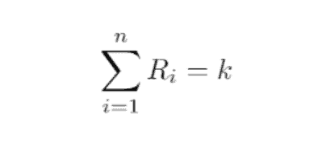
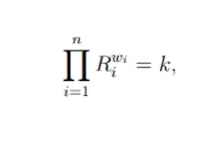

# ¿Qué es un Automated Market Maker (AMM)?

**Los Automated Market Maker o AMM, son una de las herramientas tecnológicas, económicas y financieras sobre las que se asienta la tecnología que hace posible a los exchanges descentralizados (DEX) y el ecosistema [DeFi](https://academy.bit2me.com/que-es-defi-o-finanzas-descentralizadas/).**

Un automated market maker (AMM) o creador automático de mercado, **es un protocolo ampliamente usado para la creación de [exchange descentralizado](https://academy.bit2me.com/exchange-descentralizado-dex/) (DEX).** Este protocolo **se apoya generalmente en una serie de formulaciones matemáticas y económicas que buscan crear un medio equilibrado que le permita a los usuarios realizar intercambios de criptomonedas de forma segura**, y de esta forma evitar situaciones riesgosas o contraproducentes para las transacciones.

A diferencia de los exchanges tradicionales, los DEX del tipo AMM son completamente autónomos y todo su funcionamiento es algorítmico, tal como se indica en los [**smart contracts**](https://academy.bit2me.com/que-son-los-smart-contracts/) que hacen posible su funcionamiento. Un buen ejemplo de este tipo de DEX es [**Uniswap**](https://academy.bit2me.com/que-es-uniswap/), el cual fue uno de los primeros en utilizar el modelo AMM para la realización de los intercambios en su plataforma.

Por supuesto, los AMM no son exclusivos del mundo de las criptomonedas. Las primeras experiencias con AMM provienen del mercado financiero tradicional, en donde existen desde hace ya varios años. En todo caso, explicaremos cómo funcionan los AMM en el mundo de las criptomonedas y te brindaremos información que te ayudará a entender la evolución de los AMM y su funcionamiento.

## ¿Cómo funciona un Automated Market Maker (AMM) en el mundo de las criptomonedas?

En forma general, un DEX del tipo AMM no se diferencia de un exchange tradicional. Es decir, es un espacio donde se pueden intercambiar criptomonedas y para ello se ofrece una interfaz de uso y toda las herramientas necesarias para realizar estas operaciones. Sin embargo, hasta allí llegan los parecidos, ya que detrás de todo esto se encuentra un modelo de funcionamiento completamente distinto.

En primer lugar, los AMM funcionan en su mayoría, mediante una formulación bastante sencilla que se describe matemáticamente de la siguiente forma:

> **x \* y = k**

¿Qué significa todo esto? Pues bien, desglosemos el significado de cada parte de la fórmula:

1. La x, nos sirve para indicar la cantidad del primer token del par (token A, en este caso) que se encuentran en un pool de liquidez.
2. La y, nos sirve para indicar la cantidad del segundo token del par (token B, en este caso) que se encuentran en un pool de liquidez.
3. Y finalmente la k, que nos sirve para indicar la constante fija que relaciona ambos tokens, y que permanecerá invariable durante toda la vida del pool de liquidez.

Esta fórmula nos aclara que los DEX del tipo AMM siguen el mismo modelo de presentación de pares de intercambios de los exchanges tradicionales. Por ejemplo, podemos un par de intercambio BTC/USDT en un exchange DEX del tipo AMM, gracias a que existe un pool de liquidez que tiene cantidades relacionadas de BTC y USDT que siguen y respetan la formulación arriba explicada. Un ejemplo de DEX que usa este tipo de formulaciones es [**SushiSwap**](https://academy.bit2me.com/que-es-sushiswap/), Uniswap V2 (Uniswap V3, usa una formulación distinta), [**PancakeSwap**](https://academy.bit2me.com/como-usar-b2m-pancakeswap/) y otros derivados.

Por supuesto, los DEX del tipo AMM no se limitan a la fórmula arriba descrita y, por ejemplo, Bancor utiliza una técnica propia diseñada para ser muy parecida a esta, pero que ofrece varias ventajas únicas que se adaptan a las necesidades de su plataforma. En pocas palabras, los DEX AMM pueden utilizar distintas formulaciones adaptadas a sus necesidades, algunas más complejas que otras.

### Pool de liquidez, el motor de los AMM

Por supuesto, el funcionamiento de los AMMs recae también en otro actor: **las pools de liquidez**. Estas pools no son más que **espacios controlados por [smart contracts](https://academy.bit2me.com/que-son-los-smart-contracts/) que permiten a los proveedores de liquidez agregar pares de tokens para que dicha liquidez sea utilizada para los intercambios** y, en su lugar, recibir recompensas por cada cambio realizado.

Por ejemplo, cuando vas a Uniswap y deseas hacer un intercambio de B2M/ETH, lo que pasa es lo siguiente:

1. Indicas la cantidad B2M a intercambiar por ETH.
2. El sistema de Uniswap te ofrece un valor de intercambio usando la formulación x * y = k, haciendo lo que se llama un “market making”.
3. Al aceptar el valor de intercambio, Uniswap toma tus B2M y lo coloca en la pool (aumentado la cantidad de B2M en la pool) y los intercambia por los ETH que serán enviados a tu monedero (disminuyendo la cantidad de ETH en el pool), con lo que se mantiene el equilibrio de la fórmula x * y = k (recuerda que k, es una constante).
4. Se cobran las comisiones, de las cuales una parte irá a Uniswap y la otra a los proveedores de liquidez (los usuarios que agregaron B2M/ETH a la pool para que pudieras hacer tu intercambio).
5. Con los ETH en tus manos, el B2M en el pool puede ser tomado por alguien que quiera comprarlo en ese espacio, manteniendo la dinámica de intercambio.

Como puedes ver el papel de las pools de liquidez es vital y, de hecho, parte de esto lo puedes ver en nuestro artículo de [**liquidity mining**](https://academy.bit2me.com/que-es-liquidity-mining/), una práctica que está estrechamente relacionada con estos pools y que seguro te encantará conocer.

### Recompensas dentro de los AMM

Los protocolos de la AMM a menudo tienen varios esquemas de recompensas, incluyendo la retribución por liquidez, [staking](https://academy.bit2me.com/que-es-staking/) y los derechos de gobernanza, con el fin de fomentar la participación y la contribución al protocolo que los aplica.

1. **Recompensa de liquidez:** los proveedores de liquidez (LPs) son recompensados por suministrar activos al pool de liquidez, ya que tienen que soportar los costes de oportunidad asociados a los fondos bloqueados en el pool. Los LPs reciben su parte de las comisiones pagadas por los usuarios del DEX.
2. **Recompensa por staking**: Además de la recompensa de liquidez, los LPs pueden realizar staking dentro de la plataforma con el fin de mejorar la posición de sus recompensas en la plataforma. Con ello se busca fomentar la tenencia de los LP tokens y revalorizar el mismo.
3. **Derecho de gobernanza**: otra recompensa dentro de los AMM es la de permitir decisiones de gobernanza dentro del protocolo, con lo que los LPs pueden tomar decisiones sobre el desarrollo del protocolo en el que participan.

### Costes implícitos dentro de los AMM

Por otro lado, la interacción con los protocolos Automated Market Maker (AMM) conlleva varios costes, incluyendo cargos por alguna forma de “valor” creado o “servicio” prestado y tasas por interactuar con la red de la red blockchain. Los participantes en la AMM deben prever tres tipos de comisiones: **la penalización por retirada de liquidez, la comisión de intercambio y la comisión de la red.**

1. **Penalización por retirada de liquidez**: esta aplica cuando el proveedor de liquidez desea retirar la liquidez que ha introducido al protocolo, lo que afecta negativamente a la usabilidad de la pool al elevar el **slippeage o deslizamiento**.
2. **Comisión de intercambio**: Los usuarios que interactúan con el pool de liquidez tienen que reembolsar a los LPs por el suministro de activos. Esta compensación viene en forma de comisiones de intercambio que se cobran en cada operación de intercambio y luego se distribuyen a todos los LPs.
3. **Comisión de la red**: Cada interacción con el protocolo se ejecuta en forma de transacción en la cadena, y por tanto está sujeta a las comisiones aplicables a la blockchain donde se ejecuten.

### Otros costes de los AMM

Otros dos costes nativos de los DEX basados en AMM son el deslizamiento para los usuarios del intercambio y la pérdida de divergencia para los LP.

1. **Slippeage**: El deslizamiento o ***slippeage\*** se define como la diferencia entre el precio al contado y el precio realizado de una operación. Tiene una estrecha relación con los spreads que solemos ver en los exchanges centralizados.
2. **Impermanent loss**: Para los LP, los activos suministrados a un protocolo siguen expuestos al riesgo de volatilidad, que entra en juego además de la pérdida de valor temporal de los fondos bloqueados. Así, a medida que el precio del activo se mueve hacia adelante y hacia atrás la depreciación del valor del fondo común desaparece y reaparece, y sólo se hace real cuando los activos se retiran de la pool. A este evento también se le conoce como “pérdida por divergencia”.

## Tipos de formulaciones AMM

Ahora bien, en un principio explicamos que la mayoría de Automated Market Maker (AMM) en el mundo cripto utilizan la formulación x * y = k, por ser sencilla y cumplir formidablemente con su trabajo. Sin embargo, existen otras formulaciones tanto en el mundo de las criptomonedas como el tradicional, que hacen posible el funcionamiento de los AMM y aquí explicaremos algunas de ellas:

### Creadores de mercado de función constante (Constant Function Market Makers – CFMM)

Este es un tipo de Automated Market Maker (AMM) muy utilizado en los mercados financieros tradicionales y de criptomonedas. Los CFMM fueron diseñados en base a una función que establece un conjunto predefinido de precios basado en las cantidades disponibles de dos o más activos. A diferencia de las bolsas tradicionales basadas en el libro de órdenes, los operadores negocian contra un conjunto de activos en lugar de una contraparte específica. El término “función constante” se refiere al hecho de que cualquier operación debe modificar las reservas de tal manera que el producto de las mismas permanezca inalterado (es decir, igual a una constante).

Los CFMM suelen tener tres participantes:

1. **Comerciantes**: Intercambian un activo por otro.
2. **Proveedores de liquidez (LP):** Aceptan voluntariamente operaciones contra su cartera a cambio de una comisión.
3. **Arbitrajistas**: Mantienen el precio de los activos dentro de esa cartera de acuerdo con el precio del mercado a cambio de un beneficio.

Los CFMM suelen utilizarse para la negociación en el mercado secundario y tienden a reflejar con exactitud, como resultado del arbitraje, el precio de los activos individuales en los mercados de referencia. Por ejemplo, si el precio del CFMM es inferior al precio del mercado de referencia, los arbitrajistas comprarán el activo en el CFMM y lo venderán en una bolsa basada en el libro de órdenes para obtener un beneficio.

### Creadores de mercado de productos constantes (Constant Product Market Makers – CPMM)

Los CPMM son el tipo de AMM más visto en el mundo cripto y, de hecho, su origen está dentro de este ecosistema ya que su primera implementación fue dentro de Uniswap, y de estos sale la famosa formulación:

> **x \* y = k**

En este tipo de AMM, la negociación de cualquier cantidad de cualquiera de los activos debe cambiar las reservas de tal manera que, cuando la comisión es cero, el producto x * y sigue siendo igual a la constante k. Sin embargo, ten en cuenta que dado que Uniswap cobra una comisión, cada operación aumenta realmente k, y se genera un slippeage dentro de la formulación hasta que no es posible realizar operaciones hasta que no se recupere el equilibrio en el pool.

### Creadores de mercado de suma constante (Constant Sum Market Makers – CSMM)

Un Automated Market Maker (AMM) de suma constante es una implementación relativamente sencilla de un AMM de función constante, que satisface la fórmula:

Donde Ri son las reservas de cada activo y k es una constante. Aunque esta función produce un “deslizamiento cero”, no proporciona una liquidez infinita y, por lo tanto, es probable que no sea adecuada como implementación independiente para un caso de uso de intercambio descentralizado. En la práctica, lo que ocurriría es que cualquier arbitrajista siempre drenaría una de las reservas si el precio relativo de referencia de los tokens de reserva no es uno.

### Creador de mercado de media constante (Constant Mean Market Maker – CMMM)

Un creador de mercado de media constante es una generalización de un creador de mercado de producto constante, que permite más de dos activos y ponderaciones fuera del 50/50. Introducido por primera vez por Balancer, los mercados de media constante satisfacen la siguiente ecuación en ausencia de comisiones:

donde Ri son las reservas de cada activo, W son las ponderaciones de cada activo y k es la constante. En otras palabras, en ausencia de comisiones, los mercados de media constante garantizan que la media geométrica ponderada de las reservas se mantenga constante. Un famoso DEX AMM que usa este modelo es Balancer del cual puedes conocer más en este enlace.

## Conclusiones

Los AMM son una de las construcciones fundamentales sobre las que se asienta el ecosistema DeFi que se ha ido formando en los últimos años dentro del ecosistema cripto. Los distintos protocolos que existen en la actualidad que usan este modelo han demostrado no sólo su factibilidad, sino también su fiabilidad como modelos económicos sostenibles y prácticos para lograr sistemas de finanzas completamente autónomos y seguros.

Si bien, los AMM son una tecnología que aún puede mejorarse, y no es raro ver como cada vez se ajustan de forma más realistas a las necesidades de los mercados. Un buen ejemplo de esta situación es Uniswap, cuyo sistema AMM ha ido adaptándose a la necesidad de sus LPs y usuarios.

## Bibliografía

- https://academy.bit2me.com/que-es-automated-market-maker-amm/
