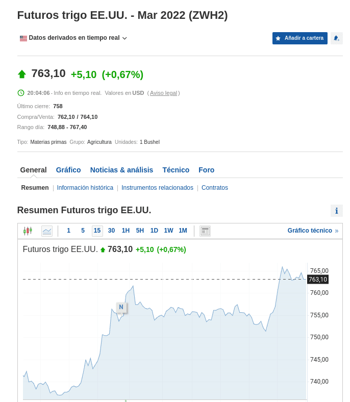
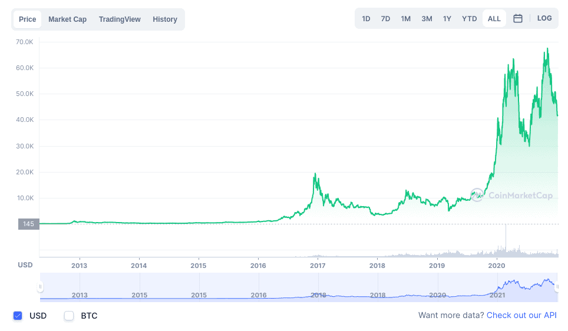

# ¿Qué es Bearish y Bullish?

**El mundo del trading de criptomonedas está lleno de conceptos y un lenguaje único, y entre esos conceptos, bearish y bullish, son dos de los más utilizados. Conoce aquí que significan y como se utilizan los mismos dentro de la jerga trader.**

Dos conceptos con el que te encontrarás muy a menudo en el trading de criptomonedas son los de bearish y bullish. Dos conceptos que debes tener muy claros y que tienen un peso importante en la psicología comercial de las criptomonedas y, por supuesto, en las operaciones burśatiles o en el sector Forex, donde también se utilizan estos dos términos.

Pero ¿Qué significan exactamente estos dos conceptos y cómo debemos prepararnos ante ellos?

## ¿Qué es Bearish?

Cuando hablamos de bearish, **nos referimos a un mercado bajista**, un mercado donde el valor de un activo está en descenso. Típicamente, se determina que un mercado es bajista o bearish, cuando el precio de un activo emprende un descenso de más de un 20% de su valor.

El símbolo de este concepto es el oso (“bear”, en inglés), en clara alusión a la forma de atacar con las garras hacia abajo que este animal utiliza contra sus presas, en este caso, a los trades y sus tenencias. También hace alusión, en los mercados especulativos, a la venta de la piel del oso antes de cazarlo.

Cuando estamos en un mercado bearish, nos encontramos con un mercado pesimista, donde los inversores buscan resguardarse de las pérdidas a la espera de nuevas oportunidades y mercados donde diversificarse. Ante esta situación, la oferta de ese bien o activo comienza a aumentar, lo que a su vez acentúa aún más el descenso del valor del activo frente a una demanda reducida.

Un buen ejemplo general de este comportamiento lo podemos ver en momentos de “cracks de mercados”. Uno de los quiebres de mercado más conocidos fue el de las puntocom en el año 2000. En ese momento, empresas como Amazon tenían un valor de 106,7 US$/acción y, tras la debacle, ese valor pasó a convertirse en 6,2 US$/acción. Estaba muy claro que en ese momento los inversionistas de Amazon estaban aterrados y con una marcada psicología pesimista sobre el futuro de esta empresa.

Basta decir que el valor de la acción no se recuperó a sus niveles del 2000 hasta el año 2007. Pero luego, llegó el “crack subprime” de 2008. En ese momento, el valor de la acción se hundió nuevamente hasta los 35,84 US$/acción, saliendo finalmente de ese caos en 2009. Por supuesto, estos dos crack marcaron fuertes tendencias bearish en todo el mundo, pero permitieron también la creación de nuevos mercados y formas de dinero. Una de esas nuevas creaciones fue precisamente Bitcoin, el cual fue creado por Satoshi Nakamoto, en respuesta del crack subprime de 2008.

Por supuesto, con las criptomonedas la historia no es distinta, ya que el ecosistema también ha tenido sus episodios bearish. El “criptoinvierno” de 2018, fue el primer acontecimiento bearish market de larga duración vivido por los mercados de las monedas virtuales. En ese entonces, Bitcoin pasó de un valor de más de 20.000 US$/BTC a rozar los 3.300 US$/BTC y la tendencia se mantuvo hasta 2020, cuando se logró recuperar nuevamente el nivel de los 20.000 US$/BTC. Incluso, muchos analistas cripto piensan que actualmente (enero 2022) el mercado se encuentra en presencia del inicio de un mercado bearish, que busca corregir el aumento de precio que Bitcoin ha sostenido desde 2020.

## ¿Qué es Bullish?

Cuando hablamos de bullish, hablamos de un mercado con tendencia alcista. El símbolo de este concepto es un toro, en clara alusión al ataque con los cuernos hacia arriba que con extraordinaria fuerza aplica este poderoso animal.

Esto significa que cuando estamos en un “mercado bullish” o “alcista”, el ambiente en dicho mercado es optimista. No solo el valor del activo se incrementa, sino que en general, la demanda (compra) del mismo aumenta, en una clara búsqueda de beneficios. En este punto, si un mercado bullish se da en medio de una poca oferta de ese activo, el efecto de esa tendencia alcista se incrementa, siguiendo el claro patrón de la Ley de Demanda y la Oferta, ya que aquellos con el capital para pagar por el activo lo harán, incluso en medio de una constante subida.

¿Te parece extraño este comportamiento? La verdad es que es bastante común y, de hecho, puedes verlo todo el tiempo en tu vida. Un ejemplo muy sencillo para entender esto, lo podemos ver con un bien muy común en nuestros hogares: el trigo. Cuando hay una buena cosecha, la disponibilidad del mismo aumenta (mayor oferta) y por tanto su precio tiende a bajar (y estamos felices por ello). Pero, sí se da el caso en que la cosecha es mala, la poca oferta frente a la demanda hace que el precio del tomate se disparé y, en ese punto inicia un periodo bullish (incremento en el precio) para ese sector. El efecto se observa rápidamente en el coste del pan y de cualquier otro derivado del trigo el cual, por cierto, es uno de los commodities más importantes a nivel mundial, teniendo su propio indicador para futuros.

Así, podemos entender el porque si un trader ve un alza en el precio de un sector y, al mismo tiempo, tiene fuertes indicios de que el valor de ese sector puede seguir el alza, entonces el trader comenzará a comprarlo impulsando el precio, y a medida que la oferta sea menor y la demanda se mantenga o se incremente, entonces el precio continuará en alza.

## ¿Qué hacer ante este tipo de mercados?

Si eres una persona con poca experiencia en el mundo de las criptomonedas y te encuentras frente a alguna de estas situaciones, puedes sentirte sobrepasado por el alud de información y previsiones sobre qué sucederá con el precio de la criptomoneda que tengas en tu poder. Después de todo, en momentos así la presión psicológica que se crea por el precio de mercado y cientos de miles de personas opinando es intensa.

Sin embargo, hay unos buenos consejos que puedes poner en práctica frente a este tipo de situaciones y aquí te damos algunos:

### En caso de bearish

1. Si el precio de un activo comienza a bajar, lo primero que debes hacer es entender la razón de la bajada. ¿Es una corrección y consolidación de precio luego de un mercado bullish prolongado? ¿Es un esquema pump&dump en el que has caído? ¿Algún problema de seguridad o de terceros relacionado con el activo? Investigar y conocer la verdad detrás de la bajada es fundamental para tomar la decisión de mantener la posición o dejarla.
2. Revisa el historial de precios del activo. Activos como BTC han bajado de forma dramática en ocasiones anteriores. Pero existe un patrón que se repite siempre: la recuperación siempre supera el valor anterior y lo supera con creces. Sí soportas un proyecto fuerte que incluso en malos momentos se sigue desarrollando viendo al futuro, entonces este consejo te puede resultar muy útil para tomar la decisión de seguir o hacerte a un lado.
3. En caso de que quieras aprovechar un bearish que ves venir, entonces opera en corto. Vende tu posición al precio actual (un precio alto), y cuando baje el precio del activo, recompra. De esa manera, podrás obtener más tokens de los que tenías inicialmente, y con el próximo bullish obtendrás mejores ganancias. Esta opción es EXTREMADAMENTE RIESGOSA, así que debes tener claro que el riesgo de pérdidas es enorme y que tal acción es solo tu responsabilidad.
4. Si eres un HODLER fuerte mantén tu posición y compra más (la conocida estrategia de “Seguir apilando”). Esta es una buena opción si buscas recompensas a largo plazo e inviertes dinero que no pone en riesgo tu calidad de vida ni la de tu familia.

### En caso de bullish

1. Si el precio de un activo comienza a subir, vigila las razones. Si es un activo que apenas abre mercado, lo mejor es mantenerte contenido porque esas tendencias bullish pueden durar apenas segundos para luego caer estrepitosamente rápido. También mantente atento de que no sea un simple esquema pump&dump, en tal caso, no caigas en la trampa y corras ese riesgo.
2. Si tienes capacidad para comprar más y tienes evidencia de que el bullish seguirá por más tiempo entonces compra más. Eso sí, NUNCA pongas en riesgo tu calidad de vida y la de tu familia, sigue la premisa de **“Invierte solo aquello que puedes permitirte perder”**, para que en el peor caso, dicha pérdida no te deje en bancarrota.
3. NO VENDAS CON PRISAS. Un error muy común es ver que el precio de un activo comienza un bullish y entonces vender la posición a un precio “alto”, cuando en realidad el mercado alcista apenas comienza y pierdes la oportunidad de obtener un poco sí tienes paciencia. En esos casos, lo mejor es mantenerse informado y ver hasta dónde se mantiene el impulso alcista.

## Bibliografía

- https://academy.bit2me.com/que-es-bearish-bullish/
