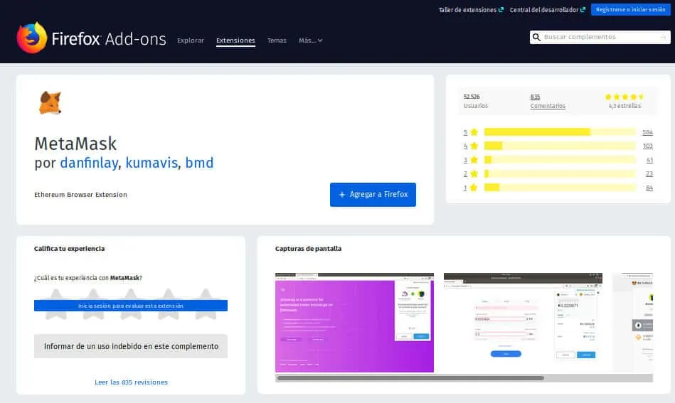
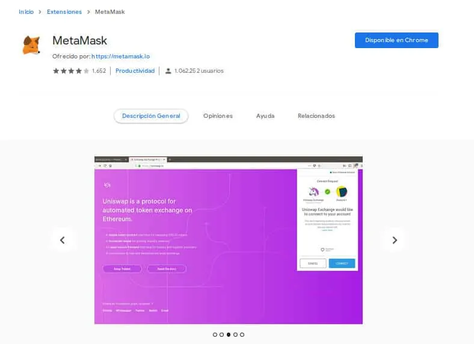
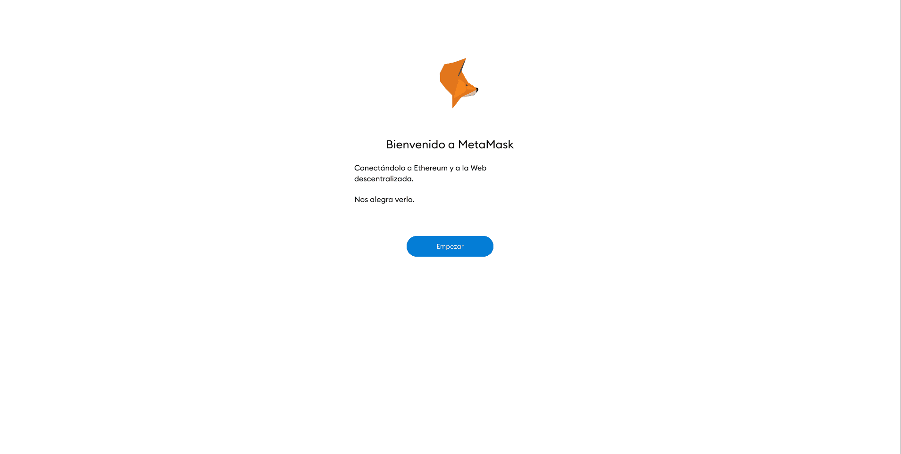
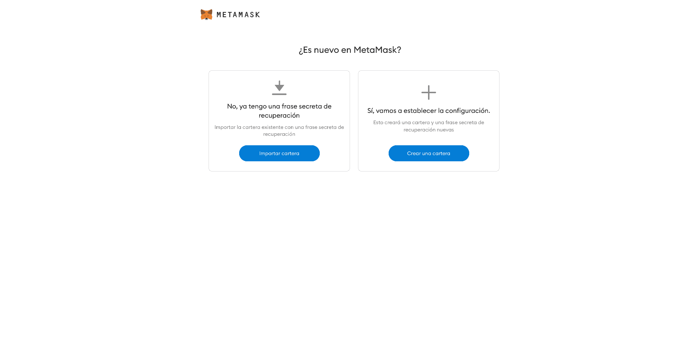
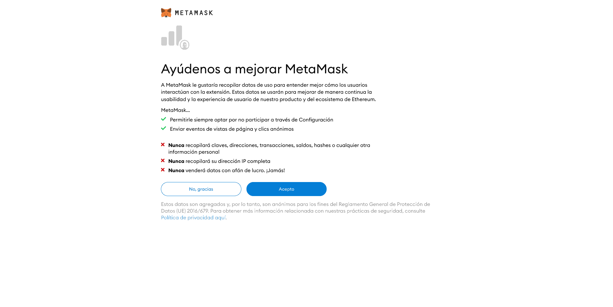
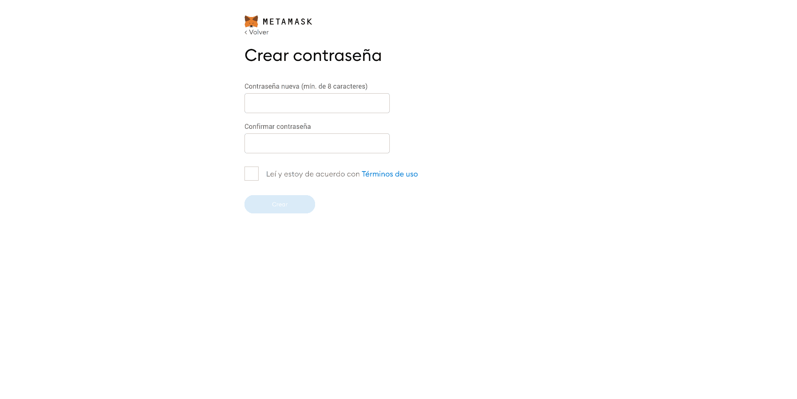
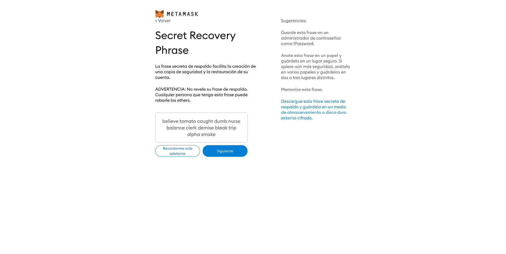
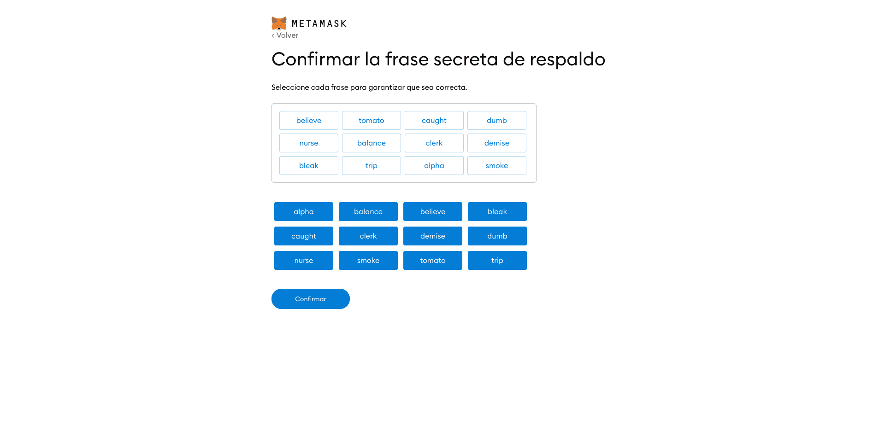
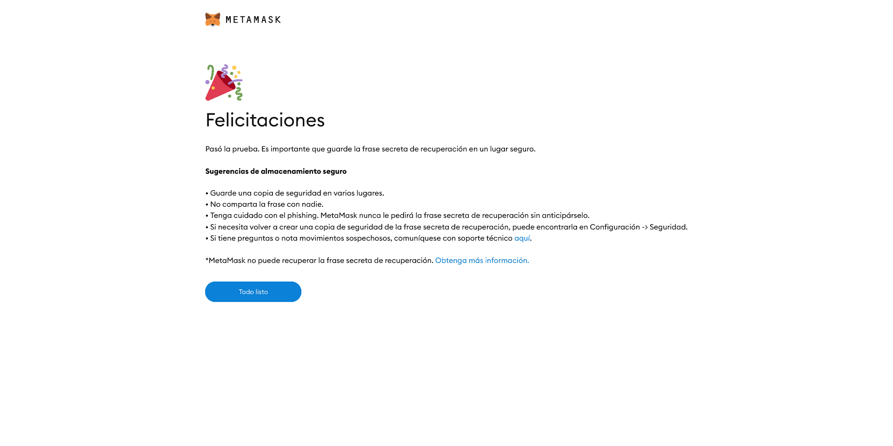
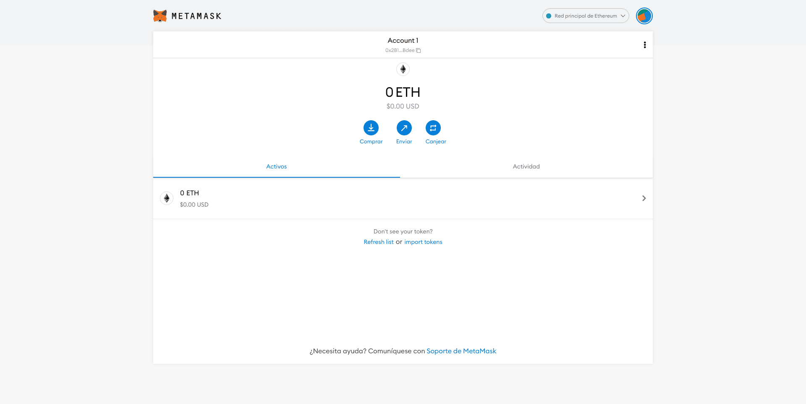

# ¿Qué es MetaMask? La forma más fácil de usar dApps

**Ethereum ha sido capaz de crear un amplio y rico ecosistema de dApps a su alrededor. Sin embargo, el uso de estas aplicaciones descentralizadas siempre había resultado algo engorroso. Algo que ha cambiado con MetaMask y su capacidad de simplificar el uso de dApps gracias a esta sencilla extensión para navegadores web.**

La interacción de los usuarios con las [**dApps**](https://academy.bit2me.com/que-son-las-dapps/) de blockchains como las de [**Ethereum**](https://academy.bit2me.com/que-es-ethereum-eth-criptomoneda/) requieren de un puente, y eso precisamente es lo que hace MetaMask. **MetaMask** es una extensión o plugin para navegadores web que permite a los usuarios interactuar fácilmente con las dApps de la blockchain de Ethereum. Esto es posible, porque MetaMask hace de puente entre las dApps y los navegadores web facilitando el uso y disfrute de las mismas.

Gracias a esto, los usuarios son capaces de utilizar de forma sencilla dichas aplicaciones distribuidas y todo de forma integrada desde su navegador favorito. Con soporte para [**Firefox**](https://www.mozilla.org/es-ES/firefox/new/), [**Chrome**](https://www.google.com/intl/es/chrome/), [**Opera**](https://www.opera.com/es/download) y [**Brave**](https://brave.com/), MetaMask ha acercado el mundo de las dApps al público en general.

Pero **¿Cómo nació MetaMask?** **¿Cómo funciona? ¿Qué ventajas ofrece?** Todo ello lo abordaremos a continuación.

## MetaMask, el nacimiento de un puente para las dApps

El desarrollo de MetaMask estuvo a cargo de dos desarrolladores, [**Aaron Davis** ](https://twitter.com/kumavis_)y [**Dan Finlay**](https://twitter.com/danfinlay). Fueron ellos quienes sentaron las primeras bases del desarrollo de MetaMask en el año 2016. La idea detrás del proyecto era sencilla y revolucionaria. MetaMask permitiría a los usuarios usar su navegador web para interactuar fácilmente con sus dApps favoritas, de forma rápida y segura.

Para ello, MetaMask usarían la interfaz y API web de Ethereum, [**web3.js**](https://web3js.readthedocs.io/en/1.0/). Esta librería oficial de Ethereum sería la base fundamental del mundo de posibilidades ofrecidas por MetaMask. Gracias a ella sería posible crear un proxy o puente comunicacional entre las dApps, MetaMask y los usuarios.

El trabajo resultó ser todo un reto técnico, en especial por el tema de mantener la seguridad necesaria para sus usuarios. Sin embargo, MetaMask logró su cometido y el **14 de julio de 2016 se presentó su primera versión.** En este punto, la extensión estuvo disponible para el navegador Chrome y derivados. Más tarde se presentaría su versión para Firefox, permitiendo el uso de dicha extensión en ese navegador.

Desde entonces MetaMask se ha transformado en la forma más fácil de acceder a las dApps a través de una interfaz fácil de usar. Todo ello sin necesidad de configurar absolutamente nada.

## ¿Cómo funciona MetaMask?

El funcionamiento de MetaMask es gracias al uso de web3.js, una librería que forma parte del desarrollo oficial de Ethereum. web3.js fue creada con el fin de permitir la creación de aplicaciones web que pudieran interactuar con la blockchain de Ethereum. Gracias a ella, páginas web y extensiones pueden aprovechar el poder de Ethereum y sus características.

En tal sentido, **MetaMask fue creada para ser un [monedero](https://academy.bit2me.com/wallet-monederos-criptomonedas/) para Ethereum y una herramienta para interactuar con [dApps](https://academy.bit2me.com/que-son-las-dapps/).** Para lograr ambos cometidos, MetaMask establece un canal de comunicaciones entre la extensión y la dApp en cuestión. **Una vez que la aplicación reconoce que MetaMask está presente, se habilita y puede ser utilizada por el usuario.**

Habilitada la dApp, el usuario puede realizar todas y cada una de las acciones o eventos que permite la misma. Desde la compra o venta de tokens, hasta el acceso a recursos o cualquier servicio que preste la misma. Todas y cada una de estas acciones tiene un costo, uno que debe ser cancelado en Ethereum o en el token indicado para el mismo. En cualquiera de los casos, MetaMask cuenta con las herramientas necesarias para manejar dicha interacción.

Es decir, **MetaMask no sólo genera un monedero de criptomonedas, sino que controla cada interacción del usuario con la dApp**, y realiza las operaciones necesarias para que dichas operaciones se lleven a cabo. Todo ello se lleva a cabo en un medio de comunicación seguro y con el uso de criptografía fuerte. MetaMask posee la capacidad de generar sus propias claves asimétrica, guardarlas localmente y gestionar su acceso. Gracias a esto, MetaMask es una extensión altamente segura.

## ¿Cómo instalar MetaMask?

La instalación de MetaMask no implica mayores dificultades. Al ser una extensión para navegadores popular y probada, la misma se encuentra disponible en la tienda o repositorio de extensiones. De esta forma, basta con acceder a la tienda de tu navegador y descargarla para usarla en tu navegador web de preferencia.

En el caso de Chrome, podrás encontrarla [**aquí**](https://chrome.google.com/webstore/detail/metamask/nkbihfbeogaeaoehlefnkodbefgpgknn?hl=es). En caso de que tengas un navegador derivado de Chrome como Opera, Brave o Vivaldi, dicha extensión funcionará perfectamente. Si en su lugar, utilizas Firefox, la extensión podrás encontrarla [**en este enlace**](https://addons.mozilla.org/es/firefox/addon/ether-metamask/?src=search). También puedes acceder a la extensión desde el sitio web oficial de MetaMask. Esta detectará tu navegador y te dirigirá al enlace correcto para la instalación de la extensión

Como advertencia desde Bit2Me Academy te advertimos de que **tengas mucho cuidado con las extensiones que instales en tu navegador**. Recuerda que existen muchos casos de suplantación de identidad (phishing) entre las extensiones por lo que se debe verificar muy bien lo que se instala. Para ello lo mejor es usar los medios oficiales y atender a las actualizaciones ofrecidas por la propia plataforma. Estas comprobaciones le permitirán disfrutar al máximo de tu experiencia con MetaMask.

## Proceso detallado de instalación y configuración

Dependiendo del navegador que utilices (Chrome, Edge o Firefox) es muy probable que con el paso anterior hayas instalado la extensión de MetaMask en el mismo. Ahora bien, aquí te guiaremos paso a paso en el proceso para que tengas tu MetaMask funcional al 100%. Este tutorial lo realizaremos sobre Firefox, pero es exactamente igual para el resto de navegadores.

### Paso #01: Comenzar con el setup del monedero

Realizada la instalación del monedero MetaMask verás una pantalla de bienvenida en la que debes hacer clic en “Empezar”

### Paso #02: Crear un monedero

El siguiente paso te dará dos opciones:

1. Importar un monedero: en este caso, MetaMask te pedirá que uses *seed phrase* (o clave de respaldo) para recuperar un viejo monedero MetaMask que hayas tenido en posesión. Este proceso te restaura ese monedero y debes tener la *seed phrase* y la clave de ese monedero a la mano.
2. Crear un monedero: para crear un nuevo monedero desde 0. Para este ejemplo elegiremos este paso.

### Paso #03: Aceptar las condiciones de uso de Metamask

En este punto MetaMask te hace saber que recolectan algunos datos que le son útiles para mejorar su monedero. Igualmente, te hacen saber que esos datos son anónimos y que no serán utilizados para rastrear tu actividad y mucho menos venderlos a terceros. En este punto, tienes la opción de “No aceptar” o “Aceptar”, en ambos casos, podrás configurar el monedero sin problemas.

### Paso #04: Crear la contraseña del monedero

Comienza lo realmente importante en la creación de nuestro monedero. Esta clave es la que permitirá que puedas desbloquear el monedero para su uso y de igual forma, es usada como entropía a la hora de crear el monedero. Todo esto significa que esta clave deber ser muy segura, por lo que te recomendamos usar claves alfanuméricas (con números y letras), con símbolos, mayúsculas y minúsculas, y con una extensión que no puede ser menor de 8 caracteres.

Un buen ejemplo de una clave con este tipo de opciones sería:

> **\#*L45!Crypt0!50n!L1b3rt4d*#**

En este caso hemos usado todas las opciones anteriores junto con una técnica de mnemotecnia para tener siempre presente nuestra clave segura en todo momento.

### Paso #05: Respaldar la seed phrase

Creada nuestra contraseña, MetaMask comienza a generar nuestra *seed phras*e la cual debemos copiar de forma muy cuidadosa en un papel o cualquier medio seguro. Recuerda en todo caso lo siguiente:

> La *seed phrase* y la contraseña del monedero son tu dinero, si las pierdes no podrás recuperarla, así que asegúrate de guardarlas en un lugar muy seguro.

Esta *seed phrase* deberás copiarla y luego MetaMask te pedirá que la confirmes para saber que ha sido copiada de forma correcta.

Al confirmar la *seed phrase* entonces ya tendrás configurada tu MetaMask y podrás usarla sin inconvenientes con los ETH o tokens que desees.

## ¿Dónde puedo usar MetaMask?

Gracias a la amplia popularidad de MetaMask, existen muchas dApps que soportan la interacción por media de esta extensión. Entre las aplicaciones más populares a las que puedes acceder mediante MetaMask se pueden destacar:

1. **Exchanges descentralizados**. **[Bit2Me DEX](https://bit2me.com/dex/)** es uno de estos mercados avanzados. Este tipo de plataformas de trading permiten aprovechar el gran potencial de la tecnología blockchain de forma clara, **eliminando por completo el riesgo de robos** al permitir tener, durante todo el proceso del intercambio, el control de tus tokens.
2. Aplicaciones como [**CryptoKitties**](https://www.cryptokitties.co/): compra tu gatito y criarlo como tu mejor mascota digital. CryptoKitties es uno de los juegos más populares de todo el criptomundo. Puedes comprar, vender o intercambiar gatitos virtuales y ganar dinero gracias a esto. Su integración con MetaMask te permite hacer uso de la plataforma de juego completamente.
3. Prediction markets como [**Veil Market**](https://veil.co/). Este es un reconocido mercado P2P de predicciones que aprovecha los protocolos Augur, 0x y Ethereum.
4. Servicios como [**Bonfire**](https://bonfireeth.github.io/Bonfire-15-I/). Bonfire es un acuerdo entre los usuarios para “quemar” ETH con la intención de hacer que ETH sea más raro y más valioso. Cada compromiso con el contrato también le da al usuario la oportunidad de ser seleccionado al azar para un premio en ETH. Las promesas rondan de 1 a 5 libras esterlinas dependiendo de la hoguera a la que se compromete un usuario. El 55% del ETH prometido al contrato se elimina en una quema de monedas. Una quema de monedas, es el proceso en el cual cada moneda es eliminada permanentemente de la circulación.
5. Juegos como [**0xUniverse**](https://0xuniverse.com/). Este es un entretenido juego del tipo RTS en el que debes conquistar planetas y expandir tu imperio a través de la galaxia. Es otro juego que permite el uso de MetaMask para interactuar con todos los aspectos del mismo.
6. Monederos del tipo [**MyEtherWallet**](https://www.myetherwallet.com/). Este reconocido monedero online es también otro de los proyectos que permite el uso de MetaMask. De hecho, se recomienda el uso de MetaMask para agregar una capa de seguridad extra al monedero. Esto gracias a la capacidad de MetaMask de almacenar localmente la información del monedero.

## Ventajas y desventajas de MetaMask

### Ventajas

1. Creada con la librería web3.js lo que garantiza que podrás usar todo el poder de Ethereum.
2. Completamente software libre, por lo que puede auditar su código y disfrutar de actualizaciones y parches de seguridad muy rápidamente.
3. Capacidad de almacenar claves privadas de forma local asegurando al máximo tus activos criptográficos.
4. Permite la creación de monederos por medio de HD. Esto ayuda a que los usuarios puedan realizar copias de seguridad de sus cuentas a través de las semillas.
5. Permite el uso de varias cuentas y redes Etherem gracias a la creación de perfiles de uso.
6. Tiene un modo privado que ofrece un alto nivel de seguridad a los datos de sus cuentas, gracias al uso del EIP 1102.
7. Permite mantener cualquier token [ERC-20](https://academy.bit2me.com/que-es-erc-20-token/) en el mismo monedero. De hecho, permite almacenar varios token [**ERC-20**](https://academy.bit2me.com/que-es-erc-20-token/) al mismo tiempo.
8. Tiene un alto nivel de integración con sitios como [**Coinbase**](https://www.coinbase.com/), [**ShapeShift**](https://shapeshift.io/) o **MyEherWallet** para poder recargar el monedero de MetaMask.
9. Permite el uso de [**nodos**](https://academy.bit2me.com/que-es-un-nodo/) Ethereum remotos o locales, permitiendo un alto nivel de seguridad en ambos casos.
10. Ofrece a nuestro navegador la capacidad de interactuar con la mayoría de DApps.
11. Cuenta con protecciones internas que bloquean casos de phishing u otros vectores de ataques que pongan en peligro sus fondos.

### Desventajas

1. El hecho de que sea una extensión para navegadores significa que estos pueden rastrear toda la actividad de MetaMask. Este es un caso especialmente cierto para Chrome, pues Google realiza una fuerte minería de datos de todos los usuarios de su navegador.
2. Pese a todas las protecciones de MetaMask, esta sigue siendo un monedero online con todas sus desventajas. Una vulnerabilidad en la extensión o el navegador puede poner en peligro todos sus fondos.
3. MetaMask está limitado solo a interactuar con los [smart contracts](https://academy.bit2me.com/que-son-los-smart-contracts/) y Dapps que señalan. No puede hacer mucho más, como por ejemplo, rehacer o escribir una nuevo smart contract.
4. El hecho de depender de redes externas para su funcionamiento, agrega un punto de fallo en el esquema de seguridad. La extensión puede ser segura, pero si los nodos no solo son, esto puede significar la pérdida o robo de información y fondos de los usuarios.

## Bibliografía

- https://academy.bit2me.com/que-es-metamask-la-forma-mas-facil-de-usar-dapps/
- https://medium.com/museo-del-caos/gu%C3%ADa-de-instalaci%C3%B3n-metamask-2021-ecabc595379
