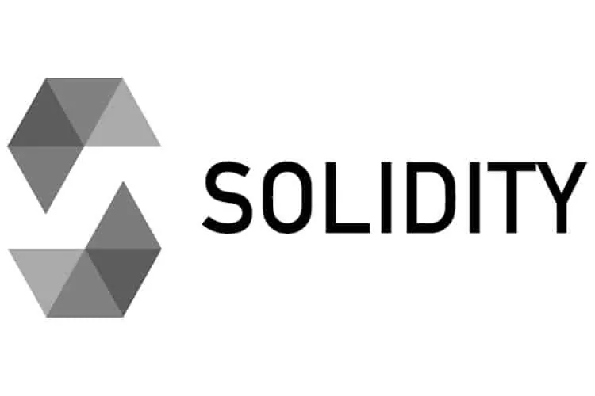
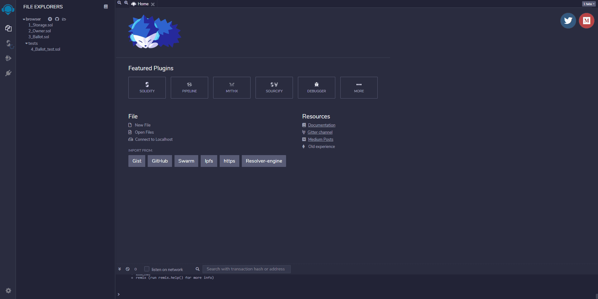
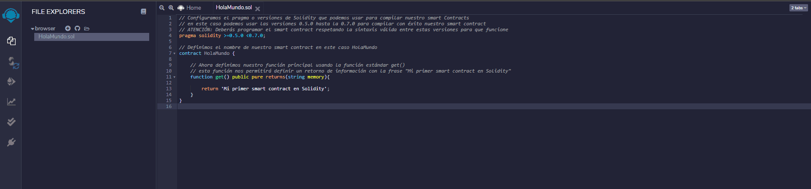
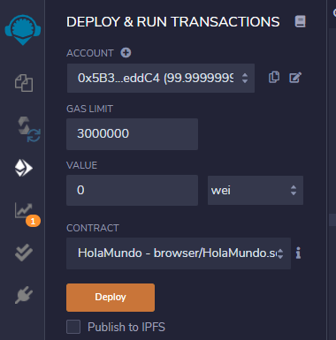
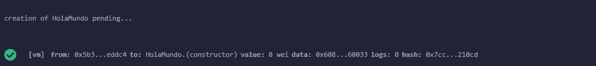
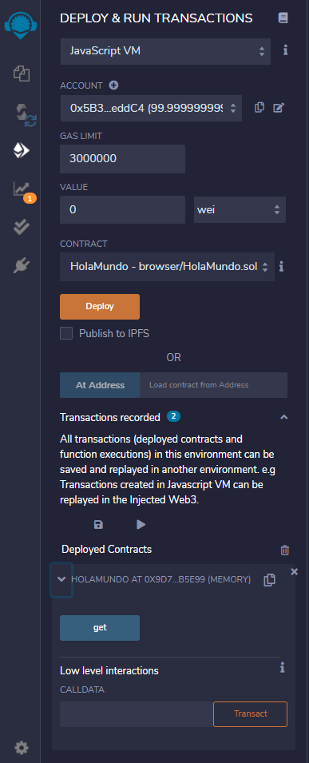

# ¿Qué es Solidity en los smart contracts de Ethereum Blockchain?

**Solidity, es el lenguaje de programación que comenzó a hacer posible las DApps de Ethereum, al permitir a los desarrolladores una forma fácil de realizar complejas aplicaciones distribuidas que sacaran el máximo provecho a la EVM de Ethereum.**

El nombre de **Solidity** hace referencia a un **lenguaje de alto nivel de tipado estático con el que se pueden programar [smart contracts](https://academy.bit2me.com/que-son-los-smart-contracts/) para la red de [Ethereum](https://academy.bit2me.com/que-es-ethereum-eth-criptomoneda/)**. Su sintaxis es muy similar a la de lengaujes muy conocidos como **C++** o **Javascript**. Solidity fue creado con el propósito de permitir la escritura de [smart contracts](https://academy.bit2me.com/que-son-los-smart-contracts/) de forma sencilla para la red Ethereum. Se trata de un lenguaje diseñado para sacar el máximo provecho a la [**Ethereum Virtual Machine**](https://academy.bit2me.com/que-es-ethereum-virtual-machine-evm/), permitiendo la creación y desarrollo de **smart contracts que puedan ser ejecutados de forma óptima en la EVM**.

Para ello el programador puede desarrollar sus aplicaciones en un lenguaje sencillo de utilizar, leer y mantener para que, al terminar, el motor de Solidity convierta ese código sencillo en el código máquina que la EVM entenderá, un código máquina prácticamente imposible de entender por una persona.

En esencia Solidity facilita el desarrollo de smart contracts sobre Ethereum y, aunque no es el único lenguaje, sí fue el primero, el más versátil y sobre el que más contratos inteligentes hay desarrollado.



## Solidity, un lenguaje Turing Complete

La principal característica de Solidity es que este lenguaje de programación es de tipo **Turing** **Complete**. Gracias a Solidity y a su relación con la EVM los desarrolladores pueden realizar programas que sean Turing Complete. Esto debido a que EVM posee la capacidad de **ejecutar cualquier código que sea definido por un desarrollador dentro del marco de sus capacidades**.

Esto representa una gran ventaja para la red Ethereum. Gracias a EVM y Solidity los desarrolladores pueden programar acciones que luego serán ejecutadas por la EVM de forma descentralizada en la red Ethereum. Pero esto también implica que se debe disponer de un mecanismo de protección para evitar su mal uso. Este mecanismo es conocido como **Gas** y sirve para evitar que el sistema pueda ser colapsado por la creación de bucles infinitos u otras acciones maliciosas. Este [**Gas**](https://academy.bit2me.com/que-es-gas-en-ethereum/) funciona como el **gasto computacional** que conlleva procesar una transacción o un smart contract en la red.

El concepto se asemeja por ejemplo a lo ideado por [**Adam Back** ](https://academy.bit2me.com/quien-es-adam-back/)con su sistema para luchar contra el spam email, el [**HashCash**](https://academy.bit2me.com/que-es-hashcash/).

## Importancia y desarrollo de Solidity

Ethereum nació como una alternativa a la red **Bitcoin**. Su creador, [**Vitalik Buterin**](https://academy.bit2me.com/quien-es-vitalik-buterin/) en su momento, propuso incorporar un lenguaje tipo Turing Complete a la red Bitcoin. Ya que consideraba que el lenguaje con el que fue desarrollado Bitcoin era insuficiente para la evolución de la red. Pero al no recibir ninguna respuesta por parte de los desarrolladores, Buterin decidió crear y desarrollar su propio proyecto: Ethereum.

Hoy en día, Bitcoin y Ethereum son las redes más valiosas, conocidas y empleadas por la comunidad de las criptomonedas. Ocupando el primer y segundo lugar respectivamente. No obstante, Bitcoin y Ethereum poseen grandes diferencias. Por ejemplo bitcoin la moneda de la red Bitcoin, fue creada como medio de pago y de resguardo de valor. Mientras que Ethereum, fue desarrollada con la finalidad de ser mucho más flexible y programable permitiéndole evolucionar con nuevas capacidades en el tiempo.

Esto gracias a EVM y Solidity, las dos herramientas que permiten a los desarrolladores sacar el máximo provecho de Ethereum. Con Solidity, se facilita la tarea de desarrollar [**aplicaciones** distribuidas (DApps)](https://academy.bit2me.com/que-son-las-dapps/) u otras funciones que hagan uso de los smart contracts.

El desarrollo de Ethereum comezó como una idea en la mente de **Gavin Wood** en 2014. La idea fue materializada por **Christian Reitwiessner** junto a un equipo de trabajo. El resultado de este trabajo llevó a Solidity. Desde entonces, el desarrollo de Solidity ha mantenido su evolución y en la actualidad se encuentra en la [**versión 0.7.4**](https://solidity.readthedocs.io/en/v0.7.4/) del lenguaje (noviembre 2020).

## Características

1. Solidity es un tipo de lenguaje orientado a objetos (OO) como C++ y C#.
2. Fue diseñado específicamente para desarrollar aplicaciones para la red Ethereum. Por lo que sólo corre en la blockchain Ethereum o derivadas compatibles.
3. Una ventaja que posee este lenguaje es que el código fuente de los programas que son realizados con el mismo puede ser accedido públicamente desde la blockchain. Incluso estando en bytecode, es posible descompilarlo y obtener una muestra bastante clara del código fuente original.
4. Solidity soporta la **herencia** y la **herencia múltiple**, dotándolo de una gran flexibilidad a la hora de programar elementos complejos.
5. Este lenguaje también proporciona una serie de bibliotecas muy útiles que facilitan la programación de los smart contracts, haciendo que el código sea reutilizable y más sencillo de mantener.

## Entornos de desarrollos disponibles

Como casi todo lenguaje de programación, Solidity puede explotar las ventajas de un entorno integrado de desarrollo o IDE. En Ethereum, el IDE oficial es conocido como [**Remix**](https://remix.ethereum.org/). Este facilita a los desarrolladores la creación de smart contract, a la vez que permite tener acceso al estado y propiedades de los smart contract ya creados. Además cuenta con poderosas herramientas de corrección y análisis de código para ayudar a los desarrolladores a depurar sus programas.

Remix también puede ser ejecutado y usado de forma online a través de Firefox o Chrome o directamente en nuestro ordenador. Y aunque este es el IDE oficial de Ethereum, también existen otros entornos compatibles con el lenguaje Solidity. Por ejemplo, [**Ethereum Studio**](https://studio.ethereum.org/) es un IDE especializado que proporciona acceso a un entorno completo de Ethereum a través de un intérprete de comando conocido como **shell**.


Así mismo, nos encontramos a **Plugin de Solidity** para [**IntelliJ IDEA**,](https://plugins.jetbrains.com/plugin/9475-intellij-solidity) otro IDE creado para el desarrollo de programas informáticos compatible con Solidity. **Atom** es una herramienta editable que se puede emplear para personalizar cualquier cosa. Podemos encontrar un paquete conocido como [**Etheratom**](https://github.com/0mkara/etheratom) que emplea la biblioteca web3.js para interactuar con un [**nodo**](https://academy.bit2me.com/que-es-un-nodo/) de Ethereum.

Otro IDE que podemos encontrar es el [**Plugin Visual Studio**](https://marketplace.visualstudio.com/items?itemName=JuanBlanco.solidity), creado por Microsoft. Este permite la creación y desarrollo de smart contract a través de un compilador de Solidity. También permite la creación de aplicaciones para Microsoft y aplicaciones webs modernas y servicios en la nube que usen su servicio Azure.

## ¿Cómo empezar a programar en Solidity?

**Comenzar a programar en Solidity para crear [smart contracts](https://academy.bit2me.com/que-son-los-smart-contracts/) en Ethereum puede sonar como un reto difícil. Sin embargo, en este articulo queremos mostrarte cuán fácil es empezar a desarrollar smart contracts ofreciéndote recursos y una breve entrada al mundo de la programación de este poderoso lenguaje.**

Como ya hemos mencionado, [**Solidity**](https://academy.bit2me.com/que-es-solidity-smart-contracts-ethereum/) es el nombre de un lenguaje de programación de alto nivel, muy parecido al conocido JavaScript, usado para la programación Web. Este lenguaje es usado para programar [**smart contracts o contratos inteligentes**](https://academy.bit2me.com/que-son-los-smart-contracts/) para la blockchain de [**Ethereum**](https://academy.bit2me.com/que-es-ethereum-eth-criptomoneda/), los cuales serán ejecutados por la [**EVM**](https://academy.bit2me.com/que-es-ethereum-virtual-machine-evm/).

Más específicamente, Solidity es un lenguaje de alto nivel que nos permite programar de forma sencilla para EVM y que luego puede ser compilado bytecode para que finalmente se ejecuten en la Máquina Virtual Ethereum. Al ser un lenguaje de alto nivel, significa que los desarrolladores cuentan con una herramienta sencilla para programar. Evitando así la dificultad de programar usando [**OP_CODES o códigos de operación**](https://academy.bit2me.com/que-es-un-op-code/), o bytecode de forma directa, algo que sí ocurre en [**Bitcoin**](https://academy.bit2me.com/que-es-bitcoin-btc-criptomoneda/).

Como resultado, la creación de [**aplicaciones descentralizadas (DApps)**](https://academy.bit2me.com/que-son-las-dapps/) resulta una tarea mucho más sencilla de realizar, revisar y testear, quedando al alcance de cualquier persona con conocimientos básicos de programación.

## Herramientas para comenzar a programar en Solidity

### Documentación y Libros sobre Solidity

Si tienes experiencia en programación, seguramente sabrás la importancia de contar con una buena documentación oficial sobre las posibilidades del lenguaje de programación que estás usando. Pues bien, esta premisa se cumple a conciencia con Solidity. En primer lugar, la documentación oficial de Solidity es excelente. En su [**web oficial**](https://solidity.readthedocs.io/en/v0.7.5/) puedes encontrar toda la información técnica que necesitas sobre las potencialidades y mejoras que presenta este lenguaje con cada nueva versión. Además, el desarrollo y mejora al lenguaje es constante demostrando que la comunidad busca mejorar e implementar nuevas funciones para hacer más sencillo y seguro la programación de DApps.

Si lo que deseas es programar en Solidity y ya tienes conocimientos previos de programación y desarrollo en otros lenguajes, este es el primer lugar al que debes ir. Si por el contrario, no tienes conocimientos en programación y desarrollo, primero deberás conocer las formas y operaciones básicas de los lenguajes de programación para entonces iniciar tu proceso de aprendizaje sobre Solidity.

Por otro lado, dos de los libros más importantes dedicados al desarrollo en Solidity son [**Solidity Programming Essentials**](https://www.packtpub.com/product/solidity-programming-essentials/9781788831383) de Ritesh Modi y [**Ethereum Smart Contract Development de Mayukh Mukhopadhyay**](https://www.packtpub.com/product/ethereum-smart-contract-development/9781788473040). Ambos libros han sido editados por Packt y están pensados para que interesados en el mundo de programación de Solidity pasen de ser principiantes a avanzados programadores en este lenguaje. Si quieres conocer aún más sobre Ethereum entonces puedes complementar tu lectura con [**Mastering Ethereum**](https://github.com/ethereumbook/ethereumbook) escrito por [**Andreas Antonopoulos**](https://academy.bit2me.com/quien-es-andreas-m-antonopoulos/) y Gavin Wood.

Si unes todos estos elementos de lectura entonces comenzarás a comprender muy bien qué es Ethereum y cómo puedes usar Solidity de forma efectiva para programar tu primera DApp y tal vez, con suerte, cambiar el mundo a mejor.

### Herramientas para programación y depuración

Ahora bien, conocer la parte teórica es solo un primer paso para comenzar tu camino a programar en Solidity. Pero es un paso sin valor si no eres capaz de llevar ese conocimiento teórico a lo práctico.

Para hacer posible esto deberás contar con herramientas para programar y depurar lo que escribas en este lenguaje. En ese caso, los IDE o Entorno Integrado de Desarrollo (Integrated Development Environment, en inglés), serán tu herramienta para lograr esto.

Un IDE es un programa que cuenta de forma integrada con una serie de herramientas que harán más sencilla tu labor de programar en un determinado lenguaje. Generalmente estos IDE contienen correctores de sintaxis, integración con librerías, localizadores de errores y modos que te permiten probar tu aplicación antes de desplegarla de forma pública.

En el caso de Ethereum, existen dos grandes IDE soportados oficialmente por la comunidad. El primero de ellos es [**Remix**](https://remix.ethereum.org/). Remix es un IDE web que podemos usar desde nuestro navegador y con el cual podremos programar y probar nuestras aplicaciones escritas en Solidity sin necesidad de instalar nada.

Otra herramienta muy usada en el mundo del desarrollo sobre Ethereum y Solidity es [**Truffle**](https://www.trufflesuite.com/). De hecho, Truffle es por lejos la herramienta mejor integrada del mundo Ethereum para la programación en Solidity. Pero por otro lado, la cantidad de opciones de Truffle lo hace una herramienta compleja de usar, en especial, si estás comenzando a aprender, por lo que solo es recomendable para personas con conocimientos más avanzados.

Del lado contrario está [**ETHFiddle**](https://ethfiddle.com/), una sencilla web que te permite ejecutar código escrito en Solidity y aprender a programar de la forma menos compleja posible. Sin embargo, si lo que deseas es crear tu propio ambiente de programación usando alguna otra herramienta, también puedes hacerlo.

Existen otros IDE y plugins que te permiten hacer esto. Por ejemplo, [**IntelliJ IDEA**](https://www.jetbrains.com/es-es/idea/) es un IDE para múltiples lenguajes de programación, pensado especialmente para programar en Java, pero que también puede ser usado para programar usando Solidity. Otras herramientas de desarrollo como [**Atom**](https://atom.io/) o [**Visual Studio Code**](https://code.visualstudio.com/) también te permiten instalar plugins que habilitan la programación usando Solidity. En cualquiera de estos casos, contarás con todo lo necesario para poder armar tu código Solidity.

### Herramientas de simulación

Otra herramienta vital para la programación es contar con acceso a la [**testnet**](https://academy.bit2me.com/que-es-testnet/) de Ethereum. Esto es necesario ya que deberás poder probar tu aplicación en un entorno muy similar al real, pero donde no te cueste dinero ninguna prueba o error.

Para ello puedes instalar un nodo de Ethereum y seguir los pasos de configuración para trabajar sobre alguna de las testnet de Ethereum, o bien acceder a las redes testnet usando un deployer (desplegador) con dicha capacidad para el IDE que estés usando. El uso de una red testnet te permitirá poner tu DApp en un ambiente muy parecido al que podrías encontrar en la red principal de Ethereum, y constatar así que la misma funciona de forma correcta en todo momento.

Sin embargo, una forma más sencilla de lograr esto es [**Ganache**](https://www.trufflesuite.com/ganache). Ganache es una herramienta que te permite simular un nodo completo de Ethereum sin los costos asociados de tener un nodo que mantiene todo una blockchain en tu computador. Gracias a esto, Ganache es una herramienta mucho más sencilla, rápida de usar y que obtiene los mismos resultados. Además, cuenta con una amplia integración con Truffle y es fácilmente integrable con otros IDE.

### Herramientas de análisis de seguridad y monitoreo

Si bien la tecnología blockchain es muy segura, la seguridad es algo que requiere proactividad en todo momento. Por esa razón, la comunidad detrás de Ethereum y Solidity ha creado una serie de herramientas de análisis que ayudan a mejorar enormemente la seguridad del código escrito para nuestros smart contracts evitando con ello que los bugs se nos escapen y terminen ocasionando pérdidas a nuestros usuarios.

Herramientas como [**MythX**](https://mythx.io/), [**Mythril**](https://github.com/ConsenSys/mythril) o [**Alethio**](https://aleth.io/) son algunas de las opciones más potentes en este sentido, permitiéndote potentes análisis de seguridad (para los casos de MythX y Mythril) y para la monitorización de tus smart contracts (en el caso de Alethio).

### Otros recursos de aprendizaje

Por supuesto, esto es solo una pequeña parte del universo de opciones que existen en la comunidad de Ethereum. En dicho caso, una de las recopilaciones más completas de herramientas y recursos de aprendizaje para Ethereum y Solidity la puedes encontrar en este repositorio de [**ConsenSys**](https://consensys.net/). Acá podrás acceder a distintos recursos de gran relevancia en la comunidad para aprender al máximo como programar en Solidity y sacarle el mayor provecho a tus conocimientos en este lenguaje.

Pero ¿Qué tal si en lugar de solo nombrar herramientas te mostramos el potencial de Solidity en un sencillo ejemplo? Pues bien, si te gusta la idea solo debes continuar leyendo.

## Nuestra primera experiencia con Solidity

Para nuestra primera de programación en Solidity usaremos Remix.

Nuestra elección de esta herramienta responde a que permite probar de forma muy sencilla el código que escribimos, así como nos brinda salidas de depuración sencilla y la facilidad de usar distintas versiones de Solidity. En ese caso, lo primero que deberás hacer es ir a esta web y seleccionar el plugin **“Solidity”** con el fin de tener todas las opciones de programación y depuración para este lenguaje.



Una vez que tengas activo el plugin “Solidity” podrás ver la siguiente sección de información, y podemos proceder a crear nuestro primer programa en Solidity. Para ello debes ir al **“File Explorer”** y agregar un nuevo archivo al que llamaremos **“HolaMundo.sol”**.

```solidity
// Configuramos el pragma o versiones de Solidity que podemos usar para
// compilar nuestro smart contracts en este caso podemos usar las versiones 0.5.0
// hasta la 0.7.0 para compilar con éxito nuestro smart contract
// ATENCIÓN: Deberás programar el smart contract respetando la sintaxis válida
// entre estas versiones para que funcione

pragma solidity >= 0.5 .0 < 0.7 .0;

// Definimos el nombre de nuestro smart contract en este caso HolaMundo

contract HolaMundo {

    // Ahora definimos nuestro función principal usando la función estándar get()
    // esta función nos permitirá definir un retorno de información con la frase
    // "Mi primer smart contract en Solidity"

    function get() public pure returns(string memory) {
        return 'Mi primer smart contract en Solidity';
    }
}
```



Muy bien ahora que tenemos nuestro código escrito en Remix, procedemos a compilar y ejecutar el mismo. Eso lo podemos hacer llenado a la sección **“Solidity Compiler”**. En esta sección solo deberemos estar atentos a la versión de Solidity que usaremos para compilar la cual debe estar entre los parámetros del pragma del smart contract. Es decir, debemos seleccionar cualquier versión de Solidity entre 0.5.0 y 0.7.0. Hecho esto, nos bastará con presionar el botón **“Compile HolaMundo.sol”.**


Lo siguiente será realizar el despliegue del smart contract, lo que podemos hacer el dirigirnos a la sección **“Deploy & Run”**, en la cual debemos hacer clic en **“Deploy”**. Desplegar un contrato tiene un coste en Ethereum, ya que se emite una transacción real con la información. No obstante, al estar en una red de pruebas, esos ether no tendrán coste real.



En respuesta obtendremos la siguiente respuesta:



Finalmente podremos ver que nuestra función **get()** se encuentra disponible para interactuar con ella. Si hacemos clic sobre ella, interactuamos y obtendremos la salida esperada (nuestro mensaje).



Para ver el mensaje completo, podemos hacer clic en el botón **“Debug”** y así podremos ver toda la salida. En dicha salida, podemos ver el mensaje que hemos puesto en el contrato.


## Evita programar por programar

Es cierto que la mejor forma de aprender algo es haciéndolo. Y es importante que programes, pero intenta ponerle sentido a lo que haces. Así que busca hacerlo con una idea de proyecto en mente, con ello te encontrarás ante situaciones reales que solventar.

Para encontrar buenas ideas es importante empaparte de la cultura que rodea toda la tecnología blockchain. Una tecnología que ha sido creada para descentralizar todo lo descentralizable. Seguro que, a poco que pienses, encontrarás situaciones donde unos pocos monopolizan el poder, toman decisiones de forma unilateral y todo ello sin transparencia.

Recuerda que la tecnología blockchain se ha creado para hacer un planeta más justo, democrático y transparente. Todo ello sin importar que caiga quien tenga que caer por medio: gobiernos, reyes, religiones, corporaciones,… No tengas miedo a plantar cara a lo que sea que consideres injusto.

## Bibliografía

- https://academy.bit2me.com/que-es-solidity-smart-contracts-ethereum/
- https://academy.bit2me.com/como-programar-solidity/
