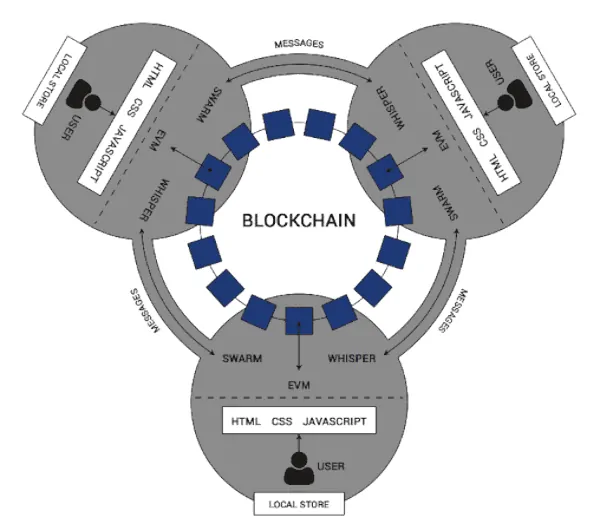

# ¿Qué son las DApps?

**Las DApps o aplicaciones descentralizadas, son un tipo de aplicación, cuyo funcionamiento se basa en una red descentralizada de nodos interactuando unos con otros.**

DApp es el acrónimo de “Decentralized Applications” o “Aplicaciones descentralizadas”. Este es un tipo de aplicación, cuyo funcionamiento no depende de puntos de control o servidores centrales, **sino que funciona en base a una red descentralizada.** Una red en la que sus usuarios tienen el control total del funcionamiento de la misma. Las DApps permiten que las personas puedan acceder a distintos servicios de forma segura. Estas aplicaciones pueden ser utilizadas en computadores personales, smartphones o incluso ser accesibles vía web.

Para tener una idea más clara de lo que es una Dapp, debemos pensar en una App (aplicación / servicio) tradicional. En esta categoría de apps tradicionales tenemos por ejemplo Youtube, Facebook, Twitter o Instagram. En todos esos servicios, los datos y decisiones se toman en unos servidores centrales. Esto le permite a la empresa detrás de esos servicios, tomar acciones de censura, alteración del comportamiento, o incluso beneficiar o perjudicar únicamente a determinados usuarios poniendo en constante tela de juicio la neutralidad e igualdad de condiciones. Ellos actúan como dictadores, tú sólo puedes confiar en que serán “buenos”.

## El origen

El concepto de DApps no es nada nuevo. Las primeras DApps conocidas se vieron en los protocolos de compartición de archivos como [**BitTorrent**](https://es.wikipedia.org/wiki/BitTorrent) o [**DC++**](https://es.wikipedia.org/wiki/DC%2B%2B). Ambas aplicaciones, son sistemas peer-to-peer de compartición de archivos con alta resistencia a la censura. Sin embargo, la primera DApp usando blockchain fue, el mismísimo Bitcoin. Esto es porque su estructura y funcionamiento describe con éxito la primera DApp blockchain de la historia.

Sin embargo, no fue hasta 2014 con la presentación de [**Ethereum**](https://academy.bit2me.com/que-es-ethereum-eth-criptomoneda/), su lenguaje Solidity y la capacidad de ejecutar **[smart contracts](https://academy.bit2me.com/que-son-los-smart-contracts/)** que las DApps se masificaron. Y es que gracias a esta triada, las DApps funcionando sobre blockchain comenzaron a hacerse muy populares. Una situación que puede llevar a la adopción masiva de la tecnología blockchain al permitir nuevas formas de interacción entre los usuarios, el mundo real y el virtual.

## Diferencias entre una DApp y una App tradicional

Las DApps y las Apps tradicionales tienen muchos elementos en común, sin embargo, su diferencia radica en cómo interactúan con dichos elementos. Ambos tipos de aplicaciones tienen tres estructuras básicas que son: el frontend, el backend y la capa de almacenamiento de datos.

### Frontend

La primera capa, el frontend, viene a ser la interfaz que los usuarios utilizan para interactuar con la aplicación. En este caso, tanto las DApp como las App tradicionales, pueden hacer uso de los inmensos recursos gráficos existentes para ello. Desde interfaces web escritas en HTML5 hasta las más elaboradas, en framework como Qt o GTK. La finalidad de esta capa es simplemente, dar al usuario la capacidad de interactuar, recibir y enviar información a la aplicación que esté usando.

### Backend

Esta segunda capa hace mención a la lógica principal de la aplicación. En una aplicación tradicional, esta lógica es centralizada, a diferencia de las DApps en la que está descentralizada. En las DApps, el backend está relacionado a un smart contract que se ejecuta sobre una blockchain, por ejemplo Ethereum. De esta forma, un smart contract tiene una programación que garantiza el funcionamiento de la DApp. Al ser los smart contract visibles y públicos, esto garantiza un alto nivel de transparencia y seguridad. Los usuarios pueden estar seguros que la DApp no hará nada distinto a lo que especifica el smart contract.

Adicional a esto, el backend es soportado por las API (Interfaz de Programación de Aplicaciones) y capacidades de la blockchain. Por ejemplo, en Ethereum existen diversas API para controlar la interacción del usuario con las capas de almacenamiento o autenticación por poner algunos ejemplos.

### Almacenamiento de datos

Por último, está la capa de almacenamiento. En una aplicación tradicional, está capa también es centralizada. Normalmente los datos son almacenados en el computador del usuario o en servidores controlados por terceros. Esta forma de trabajo, tiene muchos puntos de fallos. Un usuario por ejemplo, puede perder la información de la aplicación si su computador se daña. También puede suceder que los servidores queden fuera de servicio o sean bloqueados. Acciones que impedirían que el usuario pueda usar la aplicación de forma correcta o incluso pierda información.

Pero en las DApp, el almacenamiento de datos es completamente descentralizado también. Cada usuario de la DApp almacena un historial completo de las acciones que se realizan en la red DApp. Adicional a esto, las interacciones son almacenadas en la blockchain dentro de los [**bloques**](https://academy.bit2me.com/tipos-de-bloques-en-blockchain/) de la misma. Todo ello de forma criptográficamente segura, impidiendo acceso no autorizados por terceras personas. De esta manera, si el computador o smartphone de un usuario se dañara, bastaría con usar la DApp en un nuevo dispositivo para recuperar toda su información hasta ese preciso momento. Agreguemos además que el nivel de redundancia y seguridad con los datos, aumenta a medida que haya más usuarios haciendo uso de la DApp.

## ¿Cómo funciona una DApp?

Una DApp funciona de forma parecida a una red blockchain. En este caso, **cada usuario de la DApp es un [nodo](https://academy.bit2me.com/que-es-un-nodo/) dentro de la red**. Cada usuario, vela por el correcto funcionamiento y las operaciones que se realizan en dicha red.

El canal de comunicaciones que usa la DApp es la blockchain. En ella, se deja registro de cada operación que pasa por el smart contract que controla la DApp. La aceptación o no de las operaciones realizadas por los usuarios de la DApp, va supeditada a la programación de dicho smart contract. De esa manera, se busca garantizar que todos los participantes actúen en el marco de lo especificado por el mismo.

El smart contract en este caso, **es un punto intermedio que se encarga de corroborar la validez de cada interacción**. Cada vez que hay una nueva operación en la DApp, la información de la plataforma se actualiza en cada nodo. Con ello se garantiza que la información quede almacenada en cada uno de ellos. De esa manera, cada usuario contribuye a mantener en pie la aplicación con los recursos de su ordenador. Esta estructura también garantiza que la plataforma siempre estará en servicio. Esto debido a la imposibilidad de dar de baja a todos los nodos de la red al mismo tiempo. Una situación que puede darse por un ataque informático u otras razones como la censura.

En este punto, las DApps llevan un gran avance, pues al trabajar y ejecutarse sobre una blockchain, gozan de sus capacidades de seguridad, privacidad e incluso anonimato. Adicionalmente, garantizan también que la data usada por la DApp sólo es accesible por la persona que originó dicha información. Con lo que los usuarios mantienen un control absoluto de sus datos en todo momento.

## Características de las DApps

### Seguridad

Esta es una de las principales características de las DApps. Esto gracias a que, la misma funciona sobre una blockchain que usa criptografía fuerte para asegurar los datos que maneja. Este primer punto, asegura que la información solo puede ser vista por quien la origina y el resto solo puede verificar su validez o no. En ningún momento, la información originada por un usuario es visible para otros.

Adicional a esto, los datos que maneja la aplicación están en todo momento bajo posesión del usuario. Las DApps no guardan información en la nube o servidores externos. Esto minimiza los riesgos asociados al robo de información privada o la venta de la misma por parte de la empresa, vulnerando así la privacidad del usuario.

### Descentralización

Otra de las principales características de la DApps es su descentralización. O lo que es lo mismo, la capacidad de funcionar sin servidores centrales. Para poner esto en mejor perspectiva tengamos en cuenta el siguiente ejemplo:

Facebook es una de las redes sociales más utilizadas a nivel mundial. Con más de 2000 millones de usuarios, sus centros de datos manejan una enorme carga de datos. En este punto, mantener su infraestructura en funcionamiento es toda una titánica labor. Una que no ha quedado exenta de errores, los cuales han llevado a que la red no esté disponible a escala global. Todo ello porque Facebook es una red social centralizada.

Sin embargo, una DApp carece de este punto de fallo gracias a la descentralización. Cada usuario de la DApp tiene un historial completo de las acciones llevadas en la DApp. Algo así como una copia global de todo lo que ha pasado. Debido a esto, y a que se ejecuta sobre una blockchain, basta que solo un usuario esté activo para que la red siga funcionando sin problemas. De esta forma, se garantiza que la DApp y su red siempre funcione y no pase el caso de Facebook.

### Código abierto

Esta es otra características muy común de las DApps. El hecho de que el código fuente esté disponible garantiza un alto nivel de transparencia de la aplicación. Esto gracias a que la comunidad puede saber en todo momento que hace la DApp. Además permite realizar auditorías comunitarias, con lo que cualquier persona con los conocimiento puede revisar el código fuente de la aplicación. Esto permite mejorarla y en cualquier caso continuar su desarrollo en caso de que el proyecto sea abandonado por sus creadores originales.

Todas las DApps mantienen en forma pública el código fuente de sus [smart contracts](https://academy.bit2me.com/que-son-los-smart-contracts/) y el resto de partes de la aplicación. De esta manera, cualquier persona puede inspeccionar el código, mejorarlo o forkear el mismo.

### Herencia blockchain

Las DApp interactúan sobre la blockchain en la que se ejecuta su smart contract. Esto significa, que cada interacción en la DApp genera una entrada de datos en la blockchain. Estos datos son almacenados de forma criptográfica para así añadir transparencia y seguridad. Todas estas acciones pueden ser revisadas públicamente en el explorador de bloques de la blockchain.

Pero solo pueden verse las interacciones criptográficas, los datos en su totalidad están almacenadas de forma criptográficamente segura. Adicional a esto, el hecho de que una DApp funcione sobre una blockchain significa que para verificar cada interacción se usa un protocolo de consenso. Este puede ser el de [**Prueba de Trabajo (PoW)**](https://academy.bit2me.com/que-es-proof-of-work-pow/) o el de [**Prueba de Participación (PoS)**](https://academy.bit2me.com/que-es-proof-of-stake-pos/) o el que elija el desarrollador de la DApp. Con ello se busca garantizar el mismo nivel de seguridad aplicable a la blockchain sobre la DApp.

## Clasificación de las DApps

Las DApps pueden ser clasificadas en tres categorías, que son:

### Tipo I

En esta clasificación entran todas aquellas DApps que poseen su propia blockchain. Es decir, aquellas que tienen su propia infraestructura y no dependen de ninguna blockchain para ejecutarse. En este punto, Bitcoin es la primera DApp blockchain que ha existido. Lo mismo aplica para [**Bitcoin Cash**](https://academy.bit2me.com/que-es-bitcoin-cash-bch-criptomoneda/), [**Litecoin**](https://academy.bit2me.com/que-es-litecoin-ltc-criptomoneda/), **[Ethereum](https://academy.bit2me.com/que-es-ethereum-eth-criptomoneda/)**, [**Dash**](https://academy.bit2me.com/que-es-dash-criptomoneda/), [**Monero**](https://academy.bit2me.com/que-es-monero-xmr-criptomoneda/), entre otras.

### Tipo II

En esta clasificación nos encontramos aquellas DApps que dependen de una blockchain y sus características para funcionar. En este punto, estas DApps pueden funcionar usando tokens propios o de la blockchain sobre la cual se ejecutan. Un ejemplo de este caso es Golem.

[**Golem**](https://golem.network/) es una DApp que funciona sobre la blockchain de Ethereum. Fue creada con el fin de permitir a sus usuarios, alquilar recursos de computación para procesar datos para distintos usos. Piensen en Golem como una supercomputadora descentralizada de la cual podemos alquilar poder de procesamiento. Para lograr esto, Golem cuenta con un token [ERC-20](https://academy.bit2me.com/que-es-erc-20-token/), el **GNT (Golem Network Token)**. Este token se usa para pagar a los usuarios que alquilan su poder de cómputo y para otras actividades dentro de la red.

### Tipo III

Las DApps de este tipo, utilizan DApps de tipo II para su funcionamiento. Generalmente, los DApps tipo III, usan los tokens de las DApps tipo II, para realizar sus operaciones. Un ejemplo de estas DApps es, **[Safe Network](https://safenetwork.org/)**. Safe Network se apoya en [**Omni Layer,**](https://www.omnilayer.org/) una DApp tipo II, para generar la Safecoin, su propia criptomoneda. Esta criptomoneda es utilizada en Safe Network con el fin de realizar todas las operaciones dentro de dicha DApp.

## Limitaciones de las DApps

Algunas de las limitaciones más importantes de las DApps son las siguientes:

1. **Dificultad de explotar el entero potencial del hardware de los dispositivos de los usuarios.** Esto es especialmente cierto para DApps que se ejecutan desde navegadores web. Algo que es debido a la cantidad de capas de abstracción y el altísimo nivel de ejecución de los lenguajes de programación utilizados.
2. **La complejidad de la aplicación muchas veces puede hacer difícil su depuración y revisión de seguridad.** Esta situación es especialmente crítica en la programación de los smart contracts. Esto debido a que una vulnerabilidad en los mismos, puede afectar a todos los usuarios de la DApp al mismo tiempo.
3. **El crecimiento y mejora de las DApps está atado al enriquecimiento de las mejoras dentro de las estructuras blockchain.** Una DApp puede tener un desarrollo muy vivo, pero este se verá frenado si el desarrollo de la blockchain y sus herramientas es pobre o inexistente. En este punto, la correlación de desarrollo entre las DApps y la blockchain es simbiótica. Ambas deben seguir su desarrollo con el fin de llegar a objetivos de largo plazo.
4. **Dificultad para implementar funcionalidades necesarias para el correcto funcionamiento de las DApps.** Algunas DApps son muy sencillas en sus requerimientos de programación, otras no tanto. Tomemos por ejemplo, la DApp Golem y su sistema de computación descentralizada. La principal dificultad del proyectos es orquestar el almacenamiento de datos procesados y por procesar dentro de la red. Además otro problema que presenta es la sincronización a la hora de realizar procesos de cómputo para una determinada tarea asignada a los nodos. Todo esto hace cuesta arriba el desarrollo de todas las inmensas posibilidades de Golem, pero es un reto que los desarrolladores han asumido en su totalidad.

## Ejemplo de algunas DApps

### CryptoKitties

Este fue uno de los primeros juegos del mundo que se ha creado basándose en la tecnología blockchain. **[CryptoKitties](https://www.cryptokitties.co/)**, va de coleccionar “gatitos virtuales únicos”. Cada uno de estos gatitos tienen características y propiedades que le hacen distintos al resto. Es precisamente su extrema rareza, lo que les da valor y vendría a ser la criptomoneda del juego. Los gatitos pueden ser comprados y vendidos, obteniendo así su propiedad de forma virtual.

Adicionalmente a esto, podemos hacer “cría” de gatitos en CryptoKitties. Es decir, podemos unir a dos gatitos para obtener una descendencia genética única. el cual podremos mantener, criar más adelante o vender para hacer negocio. CryptoKitties se ejecuta sobre la blockchain de Ethereum, es una DApp del tipo II.

### NASH

Esta es una DApp tipo II que se ejecuta sobre la blockchain de NEO. El objetivo de **[NASH](https://nash.io/)**, es ejecutar un motor de coincidencia off-chain para permitir intercambios mucho más rápidos y complejos que los intercambios descentralizados existentes.

### Saturn Network

[**Saturn Network**](https://www.saturn.network/) es un intercambio descentralizado para el comercio de tokens **[ERC-20](https://academy.bit2me.com/que-es-erc-20-token/)** o ERC-223. Funciona en base a una cross-chain disponible en Ethereum y Ethereum Classic. Saturn Network ofrece un sistema de intercambio rápido y sin esfuerzo, ya que no es necesario rellenar un KYC o configurar una cuenta.

### Crazy Dogs Live

[**Crazy Dogs Live**](https://crazydogs.live/) es un sistema de juegos de apuestas centrado en crear una plataforma transparente, segura y llena de diversión para sus usuarios. Está dirigida a las carreras de perros con funciones innovadoras de minería de apuestas y transmisión en vivo. Además permite a los jugadores interactuar entre sí y disfrutar de una tremenda diversión con los juegos mientras obtiene ganancias. La plataforma también lanzará otras características en un futuro próximo para que todo el ecosistema del juego crezca exponencialmente.

Crazy Dogs Live es una DApp tipo que se ejecuta sobre la blockchain de [**TRON**](https://tron.network/).

## Bibliografía

- https://academy.bit2me.com/que-son-las-dapps/
