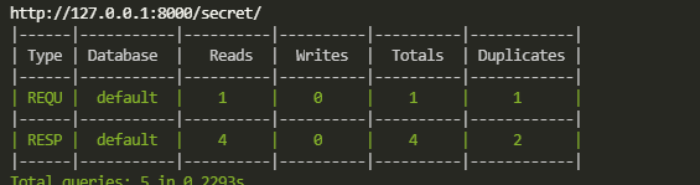

# Adicionar DJANGO QUERYCOUNT

## Instalar dependencias

```zsh
$> poetry add -D django-querycount
```

| Nombre            | Descripción                                                  |
| ----------------- | ------------------------------------------------------------ |
| django-querycount | Middleware que imprime el número de consultas de la base de datos en la consola del servidor de ejecución. |

## Configurar DJANGO QUERYCOUNT

Adicionar configuración en el fichero `src/server/settings/environments/development.py`

```python
MIDDLEWARE = (  # noqa: WPS440
    ...
    # https://github.com/bradmontgomery/django-querycount
    # Prints how many queries were executed, useful for the APIs.
    'querycount.middleware.QueryCountMiddleware',
) + MIDDLEWARE
```

Esto habilitará la funcionalidad de la biblioteca y nos permitirá usarla en tiempo de ejecución del proyecto. Es realmente beneficioso.

Ahora, configure su canal de depuración.

En cada consulta, verá un informe de tabla en el terminal. Tenga en cuenta que solo funciona cuando su depuración es verdadera `DEBUG=True`. Verá el informe solo cuando haga cualquier tipo de contacto con los modelos, después de todo, esta es una herramienta de depuración.

Una cosa más a tener en cuenta es que dará un informe de cierto modelo cuando haga clic en ese modelo.



## Bibliografía

- [Información del paquete](https://github.com/bradmontgomery/django-querycount)
